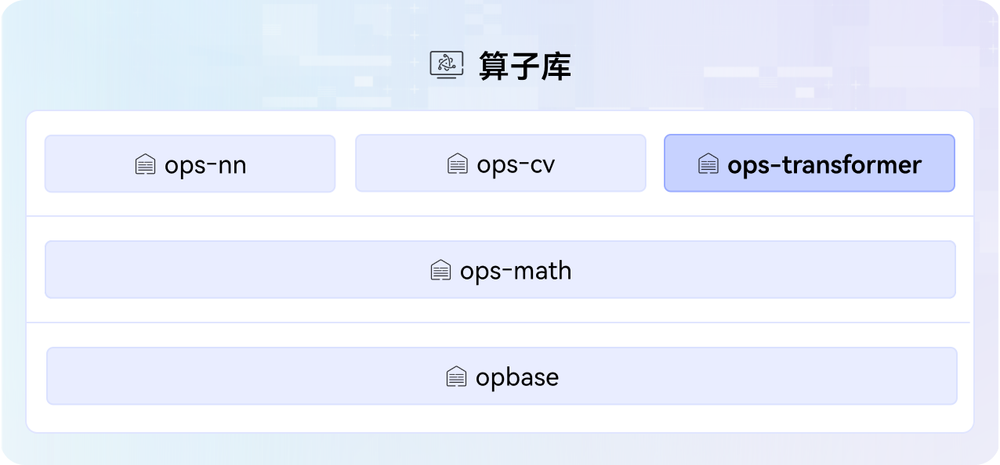

# ops-transformer

## 🔥Latest News

- [2026/02] 新支持算子[mhc_post](experimental/mhc/mhc_post)、[mhc_pre](experimental/mhc/mhc_pre)、[mhc_res](experimental/mhc/mhc_res)。
- [2026/01] 新支持算子[grouped_matmul<<<>>>调用示例](examples/fast_kernel_launch_example/csrc/grouped_matmul)，方便用户自定义使用。
- [2026/01] 新支持算子[fused_floyd_attention](attention/fused_floyd_attention)、[fused_floyd_attention_grad](attention/fused_floyd_attention_grad)、[matmul_allto_all](mc2/matmul_allto_all)。
- [2025/12] 新增[QuickStart](docs/QUICKSTART.md)，指导新手零基础入门算子项目部署（支持Docker环境）、算子开发和贡献流程。
- [2025/12] 优化指南类文档，聚焦[算子开发指南](docs/zh/develop/aicore_develop_guide.md)，明确最小交付件和关键示例代码，针对[Ascend/samples](https://gitee.com/ascend/samples/tree/master)仓算子提供迁移本项目的指导。
- [2025/12] 支持transformer类onnx算子插件，包括[NPUFlashAttention](attention/flash_attention_score/framework)、[NPUMultiHeadAttention](common/src/framework)、[NPUMoeComputeExpertTokens](moe/moe_compute_expert_tokens/framework)等。
- [2025/12] 新支持算子[kv_rms_norm_rope_cache](posembedding/kv_rms_norm_rope_cache)、[attention_update](attention/attention_update)、[attention_worker_scheduler](attention/attention_worker_scheduler)、[gather_pa_kv_cache](attention/gather_pa_kv_cache)、[kv_quant_sparse_flash_attention](attention/kv_quant_sparse_flash_attention)、[lightning_indexer_grad](attention/lightning_indexer_grad)、[mla_preprocess](attention/mla_preprocess)、[mla_preprocess_v2](attention/mla_preprocess_v2)、[grouped_matmul_swiglu_quant_v2](gmm/grouped_matmul_swiglu_quant_v2)、[attention_to_ffn](mc2/attention_to_ffn)、[ffn_to_attention](mc2/ffn_to_attention)。
- [2025/12] 开源算子支持[CANN Simulator](docs/zh/debug/cann_sim.md)仿真工具开发调试。
- [2025/12] 开源算子支持[Ascend 950PR/Ascend 950DT](docs/zh/ascend950_op_list.md)/KirinX90系列产品。
- [2025/11] 新支持算子[kv_quant_sparse_flash_attention](attention/kv_quant_sparse_flash_attention)、[lightning_indexer](attention/lightning_indexer)、[quant_lightning_indexer](attention/quant_lightning_indexer)、[sparse_flash_attention](attention/sparse_flash_attention)。
- [2025/11] 新支持示例算子[rope_matrix](experimental/posembedding/rope_matrix)和[all_gather_add](examples/mc2/all_gather_add)。
- [2025/11] 新增算子开发工程模板[NpuOpsTransformerExt](experimental/npu_ops_transformer_ext)，无缝集成PyTorch张量操作，支持自动微分和GPU/NPU统一接口。
- [2025/10] 新增[experimental](experimental)目录，完善[贡献指南](CONTRIBUTING.md)，支持开发者调试并贡献自定义算子。
- [2025/09] ops-transformer项目首次上线，开源算子支持Atlas A2/A3系列产品。

## 🚀概述

ops-transformer是[CANN](https://hiascend.com/software/cann)（Compute Architecture for Neural Networks）算子库中提供transformer类大模型计算的进阶算子库，包括attention类、moe类、mc2类等，覆盖各类attention、MoE计算、通算融合等场景，算子库在架构图中的位置如下。



## 📌版本配套

本项目源码会跟随CANN软件版本发布，关于CANN软件版本与本项目标签的对应关系请参阅[release仓库](https://gitcode.com/cann/release-management)中的相应版本说明。
请注意，为确保您的源码定制开发顺利进行，请选择配套的CANN版本与Gitcode标签源码，使用master分支可能存在版本不匹配的风险。

## 🛠️环境准备

[环境部署](docs/zh/install/quick_install.md)是体验本项目能力的前提，请先完成NPU驱动、CANN包安装等，确保环境正常。

## ⬇️源码下载

环境准备好后，下载与CANN版本配套的分支源码，通用命令如下，\$\{tag\_version\}替换为分支标签名。以9.0.0分支源码下载为例：

```bash
# 通用命令：git clone -b ${tag_version} https://gitcode.com/cann/ops-transformer.git
git clone -b 9.0.0 https://gitcode.com/cann/ops-transformer.git
```

> 说明：若环境中已存在配套分支源码，**可跳过本步骤**，例如CANNLab默认已提供最新商发版CANN对应的源码。

## 📖学习教程

- [快速入门](docs/QUICKSTART.md)：从零开始快速体验项目核心基础能力，涵盖源码编译、算子调用、开发与调试等操作。
- [进阶教程](docs/README.md)：如需深入了解项目编译部署、算子调用、开发、调试调优等能力，请查阅文档中心获取详细指引。

## 💬相关信息

- [目录结构](docs/zh/install/dir_structure.md)
- [贡献指南](CONTRIBUTING.md)
- [安全声明](SECURITY.md)
- [许可证](LICENSE)
- [所属SIG](https://gitcode.com/cann/community/tree/master/CANN/sigs/ops-transformer)

-----
PS：本项目功能和文档正在持续更新和完善中，欢迎您关注最新版本。

- **问题反馈**：通过GitCode[【Issues】](https://gitcode.com/cann/ops-transformer/issues)提交问题。
- **社区互动**：通过GitCode[【讨论】](https://gitcode.com/cann/ops-transformer/discussions)参与交流。
- **技术专栏**：通过GitCode[【Wiki】](https://gitcode.com/cann/ops-transformer/wiki)获取技术文章，如系列化教程、优秀实践等。


​    