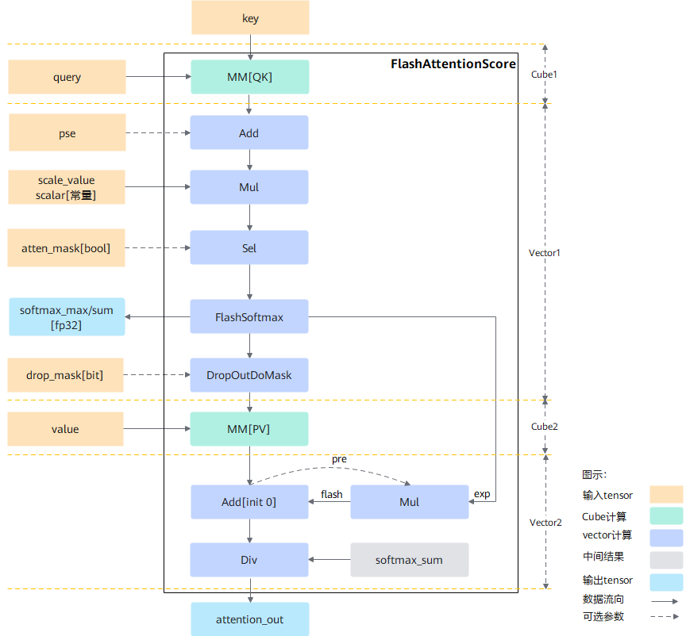
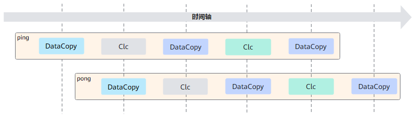
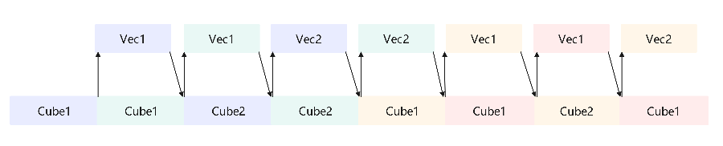

## 1 计算过程

图1训练计算流程图



按照FlashAttention正向计算流程实现，整体计算流程如下：

1. query与转置后的key做matmul计算后得到最初步的attention_score，然后与位置编码pse相加后再乘以缩放系数scale_value。此时的结果通过atten_mask进行select操作，将atten_mask中为true的位置进行遮蔽，得到结果masked_attention_score，即atten_mask中为true的位置在select后结果为负的极小值，经过softmax计算之后变成0从而达到遮蔽效果。

2. 为了实现FlashAttention加速算法，使用FlashSoftmax操作对masked_attention_score进行运算，用以代替原公式中的softmax运算，而后将结果与value做matmul运算。由于FlashSoftmax操作对masked_attention_score的Skv(输入key、value的sequence length)方向进行了切分，故实现过程中存在一个刷新流程，具体如下：
    1. 每次FlashSoftmax计算只对切分后的一个SkvSplit（SkvSplit是针对Skv轴进行切分之后的序列长度的简称）进行操作，并从第二次循环开始记录exp，其中i表示Skv切分后的循环变量，针对exp的i是从1开始，exp的计算公式如下：
       $$
       exp[i] = e^{max_{i - 1} - max_{i}}
       $$
    2. 当i = 0时，计算出的MM[PV]结果直接保存到ub_attention_out[0]的ub中。
    3. 从i = 1开始，需要增加Mul和Add操作，即将上一次的MM[PV]的结果和当前exp相乘，相乘完的结果和本次MM[PV]的结果相加得到的结果保存到ub_attention_out[1]的ub中。以此类推，遍历Skv计算完成。
    4. 由于FlashSoftmax计算中的除sum被后移到输出attention_out之前，因此最后需要将ub中的ub_attention_out按行除以softmax_sum并将最终完整的结果保存到输出内存attention_out(Final)上。

## 2 每个计算阶段的入口

以S1模板为例

1. 得到每个核处理的任务块数后，调用函数：`Process`
2. Cube1阶段，上图中Cube1，计算入口：`IterateBmm1`
3. Vector1阶段，上图中Vector1，计算入口：`ProcessVec1`
4. Cube2阶段，上图中Cube2，计算入口：`IterateBmm2`
5. Vector2阶段，上图中Vector2，计算入口：`ProcessVec2`

## 3 Tiling设计

1. Atlas A2训练系列产品  
  Tiling操作的目的是为了找到一种更高效的NPU执行方式，原始的数据量一般是非常大的，没有办法通过一次指令调用就完成所有计算，因此需要将数据量分到多个核上并行计算，且每个核上也需要考虑如何循环计算性能最优，不同的输入可能有不同的最优执行方式，所以需要通过tiling策略决定怎么将数据分配到各个核上进行计算。

  根据硬件架构特征，AI Core分成AIC和AIV两个独立的核，AIC和AIV核拥有自己独立的Scalar计算单元，能够独立加载自己的代码段，单独执行。AIC和AIV分离的架构可以使得AIC和AIV并行执行。AIC和AIV之间数据交互的通路是L2和GM（Global Memory，高带宽存储器），两者之间的交互次数对性能影响是比较大的，同时由于AIC和AIV算力差异，两者需要使用不同的基本块大小，本着尽量减少AIC和AIV通信次数和发挥最大算力的原则，CVtiling分离策略应运而生，可以有效地减少CV通信次数，同时根据不同单元的buffer特征，选择不同的基本块进行计算，从而提升算子性能。

  对于FA算子，Vector计算涉及多个输入、输出、中间计算结果、double-buffer设计等，需要将buffer分配成多份，最优分配方案中最大一份为32KB，由于Vector计算使用的数据类型是float32，因此Vector的tiling基本块为8 * 1024。为了充分发挥Cube的算力，在CV之间一轮计算的数据量进行了1:16的配比，又由于Cube侧的输入数据类型是float16，输出是float32，Cube的基本块为128 * 128，所以通过nRatio=8配比出128 * 1024的数据量。伪代码如下：

  ```c++
  // C-Tiling: (S1_c_i,D)x(D,S2_c_i) => (S1_c_i, S2_c_i):(128,1024)
  // V-Tiling: (S1_v_i, S2_v_i) => (8,1024)

  // C侧matmul计算
  Bmm((S1_c_i,D)x(D,S2_c_i)) => 128*1024  // 输出结果128*1024，放到workspace上
  // V侧Vector计算
  for S1_c_i/S1_v_i=128/8:
    copy_gm_to_ub(S1_v_i*S2_v_i)  // 从bmm的workspace上拷入bmm结果数据
    Vector(S1_v_i,S2_v_i)         // 进行Vector计算
    copy_ub_to_gm(S1_v_i*S2_v_i)  // Vector计算结束，得到最终输出数据，拷贝到GM上

  // 由于Cube侧计算数据比Vector侧大，因此，ub内需要再次进行Vector Tiling，从而产生了S1方向的配比：S1_c_i/S1_v_i
  ```

  上述示例中，仅在S1方向开了配比，S2方向C/V计算的长度是一致的，当然，也可以在S1/S2方向均开启配比；这样做的好处是，Cube一次可以发射大块的数据，避免因为小块数据不断发射带来的通信开销，也能最大程度地使用Cube单元的buffer。

2. Ascend 950PR/Ascend 950DT
  Ascend 950PR/Ascend 950DT既支持AIC&AIV分离架构，又支持AIC&AIV融合架构；AIC和AIV之间的交互通路包括L2、GM以及UB(Unified Buffer)，UB是AIC&AIV之间相较于GM更高效的交互通路。AIC可以直接输出到UB上，AIV利用UB上的数据进行vec运算，极大降低了数据搬运的时间。由于UB的容量有限，D_v>128时，mm2的输出依旧需要先保存到GM；mm1的输出始终保存在UB。

## 4 流水设计

为了追求极致性能，必须充分利用硬件资源，通常需要进行不同pipeline的流水设计。流水设计的宗旨是尽量使某一条pipeline达成bound效果，使硬件的某一个单元一直在工作，达到性能上限。

### 4.1 V侧流水

V侧流水设计需要考虑Vector的搬运及计算过程，实施的优化手段主要是double buffer。
以下面的流水任务示意图为例，Vec使用ping-pong表示两个数据处理任务，每个任务需要依次搬运DataCopy与计算Clc操作。任务间存在数据的依赖关系，比如处理完DataCopy之后，才能对Clc进行处理。
将图的流水任务做ping-pong流水间的double buffer处理后，从运行图中可以看出，对于同一片数据，搬运DataCopy与计算Clc之间，串行处理；不同的数据切片，同一时间点，可以有多个任务在并行处理，由此达到任务并行、提升性能的目的。



其中ping、pong两块计算数据所占用的内存资源均相互独立。
​FA类融合算子V侧计算过程较多，情况也比较复杂，通常简单的double buffer是无法覆盖所有情况的，因此会出现不同的计算流水排布。不同的计算流水适用于不同类的shape特征，以达到在该类特征下最好的流水设计。

### 4.2 CV流水

1. Atlas A2训练系列产品  
  融合算子通常包含了Vector计算和Cube计算，对于FA算子，V侧的计算是依赖C侧的计算结果的，如果只关注V侧流水，不关注C侧，则C侧与V侧很有可能是串行流水的效果，不能达到并行计算的目的，无法使得融合算子性能达到最优，从而有了CV流水设计。此外，CV流水在不同算子情况下，表现的现象也是不一致的，FA的Cube双发机制（又称为CV间preload流水）可实现流水优化：

    该场景流水特征下，Vector计算节点少，计算速度快，在<term>Atlas A2训练系列产品</term> C:V=1:2的情况下，Cube的搬运时长足以覆盖Vector的计算时长，因此只要关注Cube的MTE2耗时即可，最终达成MTE2 bound。在Cube双发机制下，提前发射两块Cube计算，Cube1、Cube2计算可以衔接，使得Cube利用率最高，达成Cube bound。

  

2. Ascend 950PR/Ascend 950DT
  Ascend 950PR/Ascend 950DT的CV流水设计思路和A2基本一致。差异点在于其cube的preload次数为3次：完成3次mm1的计算后才会开启mm2的计算；目的是优化启动阶段的CV流水，使其更紧密，以达到整体性能的最优。

## 5 多模板设计

为了使不同的输入可以复用相同的tiling和流水，采用了模板的方式来实现融合算子，但是不同的输入全部使用同一套模板时又无法达到性能最优和功能泛化，因此需要根据输入shape的特征区分不同的模板来实现。
FA（FlashAttentionScore，简称FA）融合算子的多模板设计思路主要为：

- **根据核内及核间切分进行模板拆分**

  由于硬件buffer大小是有限的，而计算的数据量又是巨大的，无法一次计算完，那么就需要进行tiling切分，shape不同会导致算子的切分轴不同，而算子的切分轴，会影响模板的功能及性能。简单的elewise类算子，往往会将所有的轴fuse成一根轴进行切分，逻辑简单，因此模板也比较单一。而融合算子融合了elewise、broadcast、reduce及matmul等多类场景，功能复杂，为达到较高的性能要求，往往需要根据切分轴进行模板拆分，模板拆分时为了达到性能最优，需要考虑如下几个点：

  a. 将核心的数量用满，防止部分核闲置

  b. 每一个核心被分配的计算量相对均匀，避免出现某些核计算的数据量过大，其余核在围观的情况。

  c. AIC和AIV之间处理的数据量要符合其对应的算力，避免AIC或AIV出现长时间的空闲。

  FA算子包含B、N2(key和value的N)、G(query_N/kv_N)、S1(query的S)、S2(key和value的S)共5个轴，切分顺序是先核内再核间，核内切分依据基本块大小选择切分轴，核间切分是把核内切分后剩余的轴合并后依据AI Core核数再进行切分。由于shape的大小不同，切分轴会发生变化。
  
    - Atlas A2训练系列产品：从Vector视角，FA算子划分为如下几类模板，模板按序号排优先级，序号越小，优先级越高，越先匹配。

    <table style="undefined;table-layout: fixed; width: 1576px">
    <colgroup>
      <col style="width: 170px">
      <col style="width: 170px">
      <col style="width: 310px">
      <col style="width: 212px">
    </colgroup>
    <thead>
      <tr>
        <th>模板</th>
        <th>切分轴</th>
        <th>进入条件</th>
        <th>适用范围</th>
      </tr>
    </thead>
    <tbody>
      <tr>
        <td>TNDSameAB模板</td>
        <td>UB切S1</td>
        <td>(B >= 4 and accumS1 >= 8192 and accumS2 >= 8192 and maxS1 >= 512 and maxS2 >= 512) or 
          (maxS2 >= 5120 and maxS1 >= 5120)。 </td>
        <td>TND场景</td>
      </tr>
      <tr>
        <td>TND模板</td>
        <td>UB切S1S2</td>
        <td>TND场景，但不满足TNDSameAB模板条件。 </td>
        <td>TND场景</td>
      </tr>
      <tr>
        <td>SameAB模板</td>
        <td>UB切S1</td>
        <td>非FP32，S2 >= 512 and D % 16 != 0 or D = 96，or S2 > 1024 and 128 < D < 196。 </td>
        <td>普通场景</td>
      </tr>
      <tr>
        <td>S1S2模板</td>
        <td>UB切S1S2</td>
        <td>不满足上述条件的，S2 > 1024。 </td>
        <td>普通场景</td>
      </tr>
      <tr>
        <td>S1模板</td>
        <td>UB切S1D</td>
        <td>(N2 * G * ((alignedS1 + alignedS2) * alignedD + alignedS2) * dtypeSize) >= 256 * 1024 or (N2 * G * (alignedS1 + alignedD) * alignedS2 * dtypeSize) >= 256 * 1024 or N2 * G * alignedS1 * alignedS2 * dtypeSize > 65536 * 2。</td>
        <td>普通场景</td>
      </tr>
      <tr>
        <td>B模板</td>
        <td>核间切B</td>
        <td>不满足以上条件。</td>
        <td>普通场景</td>
      </tr>
    </tbody>
    </table>

    每一类模板都有其独特的UB及Block切分轴，能处理某一类具备特定shape特征输入的场景，针对该类shape特征进行模板设计。
    - Ascend 950PR/Ascend 950DT

    由于Ascend 950PR/Ascend 950DT上核内切分的基本块为128 * 128，在各种shape情况下性能都可以达到最优的水平。因此只设计一套模板，支持全量shape，这套模板亦不区分layout是否为TND。

- **根据特殊场景及特定优化进行模板特化**

  每一个融合算子有一个基础模板，并辅以多个特化模板：

    - 基础模板覆盖功能以及大部分此类shape特征输入的性能。
    - 特化模板是覆盖特定场景的极致性能，主要根据某些适用于特定场景的特殊手段进行的优化，不适合进行泛化。

  例如，根据特殊场景空tensor特化而出的empty_input模板，基于角色的Cube核管理（RCM）优化方案设计的确定性计算模板等。
- **根据不同计算流水进行模板特化**

  为了充分发挥硬件优势，通常融合算子都需要进行流水设计，以提高融合算子性能，不同的流水设计对代码的架构影响非常大，为了提升代码的可维可测可读性，需要根据不同的计算流水进行模板特化，达到特定场景的极致性能。

### 5.1 多模板详细设计

- **基本概念：**

  **CV基本块:** 表示Cube或者Vector单次计算的数据量大小，用来描述一次完整的Cube和Vector交互的数据量，通常也等价于**核间基本块**。在芯片上由于Cube和Vector之间通信有一定开销，所以CV基本块设置的比较大，一般合适的数据量大小是512*1024（单位Bytes）。又由于Cube和Vector的核内Buffer有限，所以核间基本块可能要通过**多次核内计算**完成。

  **核内基本块：**

  如果CV基本块过大，Cube和Vector核内会将CV基本块进一步的切分，切分成适合核内L0A、L0B、L0C、UB等大小的基本块，这个就叫**核内基本块**；对于Cube侧，核内基本块一般在32KB（单位Bytes），这样可以让L0A、L0B的DoubleBuffer能力展开，同时算力和带宽也能尽可能用满；在Vector侧一般基本块大小是32KB（单位Bytes）。

  **xxx.i:** 表示经过切分后，CV基本块中的某根轴的大小，一般基本块都是2维的，xxx.i表示其中一个维度的大小。xxx可以是B、N2、G、S1、S2;
  例如，S1 = 512, S2 = 1024， S1.i = 64, S2.i = 128,表示把[S1, S2]切分成大小是[64, 128]的基本块，S1轴的基本块大小是64，S2轴的基本块大小是128。

  **xxx.o**: 表示经过基本块切分后某根轴的分数，xxx可以是B、N2、G、S1、S2;

  例如，S1 = 512, S2 = 1024， S1.i = 64, S2.i = 128,表示把[S1, S2]切分成大小是[64, 128]的基本块，S1.o = 512 / 64 = 8, S2.o = 1024 / 128 = 8 ，一共切分成8 * 8个基本块。
  - Atlas A2训练系列产品：FA算子根据切分轴不同，划分成以下几类模板，对于以下FA模板，目前都不会把S2轴切分到多核：
    > 1. 核间切分B、N2、G、S1轴，核内切分S1轴、S2轴模板，该模板是最通用模板，支持所有输入（TND除外）：
    >
    >    tiling代码文件：ops-transformer-dev/attention/flash_attention_score/op_host/flash_attention_score_tiling_general.cpp
    >
    >    tiling代码类：FlashAttentionScoreTilingS1s2Bn2gs1
    >
    >    kernel代码：ops-transformer-dev/attention/flash_attention_score/op_kernel/flash_attention_score_s1s2_bn2gs1.h
    >
    >    条件：S2 > 1024;
    >    依据: 由于Vector侧FlashSoftmax计算的shape是[S1, S2]，且FlashSoftmax操作需要S2切分的大小尽可能大，所以通常在FlashAttention中设定S2轴的基本块为1024。又由于FlashSoftmax当S2轴切分时会存在刷新流程，不断更新Softmax的结果，所以当S2大于1024时，计算流中会多一些Softmax的更新流程，这一点有别于其他模板。
    >    CV基本块选择:
    >    S1.i: 默认64，当按64切分时，如果B * N2 * G * S1.o超过Vector核数时，S1.i设置为128，这样做的目的是为了在S1比较小的时候，优先把核数用满，多核用满的性能较高
    >    S2.i: 1024
    >
    > 
    >
    > 2. 核间切分B、N2、G、S1轴，核内切分S1轴模板
    >
    >    tiling代码文件： ops-transformer-dev/attention/flash_attention_score/op_host/flash_attention_score_tiling_general.cpp
    >
    >    tiling代码类：FlashAttentionScoreTilingS1Bn2gs1
    >
    >    kernel代码：ops-transformer-dev/attention/flash_attention_score/op_kernel/flash_attention_score_s1_bn2gs1.h
    >
    >    条件：(128 < S2 <= 1024) ||  (N2 * G * (align(S1,16) + align(S2,16)) * align(D,16) * sizeof(INPUT_T)>= 512KB) || (N2 * G * (align(S1,16) + align(D,16)) * align(S2,16) * sizeof(INPUT_T))
    >
    >    依据: 当S2 < 1024时，由于S2不切分，所以不需要更新FlashSoftmax的结果，流程上更精简，不用上面第1点描述的那个泛化模板，由于S2 > 128时，切B模板不会带来性能提升，所以默认走这个模板。同时，在S2 <= 128时，如果不带Batch轴的matmul1或者matmul2的输入已经占满了整个L1，那么也不会走切B模板。切B模板的意思是，把batch轴做切分，核间基本块的大小是B.i * N2 * G * S1 * D (query的D)或者B.i * N2 * G * S2 * D (key/value的D)或者B.i * N2 * G * S1 * S2（softmax结果，即为P）；如果切B满足切分的要求，那么至少B.i大于等于2，那么B.i内层的这些轴的乘积需要小于L1的大小。上面条件里面的判断就是基于此，Q * K和P * V中任何一个矩阵乘法的输入大于了L1的Size，那么走切B模板就没有收益。
    >
    >    CV基本块选择: 
    >
    >    S1.i: 会依据S2的大小，动态调整，尽可能的让S1 * S2的数据量大一些，目的是减少通信次数和通信开销。
    >
    >    S2不切分，S2的基本块大小 = S2
    >
    > 
    >
    > 3. 核间切分B轴，核内Cube侧不切分S1、S2把B.i, N2, G作为循环轴开循环处理batch matmul，Vector核内会把B.i * N2 * G * S1综合切分，找到最合适的核内基本块。
    >
    >    tiling代码文件：ops-transformer-dev/attention/flash_attention_score/op_host/flash_attention_score_tiling_general.cpp
    >
    >    tiling代码类：FlashAttentionScoreTilingB
    >
    >    kernel代码：ops-transformer-dev/attention/flash_attention_score/op_kernel/flash_attention_score_bn2gs1s2_b.h
    >
    >    条件：无法走到上述两个模板的其他shape
    >    依据：当S1、S2、D都比较小的时候，CV的基本块较小，我们将B.i, N2, G也纳入到CV基本块中，一次CV交互的数据量更大，提升执行性能。

  - Ascend 950PR/Ascend 950DT
    > 1. 核间切分B、N2、G、S1轴，核内切分S1轴、S2轴模板，该模板是最通用模板，支持所有输入（TND除外）：
    >
    >    tiling代码文件：attention/flash_attention_score/op_host/arch35/flash_attention_score_tiling_regbase.cpp
    >
    >    tiling代码类：FlashAttentionScoreTilingS1S2Const、FlashAttentionScoreTilingVarLenConst
    >
    >    kernel代码：attention/flash_attention_score/op_kernel/arch35/flash_attention_score_kernel_train.h
    >
    >    CV基本块选择:
    >    S1.i: 128，少量场景下为64
    >    S2.i: 128，少量场景下为256

## 6 编程视角

### 6.1 AscendC高阶API

当前AscendC高阶API提供了两种编程模式，第一种是以Vector为主核，Cube为从核的视角，Vector0和Vector1会独立发起Matmul的任务，两者没有关联性。

第二种是以Cube为主核，Vector为从核，这时会由V0统一发起Matmul任务，这个任务的结果由V0和V1共同处理，一般是V0、V1各处理一半。当前如果某个模板的结尾是"_sab"，说明这个模板是一个以Cube为主核的模板。例如：

```c++
ops-transformer-dev/attention/flash_attention_score/op_kernel/flash_attention_score_s1s2_bn2gs1_sab.h
    
ops-transformer-dev/attention/flash_attention_score_grad/op_kernel/flash_attention_score_grad_s1s2_bn2gs1s2_sab.h 
```

以Cube为主核对于FlashAttention来说由于V0、V1的Matmul任务可以复用左矩阵，且输出的部分结果可以在L0C累加，减少了对于带宽的依赖诉求，大部分场景性能会更优。

### 6.2 AscendC低阶API

当前还存在一些没有使用AscendC高阶API的模板，例如：

```c++
ops-transformer-dev/attention/flash_attention_score_grad/op_kernel/flash_attention_score_grad_s1s2_bn2gs1s2_basic.h
```

这个模板更加彻底地使用了以Cube为主核，Vector为从核，这时Matmul的任务都已经完全从Cube侧发起，通过同步通知Vector侧。

Ascend 950PR/Ascend 950DT上FA通过AscendC低阶API实现。
