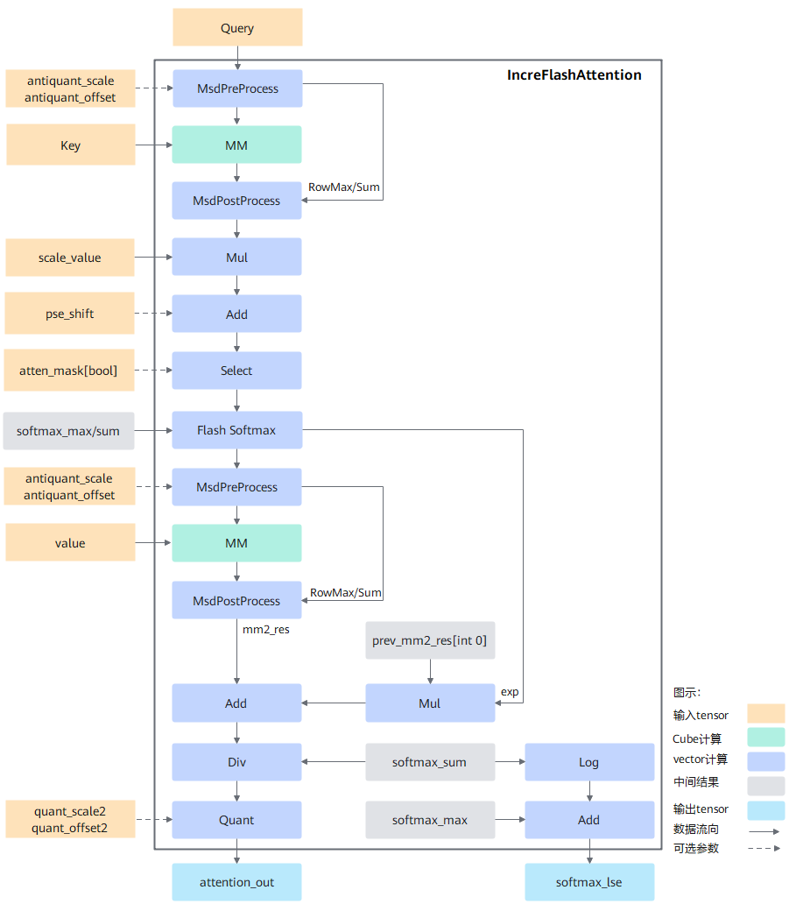

声明：本文使用[Creative Commons License version 4.0](https://creativecommons.org/licenses/by/4.0/legalcode)许可协议，转载、引用或修改等操作请遵循此许可协议。

# IFA算子设计介绍

为不断优化提升增量推理性能，提出支持增量推理的IncreFlashAttention融合算子需求。

增量推理相对于全量推理，主要有如下差异：

1. 输入数据特点是query的S轴固定为1;
2. Key和Value是经过kv cache后，将之前推理过的state信息叠加在一起,每个Batch对应的S轴的实际长度可能不一样,输入的数据是经过padding后的固定长度数据。

## 实现原理

图1计算流程图：



按照FlashAttention正向计算流程实现，整体计算流程如下：

1. query与转置后的key做matmul计算后得到最初步的attention_score,然后与位置编码pse相加后再乘以缩放系数scale_value。此时的结果通过atten_mask进行select操作，将atten_mask中为true的位置进行遮蔽,得到结果masked_attention_score,即atten_mask中为true的位置在select后结果为负的极小值,经过softmax计算之后变成0从而达到遮蔽效果。

2. 为了实现FlashAttention加速算法，使用FlashSoftmax操作对masked_attention_score进行运算,用以代替原公式中的softmax运算,而后将结果与value做matmul运算。由于FlashSoftmax操作对masked_attention_score的Skv(输入key、value的sequence length)方向进行了切分,故实现过程中存在一个刷新流程,具体如下：

   1. 每次FlashSoftmax计算只对切分后的一个SkvSplit（SkvSplit是针对Skv轴进行切分之后的序列长度的简称）进行操作，并从第二次循环开始记录exp,其中i表示Skv切分后的循环变量,针对exp的i是从1开始, exp的计算公式如下：
      $$
      exp[i] = e^{max_{i - 1} - max_{i}}
      $$

   2. 从i = 1开始，需要增加Mul和Add操作,即将上一次的MM[PV]的结果和当前exp相乘,相乘的结果和本次MM[PV]的结果相加得到的结果保存到GM中。以此类推,遍历Skv计算完成。

   3. 由于FlashSoftmax计算中的除sum被后移到输出attention_out之前，因此最后需要将ub中的attention_out按行除以softmax_sum并将最终完整的结果保存到输出内存attention_out(Final)上。

## 模板设计

为了使不同的输入可以复用相同的tiling和流水，采用了模板的方式来实现融合算子,但是不同的输入全部使用同一套模板时又无法达到性能最优和功能泛化,因此需要根据输入shape的特征区分不同的模板来实现。

### 模板类型

1. C+V模板：对应文件名incre_flash_attention_split_Bbn2s2_Us2.h, IFA基础模板，支持绝大多数输入场景,计算时同时开启VectorCore和CubeCore, matmul计算放在CubeCore执行; matmul计算为调用AscendC提供的高阶API;
2. All-Vector模板：对应文件名incre_flash_attention_allvec_new.h,对C+V模板的补充，主流程与C+V模板基本一致, matmul计算由vector实现,降低Cube启动和CV通信开销,对于部分输入类型有更好的性能表现；支持场景：

- <term>Atlas 推理系列加速卡产品</term>：全部使用该模板。

- <term>Atlas A2 训练系列产品/Atlas A2 推理系列产品</term>：非PA,非GQA,且Q、KV 、Output类型全部为FP16 。

3. matmul基础API模板: 对应文件名incre_flash_attention_preload.h,为了优化性能，基于C+V模板使用AscendC提供的matmul基础API对matmul部分重写。在C+V模板的基础上主要做了如下改动：

- 切换编程视角。C+V模板使用基于VEC的编程视角， 1个VEC需要处理1次matmul的全部计算结果；本模板使用基于CUBE的编程视角, 1次matmul的计算结果会被切分为2份, 2个VEC分别处理1份。

- 优化CUBE和VEC之间的核间流水优化。C+V模板使用顺序流水，本模板使用N-Buffer流水；所谓N-Buffer流水,是指连续执行N次某个计算阶段之后再连续N次下一个计算阶段。

- 优化CUBE核内的流水。将CUBE核内的Buffer资源在FA的两个matmul计算之间统一调度，使得CUBE核内的搬运和计算流水更加紧凑,从而提升性能。
本模板支持范围参考Tiling中的EnableCubeViewMM函数。

4. 伪量化MSD DD模板：对应文件为incre_flash_attention_preload_dd.h,基于incre_flash_attention_preload.h开发，用于伪量化MTP场景,优化了MSD算法；该模板基于incre_flash_attention_preload.h开发；当前仅支持FIA算子调用, IFA算子不会调用到这个模板。

5. MLA全量化模板：对应文件为incre_flash_attention_preload_mla.h,适用于MLA场景query、key、value为INT8并且query_rope、key_rope为BF16时的attention计算；该模板基于incre_flash_attention_preload.h开发，并将matmul相关的计算抽取到了文件ifa_service_matmul_full_quant.h中；当前仅支持FIA算子调用, IFA算子不会调用到这个模板。
下面主要介绍C+V模板，其它模板后续将逐步收编至FIA算子,暂不做介绍。

### 计算过程

#### 数据切分

由于硬件buffer大小是有限的，而计算的数据量又是巨大的,无法一次计算完,那么就需要进行tiling切分, shape不同会导致算子的切分轴不同,而算子的切分轴,会影响模板的功能及性能。简单的element-wise类算子,往往会将所有的轴fuse成一根轴进行切分,逻辑简单,因此模板也比较单一。而融合算子融合了element-wise、broadcast、reduce及matmul等多类场景,功能复杂,为达到较高的性能要求,往往需要根据切分轴进行模板拆分,模板拆分时为了达到性能最优,需要考虑如下几个点：

a. 将核心的数量用满，防止部分核闲置;

b. 每一个核心被分配的计算量相对均匀，避免出现某些核计算的数据量过大,其余核空闲的情况;

c. AIC和AIV之间处理的数据量要符合其对应的算力，避免AIC或AIV出现长时间的空闲。 

IFA算子包含B、N2(key和value的N)、G(query_N/kv_N)、S1(query的S)、S2(key和value的S)共5个轴，  S1轴固定为1,不参与切分。G轴只在Vector计算时切块,  BN2S2切分逻辑如下：

- 核间：数据外切是为了最大限度的利用多个Core并行工作，通常先按照BN2分核,即将BN2个SD块分配到多个核上,每个核计算一定数量的SD块,当BN2小于阈值时（0.4 * 总核数）,需再对S2轴进行外切（SplitKV份）,总块数为BN2 * SplitKv,每个核分配一定数量的子块,当所有子块计算完成后,再进行规约,即FlashDecode流程。

- 核内：由于单core缓存有限，需根据设定的缓存大小,对S2轴或KV子块的S2轴进行切分,此即FlashAttention过程。

#### 主流程

```c
// 单核计算伪代码
void compute() {
  loops = blocks_to_compute_of_this_core(); // 当前核需要计算几个数据块
      
  for (i = 0; i < loops; i++) {
    block = get_curr_block(i);
    bidx, nidx, sidx = dims_of_this_block(block);
      
    innerloops = get_inner_loops_of_this_block_by_actual_seq_len(bidx, nidx, sidx); // 数据块实际内切份数 
    q_offset = get_offset_of_query(bidx, nidx);

    softmax_sum = {0};
    softmax_exp = {0};
    softmax_max = {min_float};
      
    for (j = 0; j < innerloops; j++) { // flash attention循环
      kv_offset = get_offset_of_kv_block(j);

      qk_res = matmul(q + q_offset, k + kv_offset);

      qk_res = elementwise(qk_res); // pse, atten-mask

      qk_res, softmax_max, softmax_sum, softmax_exp = softmaxflash(qk_res, softmax_max, softmax_sum);

      res = matmul(qk_res, v + kv_offset);

      prev_res = load_prev_res();
      res += prev_res * softmax_exp;  // flash attention update
      store(res);

      if (j == innerloops - 1) {
        res = div(res, softmax_sum);
        output(res);
      }
    }
  }
}
```

#### FlashDecode

S2轴外切分配到不同的核上完成Attention计算后，对结果进行Reduce操作,这里总共BN2个SD大块,每个core对一个大块中的所有子块进行合并。

```c
// FlashDecode规约，单核流程
void combine() {
  SyncAll(); // 核间同步，确保所有子块计算完成
  splits = get_real_splits_of_this_block_by_actual_seq_len();
  lse = load_lse_of_this_block();
  scale[0:splits] = exp(lse[i]) / Sum(exp(lse[i]));  // i [0, splits)

  res = {0};
  split_res = load_split_res();
  for (j = 0; j < splits; j++) {
    res += split_res[j] * scale[j];
  }
  output(res);
}
```

#### AntiQuant MSD算法

IFA  AntiQuant场景矩阵计算公式为：
$$
C = A * (B + offset)\times scale
$$
A矩阵为FP16/BF16类型，  B矩阵为int8类型。

经典的反量化方案，对整个B矩阵进行反量化操作,需要对矩阵B搬入Vector处理,矩阵B的数据量较大,严重影响计算性能。

IFA场景下， A矩阵较小,可以通过变换A矩阵来适配B矩阵,基本流程：

1. 矩阵A进入Vector展开成多行，每行An均用int8格式存储;
2. 将这些An打包成新的矩阵AA计算CC = AA * B （按int8 * int8 = int32来计算）;
3. 对MatMul结果CC进行Reduce操作得到C。

#### PageAttention

KV block内存不连续， MatMul针对这种场景提供了回调函数进行B矩阵的拷贝(GM->L1),  IFA中实现相应的拷贝函数，回调函数在Cube中执行,参数通过GM传递, Vector设置相应的参数后到GM后（确保DCCI）再通知MatMul工作。 

#### GQA

G = queryheadNum / KvHeadNum,  Vector上G轴的切分由当前操作所涉及的输入输出UB大小决定，当G过大, UB缓存不足以一次加载全部数据进行计算,需要在G轴上进行切分：

```c
// GQA vector切G伪码
void process() {
  g = target_ub_size() / column_size;
  if (g > G) {
    g = G;
  }
  process_sub_block(g, column); // sub_block: g * column
}
```

## Tiling设计

### 分核设计

​        Tiling操作的目的是为了找到一种更高效的NPU执行方式，原始的数据量一般是非常大的,没有办法通过一次指令调用就完成所有计算,因此需要将数据量分到多个核上并行计算,且每个核上也需要考虑如何循环计算性能最优,不同的输入可能有不同的最优执行方式,所以需要通过Tiling策略决定怎么将数据分配到各个核上进行计算。

如前所述，总块数为BN2或BN2*SplitKv

- 输入：核数 + 块数 +  块负载（通常为每个分块的S轴实际长度）;

- 处理：根据负载值对连续的块进行组合重排，达到核间负载差值最小;

- 输出： blockid数组，每个元素对应一个核的起始blockid,最后附加一个元素等于总块数,前后元素差值为该核处理的块数。

### TilingKey规划

TilingKey为uint64类型，通常每个模板参数对应TilingKey中的一个十进制位,部分BOOL类型的模板参数采用组合方式在一个十进制位中表示。具体实现参考Tiling中的GenTilingKey函数。

```c++
constexpr uint64_t RecursiveSum() {
  return 0;
}

template <typename T, typename... Args>
constexpr uint64_t RecursiveSum(T templateId, Args... templateIds) {
  return static_cast<uint64_t>(templateId) + 10U * RecursiveSum(templateIds...);
}
constexpr uint64_t IFA_TILINGKEYOFFSET = uint64_t(10000000000000000UL);           // 10^16
constexpr uint64_t IFA_PERF_MODE_TILINGKEYOFFSET = uint64_t(1000000000000000UL);  // 10^15
template <typename... Args>
constexpr uint64_t IFA_GET_TILINGKEY(Args... templateIds) {
  return RecursiveSum(templateIds...);
}

GenTilingKey()
{
  ...
  uint64_t baseOffset =
      modeVal * IFA_TILINGKEYOFFSET + (static_cast<uint64_t>(perfMode_)) * IFA_PERF_MODE_TILINGKEYOFFSET;
  if (antiquantMode_ == PER_TOKEN_MODE || antiquantMode_ == PER_CHANNEL_MODE){
      context_->tilingKey = baseOffset + IFA_GET_TILINGKEY(layoutVal, inputQVal, inputKvVal, outputVal, originVal,
          (paVal + splitKvVal + antiquantModeVal), 0, kvLayoutInfo.kvLayoutVal, kvLayoutInfo.amlaMode, balanceMode);
  } else {
      context_->tilingKey = baseOffset + IFA_GET_TILINGKEY(layoutVal, inputQVal, inputKvVal, outputVal, originVal,
          (paVal + splitKvVal), antiquantMode_, kvLayoutInfo.kvLayoutVal, kvLayoutInfo.amlaMode, balanceMode);
  }
  ...
}

```

字段说明：

| 十进制位 | 变量                      | 说明                                                         |
| -------- | -------------------------| ------------------------------------------------------------ |
| 0        | layoutVal                | Q的Shape格式， 0: BNSD;1:BSH/BSND;2：TND                    |
| 1        | inputQVal                | query数据类型，  0:FP16;  2: BF16;3：:INT8                    |
| 2        | inputKvVal               | KV数据类型， 0: FP16;2:BF16;  3:INT8;4:INT4                  |
| 3        | outputVal                | output数据类型， 0: FP16; 2:BF16;   3:INT8                    |
| 4        | originVal                | 同inputQval                                                  |
| 5 [bit0] | splitKvVal               | 开启FlashDecode标志， 1:enable;  0: disable;                   |
| 5 [bit1] | paVal                    | 开启PageAttention标志， 1:enable;  0: disable;                 |
| 5 [bit2] | antiquantModeVal         | 开启PerToken伪量化标记， 1:enable;  0: disable;                 |
| 6        | antiquantMode_           | 量化模式， 0:无效值2:K-perChannel-V-perToken                   |
| 7        | kvLayoutInfo.kvLayoutVal | KV的shape格式，仅伪量化MSD DD模板和MLA全量化模板该字段有效，其余模板该字段的值为0, 0:BNSD 1:BSH/BSND 2：NZ |
| 8        | kvLayoutInfo.amlaMode    | 该字段废弃，取值只能为0 |
| 9        | balanceMode              | 开启新的负载均衡算法的标志，1:enable;  0: disable;仅MLA全量化模板可开启 |
| 10...14   |                         | 预留字段，值为0              |
| 15       | perfMode_                | 模板编号， 0: C1_V2 (CV配比1:2) ; 1：全V; 2: C1_V1（CV配比1:1）;3:matmul基础API模板;5:MLA全量化模板6:伪量化MSD DD模板 |
| 16       | modeVal                  | 1：IFA TilingKey Base   2：IFA启用SysPrefix功能              |
