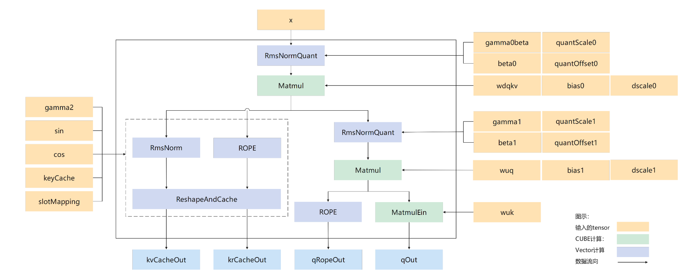

# aclnnMlaPreprocessV2

## 产品支持情况

|产品      | 是否支持 |
|:----------------------------|:-----------:|
|<term>Ascend 950PR/Ascend 950DT</term>|      ×     |
|<term>Atlas A3 训练系列产品/Atlas A3 推理系列产品</term>|      √     |
|<term>Atlas A2 训练系列产品/Atlas A2 推理系列产品</term>|      √     |
|<term>Atlas 200I/500 A2 推理产品</term>|      ×     |
|<term>Atlas 推理系列产品</term>|      ×     |
|<term>Atlas 训练系列产品</term>|      ×     |

## 功能说明

- **接口功能**：推理场景，Multi-Head Latent Attention前处理的计算。主要计算过程如下：
    - 首先对输入$x$ RmsNormQuant后乘以$W^{DQKV}$进行下采样后分为通路1和通路2。
    - 通路1做RmsNormQuant后乘以$W^{UQ}$后再分为通路3和通路4。
    - 通路3后乘以$W^{uk}$后输出$q^N$。
    - 通路4后经过旋转位置编码后输出$q^R$。
    - 通路2拆分为通路5和通路6。
    - 通路5经过RmsNorm后传入Cache中得到$k^N$。
    - 通路6经过旋转位置编码后传入另一个Cache中得到$k^R$。

- **计算流程图**



- **计算公式**：

    RmsNormQuant公式

    $$
    \text{RMS}(x) = \sqrt{\frac{1}{N} \sum_{i=1}^{N} x_i^2 + \epsilon}
    $$

    $$
    \text{RmsNorm}(x) = \gamma \cdot \frac{x_i}{\text{RMS}(x)}
    $$

    $$
    RmsNormQuant(x) = ({RmsNorm}(x) + bias) * deqScale
    $$
  
    Query计算公式，包括W^{DQKV}矩阵乘、W^{UK}矩阵乘、RmsNormQuant和ROPE旋转位置编码处理

    $$
    q^N =  RmsNormQuant(x) \cdot W^{DQKV} \cdot W^{UK}
    $$

    $$
    q^R = ROPE(x^Q)
    $$

    Key计算公式，包括RmsNorm和rope，将计算结果存入cache

    $$
    k^N = Cache({RmsNorm}(RmsNormQuant(x)))
    $$

    $$
    k^R = Cache(ROPE(RmsNormQuant(x)))
    $$

## 函数原型

每个算子分为[两段式接口](../../../docs/zh/context/两段式接口.md)，必须先调用“aclnnMlaPreprocessV2GetWorkspaceSize”接口获取入参并根据流程计算所需workspace大小，再调用“aclnnMlaPreprocessV2”接口执行计算。

```cpp
aclnnStatus aclnnMlaPreprocessV2GetWorkspaceSize(
  const aclTensor *input, 
  const aclTensor *gamma0, 
  const aclTensor *beta0, 
  const aclTensor *quantScale0, 
  const aclTensor *quantOffset0,
  const aclTensor *wdqkv, 
  const aclTensor *deScale0, 
  const aclTensor *bias0, 
  const aclTensor *gamma1, 
  const aclTensor *beta1, 
  const aclTensor *quantScale1, 
  const aclTensor *quantOffset1, 
  const aclTensor *wuq, 
  const aclTensor *deScale1, 
  const aclTensor *bias1, 
  const aclTensor *gamma2, 
  const aclTensor *cos, 
  const aclTensor *sin, 
  const aclTensor *wuk, 
  const aclTensor *kvCache, 
  const aclTensor *kvCacheRope, 
  const aclTensor *slotMapping, 
  const aclTensor *ctkvScale, 
  const aclTensor *qNopeScale, 
  int64_t          wdqDim, 
  int64_t          qRopeDim, 
  int64_t          kRopeDim, 
  double           epsilon, 
  int64_t          qRotaryCoeff, 
  int64_t          kRotaryCoeff, 
  bool             transposeWdq, 
  bool             transposeWuq, 
  bool             transposeWuk, 
  int64_t          cacheMode, 
  int64_t          quantMode, 
  bool             doRmsNorm, 
  int64_t          wdkvSplitCount, 
  bool             qDownOutFlag, 
  const aclTensor *qOut, 
  const aclTensor *kvCacheOut, 
  const aclTensor *qRopeOut, 
  const aclTensor *krCacheOut, 
  const aclTensor *qDownOut, 
  uint64_t        *workspaceSize, 
  aclOpExecutor   **executor)
```

```cpp
aclnnStatus aclnnMlaPreprocessV2(
  void          *workspace, 
  uint64_t       workspaceSize, 
  aclOpExecutor *executor, 
  aclrtStream    stream)
```

## aclnnMlaPreprocessV2GetWorkspaceSize

- **参数说明**

  <table style="undefined;table-layout: fixed; width: 1700px"><colgroup>
  <col style="width: 151px">
  <col style="width: 121px">
  <col style="width: 301px">
  <col style="width: 331px">
  <col style="width: 237px">
  <col style="width: 111px">
  <col style="width: 170px">
  <col style="width: 150px">
  </colgroup>
  <thead>
    <tr>
      <th>参数名</th>
      <th>输入/输出</th>
      <th>描述</th>
      <th>使用说明</th>
      <th>数据类型</th>
      <th>数据格式</th>
      <th>维度(shape)</th>
      <th>非连续tensor</th>
    </tr></thead>
  <tbody>
    <tr>
      <td>input</td>
      <td>输入</td>
      <td>用于计算Query和Key的x。</td>
      <td>-</td>
      <td>FLOAT16、BFLOAT16</td>
      <td>ND</td>
      <td>[tokenNum,hiddenSize]</td>
      <td>-</td>
    </tr>
    <tr>
      <td>gamma0</td>
      <td>输入</td>
      <td>首次RmsNorm计算中的γ参数。</td>
      <td>数据类型需要与input满足数据类型推导规则（参见<a href="../../../docs/zh/context/互推导关系.md">互推导关系</a>和<a href="#约束说明">约束说明</a>）。</td>
      <td>FLOAT16、BFLOAT16</td>
      <td>ND</td>
      <td>[hiddenSize]</td>
      <td>-</td>
    </tr>
    <tr>
      <td>beta0</td>
      <td>输入</td>
      <td>首次RmsNorm计算中的β参数。</td>
      <td>数据类型需要与input满足数据类型推导规则（参见<a href="../../../docs/zh/context/互推导关系.md">互推导关系</a>和<a href="#约束说明">约束说明</a>）。</td>
      <td>FLOAT16、BFLOAT16</td>
      <td>ND</td>
      <td>[hiddenSize]</td>
      <td>-</td>
    </tr>
    <tr>
      <td>quantScale0</td>
      <td>输入</td>
      <td>首次RmsNorm公式中量化缩放的参数。</td>
      <td>数据类型需要与input满足数据类型推导规则（参见<a href="../../../docs/zh/context/互推导关系.md">互推导关系</a>和<a href="#约束说明">约束说明</a>）。</td>
      <td>FLOAT16、BFLOAT16</td>
      <td>ND</td>
      <td>[1]</td>
      <td>-</td>
    </tr>
    <tr>
      <td>quantOffset0</td>
      <td>输入</td>
      <td>首次RmsNorm公式中的量化偏移参数。</td>
      <td>数据类型需要与input满足数据类型推导规则（参见<a href="../../../docs/zh/context/互推导关系.md">互推导关系</a>和<a href="#约束说明">约束说明</a>）。</td>
      <td>INT8</td>
      <td>ND</td>
      <td>[1]</td>
      <td>-</td>
    </tr>
    <tr>
      <td>wdqkv</td>
      <td>输入</td>
      <td>与输入首次做矩阵乘的降维矩阵。</td>
      <td>-</td>
      <td>INT8、FLOAT16、BFLOAT16</td>
      <td>NZ</td>
      <td>[qLoraDim + keyTotalDim,hiddenSize]</td>
      <td>-</td>
    </tr>
    <tr>
      <td>deScale0</td>
      <td>输入</td>
      <td>输入首次做矩阵乘的降维矩阵中的系数。</td>
      <td>input输入dtype为FLOAT16支持INT64，输入BFLOAT16时支持FLOAT。</td>
      <td>INT32、FLOAT</td>
      <td>ND</td>
      <td>[qLoraDim + keyTotalDim]</td>
      <td>-</td>
    </tr>
    <tr>
      <td>bias0</td>
      <td>输入</td>
      <td>输入首次做矩阵乘的降维矩阵中的系数。</td>
      <td>支持传入空tensor，quantMode为1、3时不传入。</td>
      <td>INT32</td>
      <td>ND</td>
      <td>[qLoraDim + keyTotalDim]</td>
      <td>-</td>
    </tr>
    <tr>
      <td>gamma1</td>
      <td>输入</td>
      <td>第二次RmsNorm计算中的γ参数。</td>
      <td>数据类型需要与input满足数据类型推导规则（参见<a href="../../../docs/zh/context/互推导关系.md">互推导关系</a>和<a href="#约束说明">约束说明</a>）。</td>
      <td>FLOAT16、BFLOAT16</td>
      <td>ND</td>
      <td>[qLoraDim]</td>
      <td>-</td>
    </tr>
    <tr>
      <td>beta1</td>
      <td>输入</td>
      <td>第二次RmsNorm计算中的β参数。</td>
      <td>数据类型需要与input满足数据类型推导规则（参见<a href="../../../docs/zh/context/互推导关系.md">互推导关系</a>和<a href="#约束说明">约束说明</a>）。</td>
      <td>FLOAT16、BFLOAT16</td>
      <td>ND</td>
      <td>[qLoraDim]</td>
      <td>-</td>
    </tr>
    <tr>
      <td>quantScale1</td>
      <td>输入</td>
      <td>第二次RmsNorm公式中量化缩放的参数。</td>
      <td>数据类型需要与input满足数据类型推导规则（参见<a href="../../../docs/zh/context/互推导关系.md">互推导关系</a>和<a href="#约束说明">约束说明</a>）。</td>
      <td>FLOAT16、BFLOAT16</td>
      <td>ND</td>
      <td>[1]</td>
      <td>-</td>
    </tr>
    <tr>
      <td>quantOffset1</td>
      <td>输入</td>
      <td>第二次RmsNorm公式中的量化偏移参数。</td>
      <td>数据类型需要与input满足数据类型推导规则（参见<a href="../../../docs/zh/context/互推导关系.md">互推导关系</a>和<a href="#约束说明">约束说明</a>）。</td>
      <td>INT8</td>
      <td>ND</td>
      <td>[1]</td>
      <td>-</td>
    </tr>
    <tr>
      <td>wuq</td>
      <td>输入</td>
      <td>权重矩阵。</td>
      <td>-</td>
      <td>INT8、FLOAT16、BFLOAT16</td>
      <td>NZ</td>
      <td>[headNum * (qNoRopeDim + qRopeDim),qLoraDim]</td>
      <td>-</td>
    </tr>
    <tr>
      <td>deScale1</td>
      <td>输入</td>
      <td>参与wuq矩阵乘的系数。</td>
      <td>input输入dtype为FLOAT16支持INT64，输入BFLOAT16时支持FLOAT。</td>
      <td>INT64、FLOAT</td>
      <td>ND</td>
      <td>[headNum * (qNoRopeDim + qRopeDim)]</td>
      <td>-</td>
    </tr>
    <tr>
      <td>bias1</td>
      <td>输入</td>
      <td>参与wuq矩阵乘的系数。</td>
      <td>quantMode为1、3时不传入。</td>
      <td>INT32</td>
      <td>ND</td>
      <td>[headNum * (qNoRopeDim + qRopeDim)]</td>
      <td>-</td>
    </tr>
    <tr>
      <td>gamma2</td>
      <td>输入</td>
      <td>参与RmsNormAndreshapeAndCache计算的γ参数。</td>
      <td>数据类型需要与input满足数据类型推导规则（参见<a href="../../../docs/zh/context/互推导关系.md">互推导关系</a>和<a href="#约束说明">约束说明</a>）。</td>
      <td>FLOAT16、BFLOAT16</td>
      <td>ND</td>
      <td>[512]</td>
      <td>-</td>
    </tr>
    <tr>
      <td>cos</td>
      <td>输入</td>
      <td>用于计算旋转位置编码的正弦参数矩阵。</td>
      <td>-</td>
      <td>FLOAT16、BFLOAT16</td>
      <td>ND</td>
      <td>[tokenNum,64]</td>
      <td>-</td>
    </tr>
    <tr>
      <td>sin</td>
      <td>输入</td>
      <td>用于计算旋转位置编码的余弦参数矩阵。</td>
      <td>-</td>
      <td>FLOAT16、BFLOAT16</td>
      <td>ND</td>
      <td>[tokenNum,64]</td>
      <td>-</td>
    </tr>
    <tr>
      <td>wuk</td>
      <td>输入</td>
      <td>表示计算Key的上采样权重。</td>
      <td>-</td>
      <td>FLOAT16、BFLOAT16</td>
      <td>ND</td>
      <td>[headNum,qNoRopeDim,512]</td>
      <td>-</td>
    </tr>
    <tr>
      <td>kvCache</td>
      <td>输入</td>
      <td>与输出的kvCacheOut为同一tensor。</td>
      <td>输入格式随cacheMode变化：<ul>
        <li>cacheMode为0：shape为[blockNum,blockSize,1,576]，dtype与input保持一致，<a href="../../../docs/zh/context/数据格式.md">数据格式</a>为ND。</li>
        <li>cacheMode为1：shape为[blockNum,blockSize,1,512]，tensor的shape为拆分情况，dtype与input保持一致，<a href="../../../docs/zh/context/数据格式.md">数据格式</a>为ND。</li>
        <li>cacheMode为2：shape为[blockNum,16,blockSize,32]，dtype为int8，<a href="../../../docs/zh/context/数据格式.md">数据格式</a>为NZ。</li>
        <li>cacheMode为3：shape为[blockNum,32,blockSize,16]，dtype与input保持一致，<a href="../../../docs/zh/context/数据格式.md">数据格式</a>为NZ。</li></ul>
      </td>
      <td>INT8、FLOAT16、BFLOAT16</td>
      <td>ND、NZ</td>
      <td>-</td>
      <td>-</td>
    </tr>
    <tr>
      <td>kvCacheRope</td>
      <td>输入</td>
      <td>与输出的krCacheOut为同一tensor。</td>
      <td>可选参数，支出传入空指针，输入格式随cacheMode变化：<ul>
        <li>cacheMode为0：不传入。</li>
        <li>cacheMode为1：shape为[blockNum,blockSize,1,64]，dtype与input保持一致，<a href="../../../docs/zh/context/数据格式.md">数据格式</a>为ND。</li>
        <li>cacheMode为2或3：shape为[blockNum,4,blockSize,16]，dtype与input保持一致，<a href="../../../docs/zh/context/数据格式.md">数据格式</a>为NZ。</li></ul>
      </td>
      <td>FLOAT16、BFLOAT16</td>
      <td>ND、NZ</td>
      <td>-</td>
      <td>-</td>
    </tr>
    <tr>
      <td>slotMapping</td>
      <td>输入</td>
      <td>表示用于存储kv_cache和kr_cache的索引。</td>
      <td>-</td>
      <td>INT32</td>
      <td>ND</td>
      <td>[tokenNum]</td>
      <td>-</td>
    </tr>
    <tr>
      <td>ctkvScale</td>
      <td>输入</td>
      <td>输出量化处理中参与计算的系数</td>
      <td>仅在cacheMode为2时传入。</td>
      <td>FLOAT16、BFLOAT16</td>
      <td>ND</td>
      <td>[1]</td>
      <td>-</td>
    </tr>
    <tr>
      <td>qNopeScale</td>
      <td>输入</td>
      <td>输出量化处理中参与计算的系数。</td>
      <td>仅在cacheMode为2时传入</td>
      <td>FLOAT16、BFLOAT16</td>
      <td>ND</td>
      <td>[1]</td>
      <td>-</td>
    </tr>
    <tr>
      <td>wdqDim</td>
      <td>输入</td>
      <td>表示经过matmul后拆分的dim大小。</td>
      <td>预留参数，目前只支持1536。</td>
      <td>int64_t</td>
      <td>-</td>
      <td>-</td>
      <td>-</td>
    </tr>
    <tr>
      <td>qRopeDim</td>
      <td>输入</td>
      <td>表示q传入rope的dim大小。</td>
      <td>预留参数，目前只支持64。</td>
      <td>int64_t</td>
      <td>-</td>
      <td>-</td>
      <td>-</td>
    </tr>
    <tr>
      <td>kRopeDim</td>
      <td>输入</td>
      <td>表示k传入rope的dim大小。</td>
      <td>预留参数，目前只支持64。</td>
      <td>int64_t</td>
      <td>-</td>
      <td>-</td>
      <td>-</td>
    </tr>
    <tr>
      <td>epsilon</td>
      <td>输入</td>
      <td>表示加在分母上防止除0。</td>
      <td>-</td>
      <td>double</td>
      <td>-</td>
      <td>-</td>
      <td>-</td>
    </tr>
    <tr>
      <td>qRotaryCoeff</td>
      <td>输入</td>
      <td>表示q旋转系数。</td>
      <td>预留参数，目前只支持2。</td>
      <td>int64_t</td>
      <td>-</td>
      <td>-</td>
      <td>-</td>
    </tr>
    <tr>
      <td>kRotaryCoeff</td>
      <td>输入</td>
      <td>表示k旋转系数。</td>
      <td>预留参数，目前只支持2。</td>
      <td>int64_t</td>
      <td>-</td>
      <td>-</td>
      <td>-</td>
    </tr>
    <tr>
      <td>transposeWdq</td>
      <td>输入</td>
      <td>表示wdq是否转置。</td>
      <td>预留参数，目前只支持true。</td>
      <td>bool</td>
      <td>-</td>
      <td>-</td>
      <td>-</td>
    </tr>
    <tr>
      <td>transposeWuq</td>
      <td>输入</td>
      <td>表示wuq是否转置。</td>
      <td>预留参数，目前只支持true。</td>
      <td>bool</td>
      <td>-</td>
      <td>-</td>
      <td>-</td>
    </tr>
    <tr>
      <td>transposeWuk</td>
      <td>输入</td>
      <td>表示wuk是否转置。</td>
      <td>预留参数，目前只支持true。</td>
      <td>bool</td>
      <td>-</td>
      <td>-</td>
      <td>-</td>
    </tr>
    <tr>
      <td>cacheMode</td>
      <td>输入</td>
      <td>表示指定cache的类型。</td>
      <td><ul>
        <li>0：kcache和q均经过拼接后输出。</li>
        <li>1：输出的kvCacheOut拆分为kvCacheOut和krCacheOut，qOut拆分为qOut和qRopeOut。</li>
        <li>2：krope和ctkv转为NZ格式输出，ctkv和qnope经过per_head静态对称量化为int8类型。</li>
        <li>3：krope和ctkv转为NZ格式输出。</li></ul>
      </td>
      <td>int64_t</td>
      <td>-</td>
      <td>-</td>
      <td>-</td>
    </tr>
    <tr>
      <td>quantMode</td>
      <td>输入</td>
      <td>表示指定RmsNorm量化的类型。</td>
      <td><ul>
        <li>0：per_tensor静态非对称量化，默认量化类型。</li>
        <li>1：per_token动态对称量化，未实现。</li>
        <li>2：per_token动态非对称量化，未实现。</li>
        <li>3：不量化，浮点输出，未实现。</li></ul>
      </td>
      <td>int64_t</td>
      <td>-</td>
      <td>-</td>
      <td>-</td>
    </tr>
    <tr>
      <td>doRmsNorm</td>
      <td>输入</td>
      <td>控制对输入tensor做RmsNormQuant或者做Quant。</td>
      <td><ul>
        <li>false：输入tensor只做Quant不做RmsNorm</li>
        <li>true：输入tensor做RmsNormQuant操作。</li></ul>
      </td>
      <td>bool</td>
      <td>-</td>
      <td>-</td>
      <td>-</td>
    </tr>
    <tr>
      <td>wdkvSplitCount</td>
      <td>输入</td>
      <td>表示指定wdkv拆分的个数。</td>
      <td>支持[1-3]，分别表示不拆分、拆分为2个、拆分为3个降维矩阵。预留参数，目前只支持1。</td>
      <td>int64_t</td>
      <td>-</td>
      <td>-</td>
      <td>-</td>
    </tr>
    <tr>
      <td>qDownOutFlag</td>
      <td>输入</td>
      <td>表示是否输出qDownOut。</td>
      <td>false表示不输出，true表示输出。</td>
      <td>bool</td>
      <td>-</td>
      <td>-</td>
      <td>-</td>
    </tr>
    <tr>
      <td>qOut</td>
      <td>输出</td>
      <td>表示Query的输出tensor，对应计算流图中右侧经过NOPE和矩阵乘后的输出。</td>
      <td>shape和dtype随cacheMode变化：<ul>
        <li>cacheMode为0：shape为[tokenNum, headNum, 576]，dtype与input一致，<a href="../../../docs/zh/context/数据格式.md">数据格式</a>为ND。</li>
        <li>cacheMode为1或3：shape为[tokenNum, headNum, 512]，dtype与input一致，<a href="../../../docs/zh/context/数据格式.md">数据格式</a>为ND。</li>
        <li>cacheMode为2：shape为[tokenNum, headNum, 512]，dtype为INT8，<a href="../../../docs/zh/context/数据格式.md">数据格式</a>为ND格式。</li></ul>
      </td>
      <td>INT8、FLOAT16、BFLOAT16</td>
      <td>ND</td>
      <td>-</td>
      <td>-</td>
    </tr>
    <tr>
      <td>kvCacheOut</td>
      <td>输出</td>
      <td>表示Key经过ReshapeAndCache后的输出。</td>
      <td>shape和dtype随cacheMode变化：<ul>
        <li>cacheMode为0：shape为[blockNum, blockSize, 1, 576]， dtype与input一致，<a href="../../../docs/zh/context/数据格式.md">数据格式</a>为ND。</li>
        <li>cacheMode为1：shape为[blockNum, blockSize, 1, 512]， dtype与input一致，<a href="../../../docs/zh/context/数据格式.md">数据格式</a>为ND。</li>
        <li>cacheMode为2：shape为[blockNum, 16, blockSize, 32]，dtype为INT8，<a href="../../../docs/zh/context/数据格式.md">数据格式</a>为NZ。</li>
        <li>cacheMode为3：shape为[blockNum, 32, blockSize, 16]，dtype与input一致，<a href="../../../docs/zh/context/数据格式.md">数据格式</a>为NZ。</li></ul>
      </td>
      <td>INT8、FLOAT16、BFLOAT16</td>
      <td>ND、NZ</td>
      <td>-</td>
      <td>-</td>
    </tr>
    <tr>
      <td>qRopeOut</td>
      <td>输出</td>
      <td>表示Query经过旋转编码后的输出。</td>
      <td>shape和dtype随cacheMode变化：<ul>
        <li>cacheMode为0：不输出。</li>
        <li>cacheMode为1或3：shape为[tokenNum, headNum, 64]，dtype与input一致，<a href="../../../docs/zh/context/数据格式.md">数据格式</a>为ND。</li>
        <li>cacheMode为2：shape为[tokenNum, headNum, 64]，dtype与input一致，<a href="../../../docs/zh/context/数据格式.md">数据格式</a>为ND。</li></ul>
      </td>
      <td>FLOAT16、BFLOAT16</td>
      <td>ND</td>
      <td>-</td>
      <td>-</td>
    </tr>
    <tr>
      <td>krCacheOut</td>
      <td>输出</td>
      <td>表示Key经过ROPE和ReshapeAndCache后的输出。</td>
      <td>shape和dtype随cacheMode变化：<ul>
        <li>cacheMode为0：不输出。</li>
        <li>cacheMode为1：shape为[blockNum, blockSize, 1, 64]，dtype与input一致，<a href="../../../docs/zh/context/数据格式.md">数据格式</a>为ND。</li>
        <li>cacheMode为2或3：shape为[blockNum, 4, blockSize, 16]，dtype与input一致，<a href="../../../docs/zh/context/数据格式.md">数据格式</a>为NZ。</li></ul>
      </td>
      <td>FLOAT16、BFLOAT16</td>
      <td>ND、NZ</td>
      <td>-</td>
      <td>-</td>
    </tr>
    <tr>
      <td>qDownOut</td>
      <td>输出</td>
      <td>表示Query经过降维后的输出。</td>
      <td>-</td>
      <td>FLOAT16、BFLOAT16</td>
      <td>ND</td>
      <td>[tokenNum, 1536]</td>
      <td>-</td>
    </tr>
    <tr>
      <td>workspaceSize</td>
      <td>输出参数</td>
      <td>返回需要在Device侧申请的workspace大小。</td>
      <td>-</td>
      <td>-</td>
      <td>-</td>
      <td>-</td>
      <td>-</td>
    </tr>
    <tr>
      <td>executor</td>
      <td>输出参数</td>
      <td>返回op执行器，包含了算子计算流程。</td>
      <td>-</td>
      <td>-</td>
      <td>-</td>
      <td>-</td>
      <td>-</td>
    </tr>
  </tbody></table>

- **返回值**

  aclnnStatus：返回状态码，具体参见[aclnn返回码](../../../docs/zh/context/aclnn返回码.md)。

  第一段接口完成入参校验，出现以下场景时报错：
  <table style="undefined;table-layout: fixed; width: 1155px"><colgroup>
  <col style="width: 275px">
  <col style="width: 125px">
  <col style="width: 755px">
  </colgroup>
  <thead>
    <tr>
      <th>返回值</th>
      <th>错误码</th>
      <th>描述</th>
    </tr></thead>
  <tbody>
    <tr>
      <td>ACLNN_ERR_PARAM_NULLPTR</td>
      <td>161001</td>
      <td>必须传入的参数中存在空指针。</td>
    </tr>
    <tr>
      <td>ACLNN_ERR_PARAM_INVALID</td>
      <td>161002</td>
      <td>输入参数的shape、dtype和数据类型不在支持的范围之内。</td>
    </tr>
    <tr>
      <td>ACLNN_ERR_RUNTIME_ERROR</td>
      <td>361001</td>
      <td>API内存调用npu runtime的接口异常。</td>
    </tr>
    <tr>
      <td>ACLNN_ERR_INNER_TILING_ERROR</td>
      <td>561002</td>
      <td>tiling发生异常，入参的dtype类型或者shape错误。</td>
    </tr>
  </tbody>
  </table>

## aclnnMlaPreprocessV2

- **参数说明**
  <table style="undefined;table-layout: fixed; width: 1155px"><colgroup>
  <col style="width: 173px">
  <col style="width: 133px">
  <col style="width: 849px">
  </colgroup>
  <thead>
    <tr>
      <th>参数名</th>
      <th>输入/输出</th>
      <th>描述</th>
    </tr></thead>
  <tbody>
    <tr>
      <td>workspace</td>
      <td>输入</td>
      <td>在Device侧申请的workspace内存地址。</td>
    </tr>
    <tr>
      <td>workspaceSize</td>
      <td>输入</td>
      <td>在Device侧申请的workspace大小，由第一段接口aclnnBatchMatMulGetWorkspaceSize获取。</td>
    </tr>
    <tr>
      <td>executor</td>
      <td>输入</td>
      <td>op执行器，包含了算子计算流程。</td>
    </tr>
    <tr>
      <td>stream</td>
      <td>输入</td>
      <td>指定执行任务的Stream。</td>
    </tr>
  </tbody>
  </table>

- **返回值**

  aclnnStatus：返回状态码，具体参见[aclnn返回码](../../../docs/zh/context/aclnn返回码.md)。

## 约束说明

- 确定性计算：
  - aclnnMlaPreprocessV2默认确定性实现。
- shape格式字段含义及约束
    - tokenNum：tokenNum表示输入样本批量大小，取值范围：0~256
    - hiddenSize：hiddenSize表示隐藏层的大小，取值固定为：2048~10240，为256的倍数
    - headNum：表示多头数，取值范围：1~128
    - blockNum：PagedAttention场景下的块数，取值范围：192
    - blockSize：PagedAttention场景下的块大小，取值范围：128
    - qloraDim：表示Q矩阵的LoRA输入维度，取值范围：32~4096，为32的倍数
    - keyTotalDim：表示Key部分的总维度，取值固定为：576（512主维度+64 rope维度）
    - qRopeDim：表示Q矩阵中旋转编码部分的维度，取值固定为：64
    - qNoRopeDim：表示Q矩阵中无旋转编码部分的维度，取值范围：16~256，为16的倍数
- rope模式约束
    - mla_preprocess算子中的Rotary Embedding（RoPE）操作采用half模式，暂不支持interleave模式

## 调用示例

示例代码如下，仅供参考，具体编译和执行过程请参考[编译与运行样例](../../../docs/zh/context/编译与运行样例.md)。

```Cpp
/**
 * This program is free software, you can redistribute it and/or modify.
 * Copyright (c) 2025 Huawei Technologies Co., Ltd.|Hisilicon Technologies Co., Ltd.
 * This file is a part of the CANN Open Software.
 * Licensed under CANN Open Software License Agreement Version 2.0 (the "License").
 * Please refer to the License for details. You may not use this file except in compliance with the License.
 * THIS SOFTWARE IS PROVIDED ON AN "AS IS" BASIS, WITHOUT WARRANTIES OF ANY KIND, EITHER EXPRESS OR IMPLIED, INCLUDING BUT NOT LIMITED TO NON-INFRINGEMENT, MERCHANTABILITY, OR FITNESS FOR A PARTICULAR PURPOSE.
 * See LICENSE in the root of the software repository for the full text of the License.
 */

/*!
 * \file test_aclnn_mla_preprocess_v2.cpp
 * \brief
 */

#include <iostream>
#include <vector>
#include <sys/stat.h>
#include <fstream>
#include <fcntl.h>
#include <unistd.h>
#include <cstdio>
#include <cassert>
#include <iomanip>
#include <unistd.h>
#include "acl/acl.h"
#include "aclnn/acl_meta.h"
#include "aclnnop/aclnn_mla_preprocess.h"

#define CHECK_RET(cond, return_expr)                                           \
  do {                                                                         \
    if (!(cond)) {                                                             \
      return_expr;                                                             \
    }                                                                          \
  } while (0)

#define LOG_PRINT(message, ...)                                                \
  do {                                                                         \
    printf(message, ##__VA_ARGS__);                                            \
  } while (0)

template <typename T>
bool ReadFile(const std::string &filePath, std::vector<int64_t> shape, std::vector<T>& hostData)
{
    size_t fileSize = 1;
    for (int64_t i : shape){
        fileSize *= i; 
    }
    std::ifstream file(filePath, std::ios::binary);
    if (!file.is_open()) {
        std::cerr << "无法打开文件" << std::endl;
        return 1;
    }
    // 获取文件大小
    file.seekg(0, std::ios::end);
    file.seekg(0, std::ios::beg);
    hostData.reserve(fileSize);
    if (file.read(reinterpret_cast<char*>(hostData.data()), fileSize * sizeof(T))) {
    } else {
        std::cerr << "读取文件失败" << std::endl;
        return 1;
    }
    file.close();
    return true;
}

template <typename T>
bool WriteFile(const std::string &filePath, int64_t size, std::vector<T>& hostData)
{
    int fd = open(filePath.c_str(), O_RDWR | O_CREAT | O_TRUNC, S_IRUSR | S_IWRITE);
    if (fd < 0) {
        LOG_PRINT("Open file failed. path = %s", filePath.c_str());
        return false;
    }

    size_t writeSize = write(fd, reinterpret_cast<char*>(hostData.data()), size * sizeof(T));
    (void)close(fd);
    if (writeSize != size * sizeof(T)) {
        LOG_PRINT("Write file Failed.");
        return false;
    }

    return true;
}

int64_t GetShapeSize(const std::vector<int64_t>& shape)
{
    int64_t shapeSize = 1;
    for (auto i : shape) {
        shapeSize *= i;
    }
    return shapeSize;
}

void PrintOutResult(std::vector<int64_t>& shape, void** deviceAddr, int num)
{
    auto size = GetShapeSize(shape);
    std::vector<float> resultData(size, 0);
    auto ret = aclrtMemcpy(resultData.data(), resultData.size() * sizeof(resultData[0]), *deviceAddr,
                          size * sizeof(resultData[0]), ACL_MEMCPY_DEVICE_TO_HOST);
    CHECK_RET(ret == ACL_SUCCESS, LOG_PRINT("copy result from device to host failed. ERROR: %d\n", ret); return);
    for (int64_t i = 0; i < 10; i++) {
        LOG_PRINT("result[%ld] is: %f\n", i, resultData[i]);
    }
}

int Init(int32_t deviceId, aclrtStream *stream) {
  // 固定写法，资源初始化
  auto ret = aclInit(nullptr);
  CHECK_RET(ret == ACL_SUCCESS, LOG_PRINT("aclInit failed. ERROR: %d\n", ret);
            return ret);
  ret = aclrtSetDevice(deviceId);
  CHECK_RET(ret == ACL_SUCCESS,
            LOG_PRINT("aclrtSetDevice failed. ERROR: %d\n", ret);
            return ret);
  ret = aclrtCreateStream(stream);
  CHECK_RET(ret == ACL_SUCCESS,
            LOG_PRINT("aclrtCreateStream failed. ERROR: %d\n", ret);
            return ret);
  return 0;
}

template <typename T>
int CreateAclTensor(const std::vector<T> &hostData,
                    const std::vector<int64_t> &shape, void **deviceAddr,
                    aclDataType dataType, aclTensor **tensor) {
  auto size = GetShapeSize(shape) * sizeof(T);
  // 调用aclrtMalloc申请device侧内存
  auto ret = aclrtMalloc(deviceAddr, size, ACL_MEM_MALLOC_HUGE_FIRST);
  CHECK_RET(ret == ACL_SUCCESS,
            LOG_PRINT("aclrtMalloc failed. ERROR: %d\n", ret);
            return ret);
  // 调用aclrtMemcpy将host侧数据拷贝到device侧内存上
  ret = aclrtMemcpy(*deviceAddr, size, hostData.data(), size,
                    ACL_MEMCPY_HOST_TO_DEVICE);
  CHECK_RET(ret == ACL_SUCCESS,
            LOG_PRINT("aclrtMemcpy failed. ERROR: %d\n", ret);
            return ret);

  // 计算连续tensor的strides
  std::vector<int64_t> strides(shape.size(), 1);
  for (int64_t i = shape.size() - 2; i >= 0; i--) {
    strides[i] = shape[i + 1] * strides[i + 1];
  }

  // 调用aclCreateTensor接口创建aclTensor
  *tensor = aclCreateTensor(shape.data(), shape.size(), dataType,
                            strides.data(), 0, aclFormat::ACL_FORMAT_ND,
                            shape.data(), shape.size(), *deviceAddr);
  return 0;
}


template <typename T>
int CreateAclTensorND(const std::vector<T>& shape, void** deviceAddr, void** hostAddr,
                    aclDataType dataType, aclTensor** tensor) {
    auto size = GetShapeSize(shape) * sizeof(T);
    // 调用aclrtMalloc申请device侧内存
    auto ret = aclrtMalloc(deviceAddr, size,  ACL_MEM_MALLOC_HUGE_FIRST);
    CHECK_RET(ret == ACL_SUCCESS, LOG_PRINT("aclrtMalloc ND tensor device failed. ERROR: %d\n", ret); return ret);
    // 调用aclrtMalloc申请host侧内存
    ret = aclrtMalloc(hostAddr, size,   ACL_MEM_MALLOC_HUGE_FIRST);
    CHECK_RET(ret == ACL_SUCCESS, LOG_PRINT("aclrtMalloc ND tensor host failed. ERROR: %d\n", ret); return ret);
    // 调用aclCreateTensor接口创建aclTensor
    *tensor = aclCreateTensor(shape.data(), shape.size(), dataType, nullptr, 0, aclFormat::ACL_FORMAT_ND,
                              shape.data(), shape.size(), *deviceAddr);
    // 调用aclrtMemcpy将host侧数据拷贝到device侧内存上
    ret = aclrtMemcpy(*deviceAddr, size, *hostAddr,   GetShapeSize(shape)*aclDataTypeSize(dataType),  ACL_MEMCPY_HOST_TO_DEVICE);
    CHECK_RET(ret == ACL_SUCCESS, LOG_PRINT("aclrtMemcpy  failed. ERROR: %d\n", ret); return ret);
    return 0;
}

template <typename T>
int CreateAclTensorNZ(const std::vector<T>& shape,  void** deviceAddr, void** hostAddr,
                    aclDataType dataType, aclTensor**   tensor) {
    auto size = GetShapeSize(shape) * sizeof(T);
    // 调用aclrtMalloc申请device侧内存
    auto ret = aclrtMalloc(deviceAddr, size,  ACL_MEM_MALLOC_HUGE_FIRST);
    CHECK_RET(ret == ACL_SUCCESS, LOG_PRINT("aclrtMalloc NZ tensor device failed. ERROR: %d\n", ret); return ret);
    // 调用aclrtMalloc申请host侧内存
    ret = aclrtMalloc(hostAddr, size,   ACL_MEM_MALLOC_HUGE_FIRST);
    CHECK_RET(ret == ACL_SUCCESS, LOG_PRINT("aclrtMalloc NZ tensor device failed. ERROR: %d\n", ret); return ret);
    // 调用aclCreateTensor接口创建aclTensor
    *tensor = aclCreateTensor(shape.data(), shape.size  (), dataType, nullptr, 0,   aclFormat::ACL_FORMAT_FRACTAL_NZ,
                              shape.data(), shape.size  (), *deviceAddr);
    // 调用aclrtMemcpy将host侧数据拷贝到device侧内存上
    ret = aclrtMemcpy(*deviceAddr, size, *hostAddr,   GetShapeSize(shape)*aclDataTypeSize(dataType),  ACL_MEMCPY_HOST_TO_DEVICE);
    CHECK_RET(ret == ACL_SUCCESS, LOG_PRINT("aclrtMemcpy  failed. ERROR: %d\n", ret); return ret);
    return 0;
}

int TransToNZShape(std::vector<int64_t> &shapeND, size_t  typeSize) {
    int64_t h = shapeND[0];
    int64_t w = shapeND[1];
    int64_t h0 = 16;
    int64_t w0 = 32U / typeSize;
    int64_t h1 = h / h0;
    int64_t w1 = w / w0;
    shapeND[0] = w1;
    shapeND[1] = h1;
    shapeND.emplace_back(h0);
    shapeND.emplace_back(w0);
    return 0;
}

int main() {
  // 1.（固定写法）device/stream初始化，acl API手册
  // 根据自己的实际device填写deviceId
  int32_t deviceId = 5;
  aclrtStream stream;
  auto ret = Init(deviceId, &stream);
  CHECK_RET(ret == ACL_SUCCESS, LOG_PRINT("Init acl failed. ERROR: %d\n", ret);
            return ret);
  //属性
  int64_t tokenNum = 8;
  int64_t hiddenNum = 7168;
  int64_t headNum = 32;
  int64_t blockNum = 192;
  int64_t blockSize = 128;

  int64_t wdqDim = 128;
  int64_t qRopeDim = 0; 
  int64_t kRopeDim = 0;
  double epsilon = 1e-05;
  int64_t qRotaryCoeff = 2;
  int64_t kRotaryCoeff = 2;
  bool transposeWdq = true;
  bool transposeWuq = true;
  bool transposeWuk = true;
  int64_t cacheMode =  1;
  int64_t quantMode =  0;
  bool doRmsNorm = true;
  int64_t wdkvSplitCount = 1;

  // 2. 构造输入与输出，需要根据API的接口自定义构造
  std::vector<int64_t> inputShape = {tokenNum, hiddenNum};
  std::vector<int64_t> gamma0Shape = {hiddenNum};
  std::vector<int64_t> beta0Shape = {hiddenNum};
  std::vector<int64_t> quantScale0Shape = {1};
  std::vector<int64_t> quantOffset0Shape = {1};
  std::vector<int64_t> wdqkvShape = {2112, hiddenNum};
  std::vector<int64_t> deScale0Shape = {2112};
  std::vector<int64_t> bias0Shape = {2112};
  std::vector<int64_t> gamma1Shape = {1536};
  std::vector<int64_t> beta1Shape = {1536};
  std::vector<int64_t> quantScale1Shape = {1};
  std::vector<int64_t> quantOffset1Shape = {1};
  std::vector<int64_t> wuqShape = {headNum * 192, 1536};
  std::vector<int64_t> deScale1Shape = {headNum * 192};
  std::vector<int64_t> bias1Shape = {headNum * 192};
  std::vector<int64_t> gamma2Shape = {512};
  std::vector<int64_t> cosShape = {tokenNum, 64};
  std::vector<int64_t> sinShape = {tokenNum, 64};
  std::vector<int64_t> wukShape = {headNum, 128, 512};
  std::vector<int64_t> kvCacheShape = {blockNum, blockSize, 1, 576};
  std::vector<int64_t> kvCacheRopeShape = {blockNum, blockSize, 1, 64};
  std::vector<int64_t> slotMappingShape = {tokenNum};
  std::vector<int64_t> ctkvScaleShape = {1};
  std::vector<int64_t> qNopeScaleShape = {headNum};

  std::vector<int64_t> qOutShape = {tokenNum, headNum, 576};
  std::vector<int64_t> kvCacheOutShape = {blockNum, blockSize, 1, 576};
  std::vector<int64_t> qRopeOutShape = {tokenNum, headNum, 64};
  std::vector<int64_t> krCacheOutShape = {blockNum, blockSize, 1, 64};

  void* inputDeviceAddr = nullptr;
  void* gamma0DeviceAddr = nullptr;
  void* beta0DeviceAddr = nullptr;
  void* quantScale0DeviceAddr = nullptr;
  void* quantOffset0DeviceAddr = nullptr;
  void* wdqkvDeviceAddr = nullptr;
  void* deScale0DeviceAddr = nullptr;
  void* bias0DeviceAddr = nullptr;
  void* gamma1DeviceAddr = nullptr;
  void* beta1DeviceAddr = nullptr;
  void* quantScale1DeviceAddr = nullptr;
  void* quantOffset1DeviceAddr = nullptr;
  void* wuqDeviceAddr = nullptr;
  void* deScale1DeviceAddr = nullptr;
  void* bias1DeviceAddr = nullptr;
  void* gamma2DeviceAddr = nullptr;
  void* cosDeviceAddr = nullptr;
  void* sinDeviceAddr = nullptr;
  void* wukDeviceAddr = nullptr;
  void* kvCacheDeviceAddr = nullptr;
  void* kvCacheRopeDeviceAddr = nullptr;
  void* slotMappingDeviceAddr = nullptr;
  void* ctkvScaleDeviceAddr = nullptr;
  void* qNopeScaleDeviceAddr = nullptr;
  void* qOutDeviceAddr = nullptr;
  void* kvCacheOutDeviceAddr = nullptr;
  void* qRopeOutDeviceAddr = nullptr;
  void* krCacheOutDeviceAddr = nullptr;

  void* inputHostAddr = nullptr;
  void* gamma0HostAddr = nullptr;
  void* beta0HostAddr = nullptr;
  void* quantScale0HostAddr = nullptr;
  void* quantOffset0HostAddr = nullptr;
  void* wdqkvHostAddr = nullptr;
  void* deScale0HostAddr = nullptr;
  void* bias0HostAddr = nullptr;
  void* gamma1HostAddr = nullptr;
  void* beta1HostAddr = nullptr;
  void* quantScale1HostAddr = nullptr;
  void* quantOffset1HostAddr = nullptr;
  void* wuqHostAddr = nullptr;
  void* deScale1HostAddr = nullptr;
  void* bias1HostAddr = nullptr;
  void* gamma2HostAddr = nullptr;
  void* cosHostAddr = nullptr;
  void* sinHostAddr = nullptr;
  void* wukHostAddr = nullptr;
  void* kvCacheHostAddr = nullptr;
  void* kvCacheRopeHostAddr = nullptr;
  void* slotMappingHostAddr = nullptr;
  void* ctkvScaleHostAddr = nullptr;
  void* qNopeScaleHostAddr = nullptr;
  void* qOutHostAddr = nullptr;
  void* kvCacheOutHostAddr = nullptr;
  void* qRopeOutHostAddr = nullptr;
  void* krCacheOutHostAddr = nullptr;

  aclTensor* input = nullptr;
  aclTensor* gamma0 = nullptr;
  aclTensor* beta0 = nullptr;
  aclTensor* quantScale0 = nullptr;
  aclTensor* quantOffset0 = nullptr;
  aclTensor* wdqkv = nullptr;
  aclTensor* deScale0 = nullptr;
  aclTensor* bias0 = nullptr;
  aclTensor* gamma1 = nullptr;
  aclTensor* beta1 = nullptr;
  aclTensor* quantScale1 = nullptr;
  aclTensor* quantOffset1 = nullptr;
  aclTensor* wuq = nullptr;
  aclTensor* deScale1 = nullptr;
  aclTensor* bias1 = nullptr;
  aclTensor* gamma2 = nullptr;
  aclTensor* cos = nullptr;
  aclTensor* sin = nullptr;
  aclTensor* wuk = nullptr;
  aclTensor* kvCache = nullptr;
  aclTensor* kvCacheRope = nullptr;
  aclTensor* slotMapping = nullptr;
  aclTensor* ctkvScale = nullptr;
  aclTensor* qNopeScale = nullptr;
  aclTensor* qOut = nullptr;
  aclTensor* kvCacheOut = nullptr;
  aclTensor* qRopeOut = nullptr;
  aclTensor* krCacheOut = nullptr;

  // 转换三个NZ格式变量的shape
  ret = TransToNZShape(wdqkvShape, sizeof(int8_t));
  CHECK_RET(ret == 0, LOG_PRINT("trans NZ shape failed. \n"); return ret);
  ret = TransToNZShape(wuqShape, sizeof  (int8_t));
  CHECK_RET(ret == 0, LOG_PRINT("trans NZ shape failed. \n"); return ret);

  ret = CreateAclTensorND(inputShape, &inputDeviceAddr, &inputHostAddr, aclDataType::ACL_FLOAT16, &input);
  CHECK_RET(ret == ACL_SUCCESS, return ret);
  ret = CreateAclTensorND(gamma0Shape, &gamma0DeviceAddr, &gamma0HostAddr, aclDataType::ACL_FLOAT16, &gamma0);
  CHECK_RET(ret == ACL_SUCCESS, return ret);
  ret = CreateAclTensorND(beta0Shape, &beta0DeviceAddr, &beta0HostAddr, aclDataType::ACL_FLOAT16, &beta0);
  CHECK_RET(ret == ACL_SUCCESS, return ret);
  ret = CreateAclTensorND(quantScale0Shape, &quantScale0DeviceAddr, &quantScale0HostAddr, aclDataType::ACL_FLOAT16, &quantScale0);
  CHECK_RET(ret == ACL_SUCCESS, return ret);
  ret = CreateAclTensorND(quantOffset0Shape, &quantOffset0DeviceAddr, &quantOffset0HostAddr, aclDataType::ACL_INT8, &quantOffset0);
  CHECK_RET(ret == ACL_SUCCESS, return ret);
  //wdqkv转为NZ
  ret = CreateAclTensorNZ(wdqkvShape, &wdqkvDeviceAddr, &wdqkvHostAddr, aclDataType::ACL_INT8, &wdqkv);
  CHECK_RET(ret == ACL_SUCCESS, return ret);
  //fp16输入，则这里转为int64
  ret = CreateAclTensorND(deScale0Shape, &deScale0DeviceAddr, &deScale0HostAddr, aclDataType::ACL_INT64, &deScale0);
  CHECK_RET(ret == ACL_SUCCESS, return ret);
  ret = CreateAclTensorND(bias0Shape, &bias0DeviceAddr, &bias0HostAddr, aclDataType::ACL_INT32, &bias0);
  CHECK_RET(ret == ACL_SUCCESS, return ret);
  ret = CreateAclTensorND(gamma1Shape, &gamma1DeviceAddr, &gamma1HostAddr, aclDataType::ACL_FLOAT16, &gamma1);
  CHECK_RET(ret == ACL_SUCCESS, return ret);
  ret = CreateAclTensorND(beta1Shape, &beta1DeviceAddr, &beta1HostAddr, aclDataType::ACL_FLOAT16, &beta1);
  CHECK_RET(ret == ACL_SUCCESS, return ret);
  ret = CreateAclTensorND(quantScale1Shape, &quantScale1DeviceAddr, &quantScale1HostAddr, aclDataType::ACL_FLOAT16, &quantScale1);
  CHECK_RET(ret == ACL_SUCCESS, return ret);
  ret = CreateAclTensorND(quantOffset1Shape, &quantOffset1DeviceAddr, &quantOffset1HostAddr, aclDataType::ACL_INT8, &quantOffset1);
  CHECK_RET(ret == ACL_SUCCESS, return ret);
  //wuq转为NZ
  ret = CreateAclTensorNZ(wuqShape, &wuqDeviceAddr, &wuqHostAddr, aclDataType::ACL_INT8, &wuq);
  CHECK_RET(ret == ACL_SUCCESS, return ret);
  //fp16输入，则这里转为int64
  ret = CreateAclTensorND(deScale1Shape, &deScale1DeviceAddr, &deScale1HostAddr, aclDataType::ACL_INT64, &deScale1);
  CHECK_RET(ret == ACL_SUCCESS, return ret);
  ret = CreateAclTensorND(bias1Shape, &bias1DeviceAddr, &bias1HostAddr, aclDataType::ACL_INT32, &bias1);
  CHECK_RET(ret == ACL_SUCCESS, return ret);
  ret = CreateAclTensorND(gamma2Shape, &gamma2DeviceAddr, &gamma2HostAddr, aclDataType::ACL_FLOAT16, &gamma2);
  CHECK_RET(ret == ACL_SUCCESS, return ret);
  ret = CreateAclTensorND(cosShape, &cosDeviceAddr, &cosHostAddr, aclDataType::ACL_FLOAT16, &cos);
  CHECK_RET(ret == ACL_SUCCESS, return ret);
  ret = CreateAclTensorND(sinShape, &sinDeviceAddr, &sinHostAddr, aclDataType::ACL_FLOAT16, &sin);
  CHECK_RET(ret == ACL_SUCCESS, return ret);
  ret = CreateAclTensorND(wukShape, &wukDeviceAddr, &wukHostAddr, aclDataType::ACL_FLOAT16, &wuk);
  CHECK_RET(ret == ACL_SUCCESS, return ret);
  ret = CreateAclTensorND(kvCacheShape, &kvCacheDeviceAddr, &kvCacheHostAddr, aclDataType::ACL_FLOAT16, &kvCache);
  CHECK_RET(ret == ACL_SUCCESS, return ret);
  ret = CreateAclTensorND(kvCacheRopeShape, &kvCacheRopeDeviceAddr, &kvCacheRopeHostAddr, aclDataType::ACL_FLOAT16, &kvCacheRope);
  CHECK_RET(ret == ACL_SUCCESS, return ret);
  ret = CreateAclTensorND(slotMappingShape, &slotMappingDeviceAddr, &slotMappingHostAddr, aclDataType::ACL_INT32, &slotMapping);
  CHECK_RET(ret == ACL_SUCCESS, return ret);
  ret = CreateAclTensorND(ctkvScaleShape, &ctkvScaleDeviceAddr, &ctkvScaleHostAddr, aclDataType::ACL_FLOAT16, &ctkvScale);
  CHECK_RET(ret == ACL_SUCCESS, return ret);
  ret = CreateAclTensorND(qNopeScaleShape, &qNopeScaleDeviceAddr, &qNopeScaleHostAddr, aclDataType::ACL_FLOAT16, &qNopeScale);
  CHECK_RET(ret == ACL_SUCCESS, return ret);
  ret = CreateAclTensorND(qOutShape, &qOutDeviceAddr, &qOutHostAddr, aclDataType::ACL_FLOAT16, &qOut);
  CHECK_RET(ret == ACL_SUCCESS, return ret);
  ret = CreateAclTensorND(kvCacheOutShape, &kvCacheOutDeviceAddr, &kvCacheOutHostAddr, aclDataType::ACL_FLOAT16, &kvCacheOut);
  CHECK_RET(ret == ACL_SUCCESS, return ret);
  ret = CreateAclTensorND(qRopeOutShape, &qRopeOutDeviceAddr, &qRopeOutHostAddr, aclDataType::ACL_FLOAT16, &qRopeOut);
  CHECK_RET(ret == ACL_SUCCESS, return ret);
  ret = CreateAclTensorND(krCacheOutShape, &krCacheOutDeviceAddr, &krCacheOutHostAddr, aclDataType::ACL_FLOAT16, &krCacheOut);
  CHECK_RET(ret == ACL_SUCCESS, return ret);

  // 3. 调用CANN算子库API，需要修改为具体的API名称
  uint64_t workspaceSize = 0;
  aclOpExecutor *executor;

  // 调用acaclnnMlaPreprocess第一段接口
  ret = aclnnMlaPreprocessGetWorkspaceSize(
    input, gamma0, beta0, quantScale0, quantOffset0,
    wdqkv, deScale0, bias0, gamma1, beta1, quantScale1, quantOffset1, wuq, deScale1, bias1, gamma2, cos, sin, wuk, kvCache, kvCacheRope, slotMapping, ctkvScale, qNopeScale,
    wdqDim, qRopeDim, kRopeDim, epsilon, qRotaryCoeff, kRotaryCoeff, transposeWdq, transposeWuq, transposeWuk, cacheMode, quantMode, doRmsNorm, wdkvSplitCount, qOut, kvCacheOut, qRopeOut, krCacheOut, &workspaceSize, &executor);
  CHECK_RET(
      ret == ACL_SUCCESS,
      LOG_PRINT("acaclnnMlaPreprocessGetWorkspaceSize failed. ERROR: %d\n", ret);
      return ret);

  // 根据第一段接口计算出的workspaceSize申请device内存
  void *workspaceAddr = nullptr;
  if (workspaceSize > 0) {
    ret = aclrtMalloc(&workspaceAddr, workspaceSize, ACL_MEM_MALLOC_HUGE_FIRST);
    CHECK_RET(ret == ACL_SUCCESS,
              LOG_PRINT("allocate workspace failed. ERROR: %d\n", ret);
              return ret);
  }

  // 调用acaclnnMlaPreprocess第二段接口
  ret = aclnnMlaPreprocess(workspaceAddr, workspaceSize, executor, stream);
  CHECK_RET(ret == ACL_SUCCESS,
            LOG_PRINT("acaclnnMlaPreprocess failed. ERROR: %d\n", ret);
            return ret);

  // 4.（固定写法）同步等待任务执行结束
  ret = aclrtSynchronizeStream(stream);
  CHECK_RET(ret == ACL_SUCCESS,
            LOG_PRINT("aclrtSynchronizeStream failed. ERROR: %d\n", ret);
            return ret);

  // 5.获取输出的值，将device侧内存上的结果拷贝至host侧，需要根据具体API的接口定义修改
  auto qOutSize = GetShapeSize(qOutShape);
  std::vector<float> qOutData(qOutSize, 0);
  ret = aclrtMemcpy(qOutData.data(), qOutData.size() * sizeof(qOutData[0]), qOutDeviceAddr, qOutSize * sizeof(float),
                    ACL_MEMCPY_DEVICE_TO_HOST);
  CHECK_RET(ret == ACL_SUCCESS, LOG_PRINT("copy result from device to host failed. ERROR: %d\n", ret); return ret);

  // 6. 释放aclTensor和aclScalar，需要根据具体API的接口定义修改
  // 释放aclTensor资源
  aclDestroyTensor(input);
  aclDestroyTensor(gamma0);
  aclDestroyTensor(beta0);
  aclDestroyTensor(quantScale0);
  aclDestroyTensor(quantOffset0);
  aclDestroyTensor(wdqkv);
  aclDestroyTensor(deScale0);
  aclDestroyTensor(bias0);
  aclDestroyTensor(gamma1);
  aclDestroyTensor(beta1);
  aclDestroyTensor(quantScale1);
  aclDestroyTensor(quantOffset1);
  aclDestroyTensor(wuq);
  aclDestroyTensor(deScale1);
  aclDestroyTensor(bias1);
  aclDestroyTensor(gamma2);
  aclDestroyTensor(cos);
  aclDestroyTensor(sin);
  aclDestroyTensor(wuk);
  aclDestroyTensor(kvCache);
  aclDestroyTensor(kvCacheRope);
  aclDestroyTensor(slotMapping);
  aclDestroyTensor(ctkvScale);
  aclDestroyTensor(qNopeScale);

  // 7. 释放device资源
  aclrtFree(inputDeviceAddr);
  aclrtFree(gamma0DeviceAddr);
  aclrtFree(beta0DeviceAddr);
  aclrtFree(quantScale0DeviceAddr);
  aclrtFree(quantOffset0DeviceAddr);
  aclrtFree(wdqkvDeviceAddr);
  aclrtFree(deScale0DeviceAddr);
  aclrtFree(bias0DeviceAddr);
  aclrtFree(gamma1DeviceAddr);
  aclrtFree(beta1DeviceAddr);
  aclrtFree(quantScale1DeviceAddr);
  aclrtFree(quantOffset1DeviceAddr);
  aclrtFree(wuqDeviceAddr);
  aclrtFree(deScale1DeviceAddr);
  aclrtFree(bias1DeviceAddr);
  aclrtFree(gamma2DeviceAddr);
  aclrtFree(cosDeviceAddr);
  aclrtFree(sinDeviceAddr);
  aclrtFree(wukDeviceAddr);
  aclrtFree(kvCacheDeviceAddr);
  aclrtFree(kvCacheRopeDeviceAddr);
  aclrtFree(slotMappingDeviceAddr);
  aclrtFree(ctkvScaleDeviceAddr);
  aclrtFree(qNopeScaleDeviceAddr);

  // 8. 释放host资源
  aclrtFree(inputHostAddr);
  aclrtFree(gamma0HostAddr);
  aclrtFree(beta0HostAddr);
  aclrtFree(quantScale0HostAddr);
  aclrtFree(quantOffset0HostAddr);
  aclrtFree(wdqkvHostAddr);
  aclrtFree(deScale0HostAddr);
  aclrtFree(bias0HostAddr);
  aclrtFree(gamma1HostAddr);
  aclrtFree(beta1HostAddr);
  aclrtFree(quantScale1HostAddr);
  aclrtFree(quantOffset1HostAddr);
  aclrtFree(wuqHostAddr);
  aclrtFree(deScale1HostAddr);
  aclrtFree(bias1HostAddr);
  aclrtFree(gamma2HostAddr);
  aclrtFree(cosHostAddr);
  aclrtFree(sinHostAddr);
  aclrtFree(wukHostAddr);
  aclrtFree(kvCacheHostAddr);
  aclrtFree(kvCacheRopeHostAddr);
  aclrtFree(slotMappingHostAddr);
  aclrtFree(ctkvScaleHostAddr);
  aclrtFree(qNopeScaleHostAddr);
  if (workspaceSize > 0) {
    aclrtFree(workspaceAddr);
  }
  aclrtDestroyStream(stream);
  aclrtResetDevice(deviceId);
  aclFinalize();

  return 0;
}
```
