# sparseMode介绍

在大模型领域，sparseMode（稀疏模式）通常指模型架构或计算公式中参数或激活的稀疏性设计，与稠密模式（DenseMode）相对。

本节将介绍常用的sparseMode和对应的场景说明。

| sparseMode | 含义                                  | 备注               |
| ---------- | --------------------- | ------------------ |
| 0          | defaultMask模式。                     | -    |
| 1          | allMask模式。                         | -    |
| 2          | leftUpCausal模式。                    | -    |
| 3          | rightDownCausal模式。                 | -    |
| 4          | band模式。                            | -    |
| 5          | prefix非压缩模式。                    | varlen场景不支持。 |
| 6          | prefix压缩模式。                      | -       |
| 7          | varlen外切场景，rightDownCausal模式。 | 仅varlen场景支持。 |
| 8          | varlen外切场景，leftUpCausal模式。    | 仅varlen场景支持。 |
| 9          | treeMask模式。                        | 非量化支持GQA和MLA场景，全量化仅支持MLA场景。 |

attenMask的工作原理为，在Mask为True的位置遮蔽query(Q)与key(K)的转置矩阵乘积的值，示意如下：

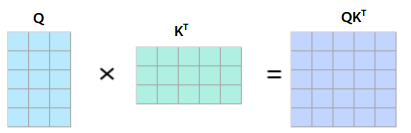

$QK^T$矩阵在attenMask为True的位置会被遮蔽，效果如下：

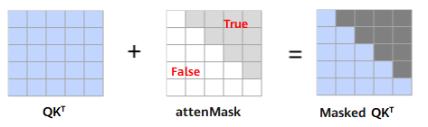

## sparseMode=0

sparseMode为0时，代表defaultMask模式。

- 不传mask：如果attenMask未传入则不做mask操作，attenMask取值为None，忽略preTokens和nextTokens取值。Masked $QK^T$矩阵示意如下：

  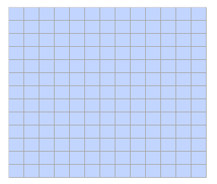

- nextTokens取值为0，preTokens大于等于Sq，表示causal场景sparse，attenMask应传入下三角矩阵，此时preTokens和nextTokens之间的部分需要计算，Masked $QK^T$矩阵示意如下：

  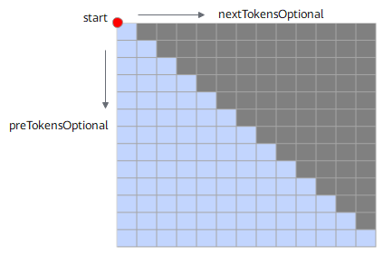 

  attenMask应传入下三角矩阵，示意如下：
  
  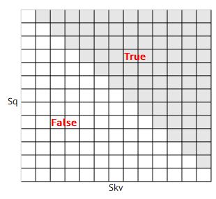

- preTokens小于Sq，nextTokens小于Skv，且都大于等于0，表示band场景，此时preTokens和nextTokens之间的部分需要计算。Masked $QK^T$矩阵示意如下：

  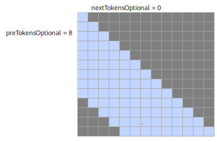     
  
  attenMask应传入band形状矩阵，示意如下：

  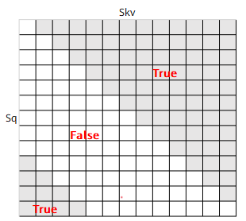

- nextTokens为负数，以preTokens=9，nextTokens=-3为例，preTokens和nextTokens之间的部分需要计算。Masked $QK^T$示意如下：

  **说明：nextTokens为负数时，preTokens取值必须大于等于nextTokens的绝对值，且nextTokens的绝对值小于Skv。**
  
  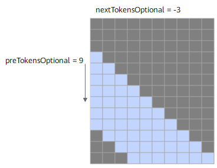 

- preTokens为负数，以nextTokens=7，preTokens=-3为例，preTokens和nextTokens之间的部分需要计算。Masked $QK^T$示意如下：

  **说明：preTokens为负数时，nextTokens取值必须大于等于preTokens的绝对值，且preTokens的绝对值小于Sq。**

  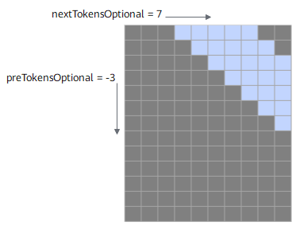 
  
## sparseMode=1

sparseMode为1时，代表allMask，即传入完整的attenMask矩阵。

该场景下忽略nextTokens、preTokens取值，Masked $QK^T$矩阵示意如下：

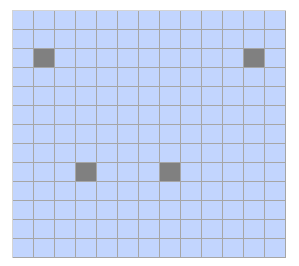 

## sparseMode=2

sparseMode为2时，代表leftUpCausal模式的mask，对应以左上顶点划分的下三角场景（参数起点为左上角）。

该场景下忽略preTokens、nextTokens取值，Masked $QK^T$矩阵示意如下：

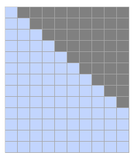

传入的attenMask为优化后的压缩下三角矩阵（2048\*2048），压缩下三角矩阵示意（下同）：

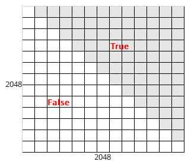 

## sparseMode=3

sparseMode为3时，代表rightDownCausal模式的mask，对应以右下顶点划分的下三角场景（参数起点为右下角）。

该场景下忽略preTokens、nextTokens取值。attenMask为优化后的压缩下三角矩阵（2048\*2048），Masked $QK^T$矩阵示意如下：

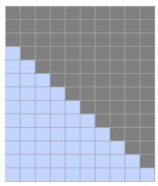

## sparseMode=4

sparseMode为4时，代表band场景，即计算preTokens和nextTokens之间的部分，参数起点为右下角，preTokens和nextTokens之间需要有交集。attenMask为优化后的压缩下三角矩阵（2048\*2048）。Masked $QK^T$矩阵示意如下：

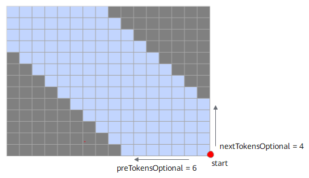

## sparseMode=5

sparseMode为5时，代表prefix非压缩场景，即在rightDownCausal的基础上，左侧加上一个长为Sq，宽为N的矩阵，N的值由可选输入prefix获取，例如下图中表示batch=2场景下prefix传入数组[4,5]，每个batch轴的N值可以不一样，参数起点为左上角。

该场景下忽略preTokens、nextTokens取值，attenMask矩阵数据格式须为BNSS或B1SS，Masked $QK^T$矩阵示意如下：

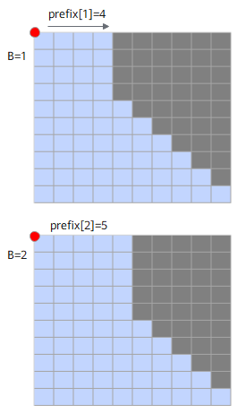

attenMask应传入矩阵示意如下：

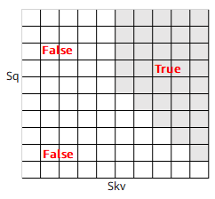

## sparseMode=6

sparseMode为6时，代表prefix压缩场景，即prefix场景时，attenMask为优化后的压缩下三角+矩形的矩阵（3072\*2048）：其中上半部分[2048, 2048]的下三角矩阵，下半部分为[1024, 2048]的矩形矩阵，矩形矩阵左半部分全0，右半部分全1，attenMask应传入矩阵示意如下。该场景下忽略preTokens、nextTokens取值。

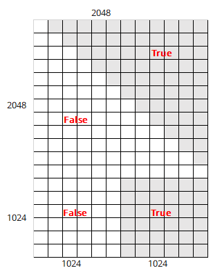

## sparseMode=7

sparseMode为7时，表示varlen且为长序列外切场景（即长序列在模型脚本中进行多卡切query的sequence length）；用户需要确保外切前为使用sparseMode 3的场景；当前mode下用户需要设置preTokens和nextTokens（起点为右下顶点），且需要保证参数正确，否则会存在精度问题。

Masked $QK^T$矩阵示意如下，在第二个batch对query进行切分，key和value不切分，4x6的mask矩阵被切分成2x6和2x6的mask，分别在卡1和卡2上计算：

- 卡1的最后一块mask为band类型的mask，配置preTokens=6（保证大于等于最后一个Skv），nextTokens=-2，actual_seq_qlen应传入{3,5}，actual_seq_kvlen应传入{3,9}。
- 卡2的mask类型切分后不变，sparseMode为3，actual_seq_qlen应传入{2,7,11}，actual_seq_kvlen应传入{6,11,15}。

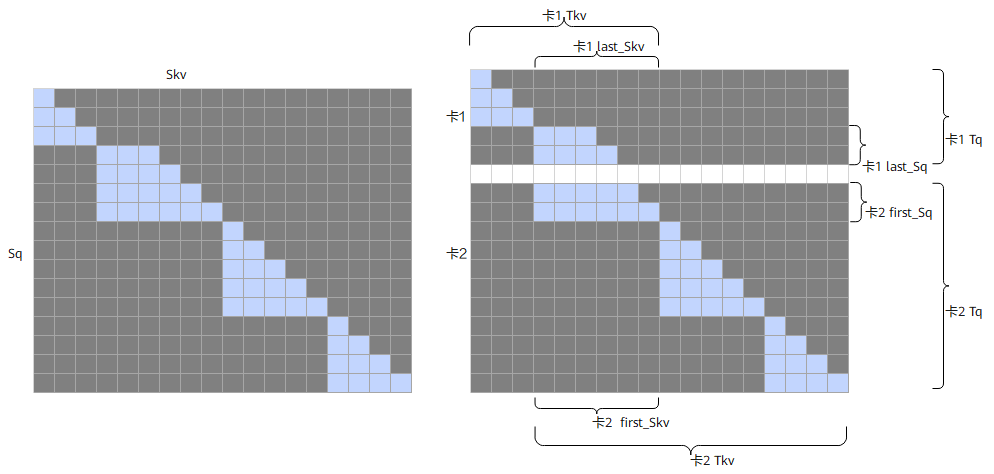

**说明**：

- sparseMode=7，band表示的是最后一个非空tensor的Batch的sparse类型；如果只有一个batch，用户需按照band模式的要求来配置参数；sparseMode=7时，用户需要输入2048x2048的下三角mask作为该融合算子的输入。
- 基于sparseMode=3进行外切产生的band模式的sparse参数应符合以下条件：
  - preTokens >= last_Skv。
  - last_Sq-last_Skv <= nextTokens <= 0。
  - 当前模式下不支持可选输入pse。
- 非band模式的batch应满足：Sq <= Skv。

## sparseMode=8

sparseMode为8时，表示varlen且为长序列外切场景；用户需要确保外切前为使用sparseMode 2的场景；当前mode下用户需要设置preTokens和nextTokens（起点为右下顶点），且需要保证参数正确，否则会存在精度问题。

Masked $QK^T$矩阵示意如下，在第二个batch对query进行切分，key和value不切分，5x4的mask矩阵被切分成2x4和3x4的mask，分别在卡1和卡2上计算：

- 卡1的mask类型切分后不变，sparseMode为2，actual_seq_qlen应传入{3,5}，actual_seq_kvlen应传入{3,7}。
- 卡2的第一块mask为band类型的mask，配置preTokens=4（保证大于等于第一个Skv），nextTokens=1，actual_seq_qlen应传入{3,8,12}，actual_seq_kvlen应传入{4,9,13}。

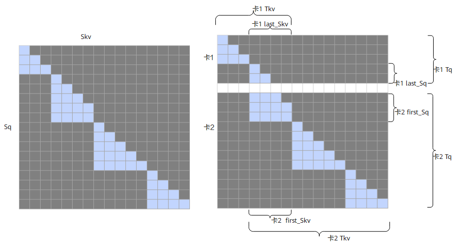

**说明**：

- sparseMode=8，band表示的是第一个非空tensor的Batch的sparse类型；如果只有一个batch，用户需按照band模式的要求来配置参数；sparseMode=8时，用户需要输入2048x2048的下三角mask作为该融合算子的输入。
- 基于sparseMode=2进行外切产生的band模式的sparse的参数应符合以下条件：
  - preTokens >= first_Skv。
  - nextTokens >= first_Sq - first_Skv，根据实际情况进行配置。
  - 当前模式下不支持可选输入pse。

## sparseMode=9

sparseMode为9时，代表treeMask模式，用于推测解码（speculative decoding）场景下的树形注意力掩码。用户需传入自定义的树形mask，mask中值为1的位置会被遮蔽。

树形mask矩阵特征如下：

- 对角线位置（s1==s2）：值为0，表示token关注自身。
- 上三角位置（s1<s2）：值为1，表示不关注未来token。
- 下三角位置（s1>s2）：值为0或1，由树结构决定部分注意力关系。

attenMask输入格式：

- inputLayout为BSH、BSND或BNSD时：attenMask的shape为(B, S1, S1)，每个batch传入S1×S1大小的tree mask。

  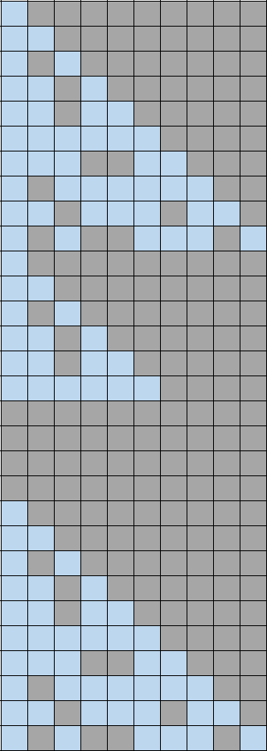

- inputLayout为TND时：attenMask为1D紧凑格式，shape为(∑S1i²,)，即每个batch的S1i×S1i mask拼接传入。

  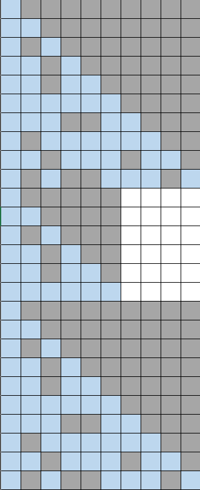

约束说明：

- 非量化场景支持GQA和MLA，全量化场景仅支持MLA。
- 不支持左padding、pseShift、sharedPrefix。
- 输出dtype不支持INT8。
- 每个batch需满足Q_S ≤ KV_S。
