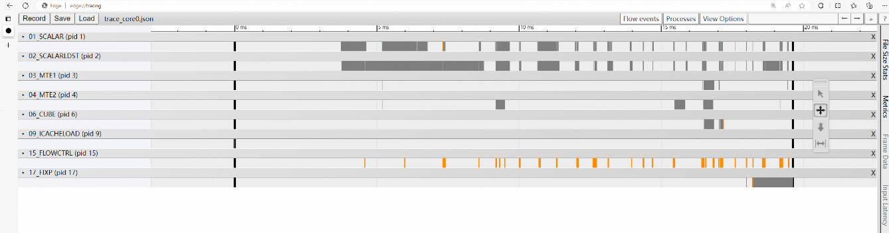

# 简介

CANN Simulator是一款面向算子开发场景的SoC级芯片仿真工具，用于分析运行在AI仿真器上的AI任务在各阶段的精度和性能数据（如指令执行情况等）。该工具有助于用户进行深度性能调优，使研发人员在无法获取或芯片资源紧缺的情况下，也能获得与真实芯片几乎一致的验证效果和性能反馈。

# 主要功能

该工具与板上运行保持二进制兼容（同一kernel可同时在仿真和AI处理器执行），主要用途如下：

* 精度仿真：输出bit级精度结果，协助用户完成算子的精度验证。
* 性能仿真：输出指令流水图，协助用户定位算子性能瓶颈问题。

# 使用前准备

## 使用约束

* 工具推荐环境配置：CPU 16核，内存32GB以上。
* 本文中举例路径均需要确保运行用户具有读或读写权限。
* 出于安全性和权限最小化考虑，建议使用普通用户权限执行本工具，避免使用root等高权限账户。
* 本工具依赖CANN软件包，在使用前请先安装CANN软件包，无需安装驱动和固件，并通过source命令执行CANN的set_env.sh环境变量文件。为确保安全，执行source命令后请勿修改set_env.sh中涉及的环境变量。
* 用户应遵循最小权限原则，例如，给工具输入的文件要求other用户不可写，在一些对安全要求更严格的功能场景下还需确保输入的文件group用户不可写。
* 本工具为开发工具，不建议在生产环境使用。
* 工具的仿真功能仅支持单卡场景，无法仿真多卡环境，代码中只能设置为0卡。若修改可见卡号，将导致仿真失败。
* 仿真环境仅支持AI Core计算类算子（不支持MC2和HCCL类型的算子）。
* CANN Simulator工具目前处于尝鲜版本阶段，仅支持Ascend950PR芯片，建议仿真器运行环境配置为16核CPU和32GB以上内存。
* 目前不支持arm环境仿真。

## 环境准备

CANN Simulator集成在CANN toolkit包里，参考[环境部署](../install/quick_install.md)完成软件包的安装

# 快速开始

下面以[add_examples](../../../examples/add_example/)为例，对算子仿真进行详细说明

## 算子编译

* 参考[算子调用](../invocation/quick_op_invocation.md)完成add_example的算子编译和安装

```bash
# 说明：进入项目根目录，执行如下编译命令，命令仅供参考，详细可以查看算子调用的说明。
bash build.sh --pkg --soc=Ascend950 --vendor_name=custom --ops=add_example
# 安装自定义算子包
./build_out/cann-ops-transformer-${vendor_name}_linux-${arch}.run
```

* 参考[aclnn调用](../invocation/quick_op_invocation.md)完成test_aclnn_add_example.cpp的编译，编出可执行文件test_aclnn_add_example

## 执行仿真命令

```bash
cannsim record ./test_aclnn_add_example -s Ascend950 --gen-report
```

仿真工具执行日志文件在examples/add_example/examples/build/bin/cannsim_*目录，执行日志文件为cannsim.log。


从仿真工具日志文件可以看到示例中的打印信息：

```bash
add_example first input[0] is: 1.000000, second input[0] is: 1.000000, result[0] is: 2.000000
add_example first input[1] is: 1.000000, second input[1] is: 1.000000, result[1] is: 2.000000
add_example first input[2] is: 1.000000, second input[2] is: 1.000000, result[2] is: 2.000000
add_example first input[3] is: 1.000000, second input[3] is: 1.000000, result[3] is: 2.000000
add_example first input[4] is: 1.000000, second input[4] is: 1.000000, result[4] is: 2.000000
add_example first input[5] is: 1.000000, second input[5] is: 1.000000, result[5] is: 2.000000
add_example first input[6] is: 1.000000, second input[6] is: 1.000000, result[6] is: 2.000000
```

## 查看性能流水

仿真性能流水文件在本项目`examples/add_example/examples/build/bin/cannsim_*/report目录，流水相关文件为：

```bash
trace_core0.json
```

在Chrome浏览器中输入“chrome://tracing”地址，并将生成的指令流水图文件（trace_core0.json）拖到空白处打开，具体参数介绍参考“仿真结果解析”章节。

# 仿真执行说明

## 命令功能

在仿真环境中执行应用程序。

## 命令格式

cannsim record [options] user_app

## 参数说明

表1 仿真执行参数说明

|参数|可选/必选|说明|
| --- | --- | --- |
|-s或 --soc-version | 必选 | 指定模拟目标芯片版本（如：Ascend950）。|
|-o或 --output | 可选 | 生成文件所在路径，可配置为绝对路径或者相对路径，并且执行工具的用户需要具有读写权限。如果未指定路径，则默认在当前目录下保存数据。|
|-g或 --gen-report | 可选 | 启用仿真完成后是否进行自动解析，并生成分析报告。默认不自动解析。|
|-u或 --user-option | 可选 | 用户自定义算子参数，以命令行选项形式传递给算子程序。|
|-n或 --core-id | 可选 | 仿真期间启用日志的AI Core，格式同report -n：'all'、'0-2,12-14'、'5'。默认全开；配合 -g且未指定时回退到core 0。|
|user_app|必选|待运行的算子程序或命令（如 ./app, python train.py, bash run.sh）。|

## 使用示例

1. 完成算子开发和编译。
2. 执行仿真命令，可参考以下使用示例

    ```bash
    方式一：启用仿真，并将输出保存至 ./output目录，/path/to/app为算子程序
    $ cannsim record /path/to/app -o ./output -s Ascend950

    方式二：启用仿真并生成报告，用于后续性能分析
    $ cannsim record /path/to/app -o ./output -s Ascend950 --gen-report
    ```

3. 命令完成后，会在默认路径或指定的“output”目录下生成以“cannsim_{timestamp}_${user_app}”命名的文件夹，结构示例如下：

```bash
├─cannsim_{timestamp}_${user_app}
├── cannsim.log
```

4. 用户可以获取算子执行结果，并进行精度的对比，结果展示在cannsim.log，示例如下

    以下输出仅为Ascend C单算子直调精度比较结果举例，因版本不同略有差异，请以实际输出为准。

    ```bash
    INFO:root:[INFO] compare data case[ case001]
    INFO:root:---------------RESULT---------------
    INFO:root:['case_name', 'wrong_num', 'total_num', 'result', 'task_duration']
    INFO:root:[' case001', 0, 65536, 'Success']
    ```

5. 查看算子指令流水图，参考仿真结果解析。

# 仿真结果解析说明

## 命令功能

生成可视化的指令流水图。

## 命令格式

cannsim report [options]

## 参数说明

表1 仿真结果解析参数说明

|参数 | 可选/必选 | 说明|
| --- | --- | --- |
|-e或 --export | 必选 | 仿真执行结果目录，指定到cannsim_{timestamp}_${user_app}层，可配置为绝对路径或者相对路径，且执行用户需具有读写权限。|
|-o或 --output | 可选 | 指令流水图输出目录，可配置为绝对路径或者相对路径，且执行用户需具有读写权限。若未指定路径，默认与export目录相同。|
|-n或 --core-id | 可选 | 指定生成指令流水的核ID，支持格式：'all'、'0-2,12-14'、'5'。不指定默认生成0核的指令流水。|
|-f或 --object-file | 可选 | 设备对象文件路径，用于辅助生成报告。|

## 使用示例

1. 参考仿真执行执行算子仿真，对比输出示例，确保对应的结果执行正确。
2. 执行仿真结果解析命令，可参考以下执行用例。

    ```bash
    在当前目录下生成性能分析报告（默认仅分析核0）
    cannsim report -e /path/to/cannsim_{timestamp}_${user_app} 

    在指定目录下生成核0、核1、核11、核12的性能分析报告
    cannsim report -e /path/to/cannsim_{timestamp}_${user_app} -o /path/to/report -n '0-1, 11-12'
    ```

3. 命令执行完后，会在output配置的目录下生成对应的流水文件，文件格式为json格式，输出结果示例如下：

    ```bash
    trace_core0.json
    trace_core1.json
    ...
    ```

4. 仿真结果查看
    在Chrome浏览器中输入“chrome://tracing”地址，并将生成的指令流水图文件（trace.json）拖到空白处打开，键盘上输入快捷键（W：放大，S：缩小，A：左移，D：右移）可进行查看。
    

    表2 关键字段说明

    |字段名|字段含义|
    | --- | --- |
    |VECTOR|向量运算单元。|
    |SCALAR|标量运算单元。|
    |Cube|矩阵乘运算单元。|
    |MTE1|数据搬运流水，数据搬运方向为：L1 ->{L0A/L0B, UBUF}。|
    |MTE2|数据搬运流水，数据搬运方向为：{DDR/GM, L2} ->{L1, L0A/B, UBUF}。|
    |MTE3|数据搬运流水，数据搬运方向为：UBUF -> {DDR/GM, L2, L1}、L1->{DDR/L2}。|
    |FIXP|数据搬运流水，数据搬运方向为：FIXPIPE L0C -> OUT/L1。|
    |FLOWCTRL|控制流指令。|
    |ICACHELOAD|查看未命中的ICache。|

# 查询帮助信息

## 命令功能

查询工具帮助信息。

## 命令格式

查询工具帮助信息：

```bash
cannsim --help
```

查询工具record子命令的帮助信息：

```bash
cannsim record --help
```
  
查询工具report子命令的帮助信息：

 ```bash
 cannsim report --help 
 ```

## 参数说明

无

## 使用示例

1. 登录Host侧服务器。
2. 执行以下命令。

    ```bash
    cannsim --help
    ```

## 输出说明

```bash
usage: cannsim [-h] {record,report} ...

Command-line tool for performance simulation analysis on Ascend hardware.

positional arguments:
  {record,report}  Available commands
    record         Run user application in AscendOps simulation environment
    report         Generate performance analysis reports

options:
  -h, --help       show this help message and exit
```
