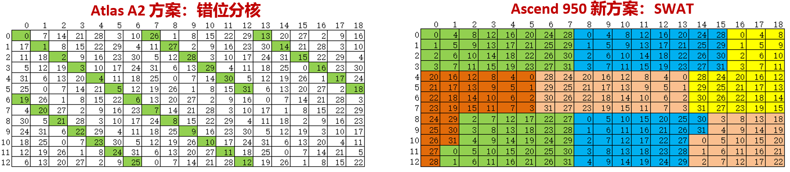
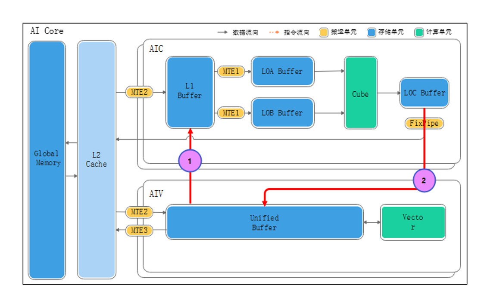

# 算子跨平台迁移指导

本指南介绍算子在多平台间迁移的适配要点与方案。以算子从Atlas A2系列迁移至Ascend 950系列为例，对比硬件架构差异项及所涉适配点，并提供相关算子适配样例。


## 一、硬件架构及规格参数对比
### Atlas A2 系列硬件架构
<div align="center">
  
</div>

### Ascend 950 系列硬件架构
<div align="center">
  
</div>

### 代际规格参数对比

通常根据不同的应用场景、工艺或硬件配置划分为多个产品型号，各型号在性能、资源配置等方面可能存在一定差异。为便于说明与直接对比，本节选择代表性配置作为参数展示与差异解析对象，其他相关调整请以实际手册或官方发布为准。

<table>
  <tr>
    <th colspan="2" style="width: 25%;">规格项</th>
    <th style="width:37.5%;">Atlas A2</th>
    <th style="width:37.5%;">Ascend 950</th>
  </tr>
  <tr>
    <td rowspan="4">AICore</td>
    <td>核数</td>
    <td>24</td>
    <td>32</td>
  </tr>
  <tr>
    <td>频率</td>
    <td>1.8</td>
    <td>1.65</td>
  </tr>
  <tr>
    <td>Cube算力规格</td>
    <td>353T/376T @BF16,FP16</td>
    <td>426T@BF16,FP16 757T@FP8,HIFP8,MXFP8,INT8 1514T@MXFP4</td>
  </tr>
  <tr>
    <td>Vector算力规格(FP16)</td>
    <td>23.5T</td>
    <td>54T</td>
  </tr>
  <tr>
    <td rowspan="2">Memory</td>
    <td>Memory容量(GB)</td>
    <td>64</td>
    <td>128</td>
  </tr>
  <tr>
    <td>Memory带宽</td>
    <td>1.6TB/s</td>
    <td>1.6TB/s</td>
  </tr>
</table>

## 二、硬件能力变更引入适配点

<table>
  <tr>
    <th style="width: 25%;">硬件单元</th>
    <th style="width:35%;">硬件能力变更</th>
    <th style="width:40%;">典型影响范围</th>
  </tr>
  <tr>
    <td rowspan="5">搬运单元</td>
    <td>删除L1到GM的数据通路</td>
    <td>依赖L1直接回写GM的kernel需改为L1→UB→GM或L0C/FIXPIPE→GM路径；相关DataCopy链路、事件同步与缓冲规划需调整</td>
  </tr>
  <tr>
    <td>删除GM到L0A、L0B的数据通路</td>
    <td>GM→L0A/L0B直连不再可用，需通过GM→L1→L0A/L0B完成；L1切块策略和MTE1/2流水需重构</td>
  </tr>
  <tr>
    <td>ND DMA灵活数据搬运，支持随路ND->NZ转换</td>
    <td>可用ND2NZ/DN2NZ在MTE2阶段完成格式转换，减少中间buffer和格式转换开销；需关注步长、对齐与NZ形状映射</td>
  </tr>
  <tr>
    <td>支持Cube-&gt;Vector高效内部 数据通路:L1&lt;-&gt;UB、L0C-&gt;UB、FIXP-&gt;UB</td>
    <td>可在UB侧做中间累加/激活/融合（如切K累加、后处理），减少GM往返；对应同步与管线切分需调整</td>
  </tr>
  <tr>
    <td>引入集合通信加速器CCU1.0</td>
    <td>通算融合算子在Eager模式下调整HcclServerType；在Graph模式下改用CCU系列GE接口</td>
  </tr>
  <tr>
    <td rowspan="3">计算单元</td>
    <td>Vector新增Regbase范式</td>
    <td>原依赖Membase的访存pattern、对齐方式、寄存器数量假设等需要重新审查；模板/tiling可能需要更新到Regbase版本</td>
  </tr>
  <tr>
    <td>Cube不再支持int4_t</td>
    <td>所有使用int4_t的算子需要切换到支持的数据类型（如int8），并更新量化解算逻辑</td>
  </tr>
  <tr>
    <td>不支持4：2稀疏矩阵计算</td>
    <td>原依赖4：2稀疏特性提速的kernel需要改为稠密或其他支持的稀疏策略，并更新性能预期说明</td>
  </tr>
  <tr>
    <td rowspan="1">存储单元</td>
    <td>Local Buffer内存改进：Cube L0C 256KB、Vector UB 256KB</td>
    <td>更大L0C/UB允许增大基本块与双缓冲容量，减少切K/切块轮次；需重新评估L1/L0/UB配比与tile尺寸</td>
  </tr>
  <tr>
    <td rowspan="2">其他</td>
    <td>多核同时访问Global Memory同地址性能优化</td>
    <td>涉及矩阵乘相关算子的模板可优化</td>
  </tr>
  <tr>
    <td>SIMT</td>
    <td>SIMT引入后可用线程级并行处理分支/不规则计算，但需要适配线程划分、共享内存与同步语义；部分Vector实现可迁移为SIMT版本</td>
  </tr>
</table>


## 三、推荐迁移步骤
1. 确认算子涉及的计算单元（Cube/Vector）和对应单元支持的数据类型是否在平台间存在差异。
2. 确认涉及的数据搬运单元（ND-&gt;NZ、GM&lt;-&gt;Lx、集合通信等）是否在平台间存在差异。
3. 按硬件能力变更点逐项对照修改（Vector架构、Cube支持数据类型、L1/L0/UB大小、CCU通信等）。
4. 参考算子迁移样例调整/补齐Atlas A2/Ascend 950 分支逻辑。

## 四、算子迁移样例

### Cube矩阵计算类算子

#### Global Memory同地址访问冲突优化

Ascend 950硬件新增同地址请求并行处理特性，不需要在各种分核场景额外规避同地址访问冲突。迁移时可将Atlas A2上为“错位规避冲突”设计的分核策略简化为更规则的滑动窗口模板（如行组窗口+列向往返扫描），减少无效偏移与冗余地址变换。实践中建议先以功能等价为目标保留原tile尺寸，再逐步放开分核约束，结合profiling数据观察MAC利用率、MTE2利用率、L2命中率等关键指标，确认模板调整是否带来稳定收益。

<div align="center">
  
</div>

#### Tile尺寸大小调整
Atlas A2上L0C大小为128KB，Ascend 950提升到256KB，意味着单次可承载更大的累加结果块。迁移时可优先增大Tile块切分粒度或提高K方向单轮处理深度，以减少切块与切K轮次，降低循环控制和搬运开销。同时需要重新平衡L1/L0/UB容量预算，避免L0C放大后挤压A/B/scale缓冲导致流水断点。


### Vector向量计算类算子
#### SIMT
Ascend 950系列新增了SIMT单元。SIMT在处理非规整离散访问方面相比SIMD有较大优势，适合地址不连续、访存跨度变化大、分支路径不一致的场景（如scatter/gather、索引重排、稀疏更新等）。

迁移时建议优先识别“访存主导”且“向量化效率低”的算子子流程：若原有SIMD实现存在大量掩码分支、无效lane占比高、或需要复杂地址拼装，可将该部分改写为SIMT路径，通常可降低控制开销并提升有效访存吞吐。

实践中需重点关注以下事项：一是线程任务切分要与数据稀疏性匹配，避免线程负载极不均衡；二是减少高频随机访存导致的流水空转，尽量在上游完成索引规整与分桶；三是将边界处理与主路径解耦，避免在热点循环中引入过多分支。建议在迁移后同时对比“纯SIMD实现”和“SIMD+SIMT混合实现”，按数据分布选择最优策略，而非固定单一路径。

**以gather_v2算子为例：SIMD与SIMT实现对比**

gather_v2算子根据合轴后的尾轴为单位进行gather，因此模板选择的依据是：尾轴 ≤ 2048时走SIMT模板，尾轴 > 2048时走SIMD模板。因为尾轴小时，需要离散访问多个不连续的小块地址，simt效率高。以下对比两种实现的核心差异：

**1. 编程模型差异**

SIMD实现采用传统的向量化编程模型，需显式管理UB缓冲区和流水队列：
```cpp
// SIMD: 使用队列机制管理数据缓冲
TQueBind<QuePosition::VECIN, QuePosition::VECOUT, BUFFER_NUM> inQueue_;
TBuf<QuePosition::VECCALC> indexBuf_;

// SIMD: 逐行处理，显式搬运和同步
for (int64_t j = 0; j < rows; j++) {
    INDICES_T index = GetIndex(yIdx, indiceEndIdx);  // 标量读取索引
    int64_t xIndex = index * tilingData_->innerSize;
    DataCopyPad(xLocal[j * colsAlign], xGm[offset], dataCoptExtParams, dataCopyPadExtParams); // 批量连续数搬入
}
inQueue_.EnQue<int8_t>(xLocal);  // 入队等待输出
```

SIMT采用线程级并行模型，每个线程独立处理元素：
```cpp
// SIMT: 使用线程级并行，无需显式buffer管理
__simt_vf__ LAUNCH_BOUND(2048) void GatherSimt(...) {
    for (INDEX_SIZE_T index = Simt::GetThreadIdx(); 
         index < currentCoreElements;
         index += Simt::GetThreadNum()) {  // 线程跳跃式并行
        // 每个线程独立计算单点索引并访问
        INDEX_SIZE_T gatherI = Simt::UintDiv(yIndex, m0, shift0);
        INDICES_T indicesValue = indices[gatherI];  // 根据单点索引gatherI直接访问GM
        y[yIndex] = idxOutOfBound ? 0 : x[xIndex];  // 直接写回GM
    }
}
```

**2. 访存模式差异**

| 特性 | SIMD实现 | SIMT实现 |
|------|----------|----------|
| 数据访问 | 通过DataCopyPad显式搬运到UB | 线程直接通过`__gm__`指针访问GM |
| Buffer管理 | 需AllocTensor/EnQue/DeQue/FreeTensor | 无需显式buffer，硬件自动管理 |
| 同步机制 | 显式事件同步（HardEvent::MTE2_V等） | 线程间隐式同步 |

**3. 适用场景差异**

SIMD适合连续访问大块地址的场景，通过向量化指令高效处理连续数据；

SIMT适合离散访存，线程并行处理；


#### Regbase
Ascend 950系列引入了Regbase编程范式，相比传统的Membase（Vector API）编程，Regbase更接近底层硬件的寄存器操作，提供更精细的向量化控制能力。

**特点**

- 使用`AscendC::MicroAPI`命名空间下的底层API
- 直接操作寄存器`RegTensor<T>`而非显式管理UB缓冲队列
- 通过`MaskReg`实现灵活的元素级掩码控制

**与Membase编程模型对比**

| 特性 | Membase（传统Vector API） | Regbase（MicroAPI） |
|------|---------------------------|---------------------|
| 数据载体 | `LocalTensor<T>` + Queue机制 | `RegTensor<T>`寄存器 |
| 内存管理 | 显式Alloc/EnQue/DeQue/Free | 寄存器自动分配 |
| 掩码控制 | 函数参数控制 | `MaskReg`寄存器控制 |
| 数据搬运 | `DataCopy`/`DataCopyPad` | `MicroAPI::DataCopy` + 分发模式 |

**代码示例**

```cpp
__simd_vf__ __aicore__ void GenIndexBuf(ubuf int32_t* helpAddr, int32_t colFactor)
{
    // 声明寄存器张量
    AscendC::MicroAPI::RegTensor<int32_t> v0;
    AscendC::MicroAPI::RegTensor<int32_t> v1;
    AscendC::MicroAPI::RegTensor<int32_t> vd1;
    
    // 创建全量掩码
    AscendC::MicroAPI::MaskReg preg = 
        AscendC::MicroAPI::CreateMask<int32_t, AscendC::MicroAPI::MaskPattern::ALL>();
    
    // 标量复制到寄存器
    AscendC::MicroAPI::Duplicate(v1, colFactor, preg);
    // 生成序列 [0, 1, 2, ...]
    AscendC::MicroAPI::Arange(v0, 0);
    // 向量运算
    AscendC::MicroAPI::Div(vd1, v0, v1, preg);
    AscendC::MicroAPI::Mul(vd2, vd1, v1, preg);
    AscendC::MicroAPI::Sub(vd3, v0, vd2, preg);
    // 寄存器数据写回UB
    AscendC::MicroAPI::DataCopy(helpAddr, vd3, preg);
}
```

```cpp
// 动态掩码：处理尾部不完整数据
__simd_vf__ __aicore__ void GatherProcess(ubuf int8_t* curYAddr, uint16_t repeatimes, uint16_t computeSize)
{
    MicroAPI::RegTensor<int8_t> vregTemp;
    MicroAPI::MaskReg preg;
    
    for (uint16_t r = 0; r < repeatTimes; r++) {
        // 根据剩余元素数更新掩码
        preg = MicroAPI::UpdateMask<int8_t>(sreg);
        // 创建地址偏移寄存器
        MicroAPI::AddrReg offset = MicroAPI::CreateAddrReg<int8_t>(r, computeSize);
        MicroAPI::DataCopy(vregTemp, curXAddr, offset);
        // 带掩码的数据存储
        MicroAPI::DataCopy(curYAddr, vregTemp, offset, preg);
    }
}
```

```cpp
// 数据聚合
__VEC_SCOPE__
{
    MicroAPI::RegTensor<uint32_t> indicesReg;
    MicroAPI::RegTensor<int32_t> vd0;
    
    for (uint16_t indices = 0; indices < indicesLoopNum; indices++) {
        // 加载索引（E2B分发模式：将标量广播到向量）
        MicroAPI::DataCopy<uint32_t, MicroAPI::LoadDist::DIST_E2B_B32>(indicesReg, indicesAddr);
        // 根据索引进行Gather数据聚合
        MicroAPI::DataCopyGather(vd0, curXAddr, indicesReg, preg);
        // 数据块拷贝输出
        MicroAPI::DataCopy<int32_t, MicroAPI::DataCopyMode::DATA_BLOCK_COPY>(
            curYAddr, vd0, blockStride, preg);
    }
}
```

**关键Regbase API说明**

| API分类 | API名称 | 功能说明 |
|---------|---------|----------|
| 寄存器类型 | `RegTensor<T>` | 向量寄存器张量类型 |
| 掩码类型 | `MaskReg` | 掩码寄存器类型 |
| 掩码创建 | `CreateMask<T, Pattern>()` | 创建掩码（ALL/HALF等模式） |
| 掩码更新 | `UpdateMask<T>(count)` | 根据剩余元素数动态更新掩码 |
| 标量操作 | `Duplicate(reg, val, mask)` | 将标量值复制到寄存器所有元素 |
| 序列生成 | `Arange(reg, start)` | 生成连续序列 |
| 算术运算 | `Add/Sub/Mul/Div(dst, src1, src2, mask)` | 向量算术运算 |
| 标量运算 | `Adds/Muls(dst, src, scalar, mask)` | 向量与标量运算 |
| 类型转换 | `Cast<DT, ST>(dst, src, mask)` | 数据类型转换 |
| 比较运算 | `Compare<T, CMPMODE>(mask, src1, src2, pred)` | 向量比较生成掩码 |
| 数据加载 | `DataCopy<T, LoadDist>(reg, addr)` | 从UB加载到寄存器 |
| 数据存储 | `DataCopy<T>(addr, reg, mask)` | 从寄存器存储到UB |
| Gather | `DataCopyGather(dst, base, indices, mask)` | 根据索引收集数据 |
| 地址偏移 | `CreateAddrReg<T>(loop, stride)` | 创建循环地址偏移寄存器 |

**分发模式（LoadDist）说明**

| 模式 | 说明 | 典型用途 |
|------|------|----------|
| `DIST_NORM` | 正常连续加载 | 连续数据处理 |
| `DIST_UNPACK_B16` | 16位解包加载 | FP16/BF16转FP32 |
| `DIST_BRC_B32/B16` | 广播加载 | 标量scale广播 |
| `DIST_E2B_B32` | 标量到向量广播 | 索引值广播 |

**迁移建议**

1. 适合Regbase的场景：需要精细控制寄存器分配、复杂掩码逻辑、Gather/Scatter访存模式
2. 保留Membase的场景：简单的连续数据搬运和计算、双缓冲流水线
3. 混合使用：可在同一算子中结合两种范式，用Regbase处理核心计算逻辑，用Membase管理数据搬运

### Cube-Vector融合类算子
#### MTE数据搬运路径变化
Ascend 950新架构引入UB2L1 & L0C2UB间的直连通路，实现矩阵计算数据的快速搬移，旨在简化CV融合算子开发并提升性能。
<div align="center">
  
</div>

**矩阵搬入**

启用UB至L1（UB2L1）直连通路，通过DataCopy接口，支持融合算子的向量计算结果直接搬入L1。

**矩阵搬出**

启用L0C至UB（L0C2UB）直连通路，通过DataCopy接口，支持融合算子的矩阵计算结果直接搬入UB进行后续向量计算。 

对于切K或多阶段融合场景，可将“L0C搬回GM再读回UB”改为“L0C直达UB累加/后处理”，降低GM往返带宽压力和时延。迁移时建议把中间结果归并、激活/量化前处理放到UB侧完成，并显式梳理MTE1/MTE2/MTE3与计算单元的事件同步顺序，确保跨单元流水连续，避免由于新增通路引入数据可见性或同步时序问题。关键开启接口定义可参考：
```cpp
// 1. 新增: 搬入接口增加UB2L1的Nd2Nz搬入，支持Src&Dst都是LocalTensor的形式
template <typename T>   
__aicore__ inline void DataCopy(const LocalTensor<T>& dst, const LocalTensor<T>& src, const Nd2NzParams& intriParams)；

// 2. 新增: 搬出接口增加L0C2UB的搬出，支持直接从L0C搬出到UB,支持Src&Dst都是LocalTensor的形式
template <typename T, typename U, const FixpipeConfig& config = CFG_ROW_MAJOR>
__aicore__ inline void Fixpipe(const LocalTensor<T>& dst, const LocalTensor<U>& src, const FixpipeParamsC310<config.format>& intriParams);
template <CO2Layout format = CO2Layout::ROW_MAJOR>
struct FixpipeParamsC310 {
    // ... 
    uint8_t dualDstCtl = 0;
};

// 3. 能力增强: 核间同步接口新增模式3
template <uint8_t modeId, pipe_t pipe>
__aicore__ inline void CrossCoreSetFlag(uint16_t flagId)
template <uint8_t modeId = 0, pipe_t pipe = PIPE_S>
__aicore__ inline void CrossCoreWaitFlag(uint16_t flagId)

```

#### 核间同步信号量匹配
`CrossCoreSetFlag`和`CrossCoreWaitFlag`是核间同步信号量接口，广泛用于多核间的数据依赖与协同控制。本质上以“信号量”的方式实现不同AICore之间的数据处理阶段解耦与有序推进，常用于流水线控制、双缓冲切换、跨核协作等场景。

- `CrossCoreSetFlag`：当前核（或线程）在完成某个阶段的数据处理后，主动设置指定的flag信号，告知依赖方（一般是其它核或下游流水线阶段）本阶段已完成，可以继续执行后续流程。
- `CrossCoreWaitFlag`：当前核（或线程）需等待某个flag信号被设置（即依赖的数据或事件完成），检测flag后才会继续向下执行。

这套信号量的本质是保证多线程/多流水阶段间一致的同步序列，防止因资源未就绪或依赖没完成而发生数据竞争或死锁等硬件异常。详细的接口说明可参考官方文档：[CrossCoreSetFlag与CrossCoreWaitFlag核间同步接口详解](https://www.hiascend.com/document/detail/zh/CANNCommunityEdition/900beta1/API/ascendcopapi/atlasascendc_api_07_0273.html)。


在Ascend 950上`CrossCoreWaitFlag`和`CrossCoreSetFlag`数量必须严格匹配，且建议在同一同步语义域内按“先生产后消费”的顺序成对设计。Atlas A2上算子与算子间若存在多余`CrossCoreSetFlag`信号量，HWTS会进行特殊处理清零计数器，Ascend 950系列为减少硬件开销，不再依赖该类兜底机制，要求单算子内核间同步信号量一一匹配，否则会出现必现卡死。

迁移时请重点排查以下问题：其一，异常分支提前返回导致只执行`Set`未执行对应`Wait`（或反之）；其二，多stage流水复用同一`flagId`但生命周期重叠，造成“跨阶段串扰”；其三，循环内条件触发同步但循环边界未对齐，导致迭代次数不一致。以上问题在Atlas A2上可能被掩盖，在Ascend 950上会直接暴露为阻塞超时或死锁。对跨核流水较复杂的算子，可先构建最小数据集进行单stage验证，再逐步叠加双缓冲和多stage，以降低定位同步问题的复杂度。

### 集合通信类算子

Ascend 950引入集合通信加速器CCU1.0，降低了访存需求，减少了调度时延，为有效利用该特性，将算子跨片通信方式由A2的AICPU改为CCU通信。

**Eager模式**

在aclnn两段式接口中的第二段接口中，为算子执行器aclOpExecutor指定集合通信类型。

以[MatmulAllReduce](https://gitcode.com/cann/ops-transformer/tree/master/mc2/matmul_all_reduce)算子迁移适配为例：
设置NnopbaseSetHcclServerType枚举值，A2为NNOPBASE_HCCL_SERVER_AICPU，950为NNOPBASE_HCCL_SERVER_TYPE_CCU。
```CPP
// ...
aclnnStatus aclnnMatmulAllReduce(
    void* workspace, uint64_t workspaceSize, aclOpExecutor* executor, const aclrtStream stream)
{
    // ...
    if (NnopbaseSetHcclServerType) {
        if (op::GetCurrentPlatformInfo().GetCurNpuArch() == NpuArch::DAV_3510) {
            NnopbaseSetHcclServerType(executor, NnopbaseHcclServerType::NNOPBASE_HCCL_SERVER_TYPE_CCU);
        }
    }
    // ...
    return ACLNN_SUCCESS;
}
```

**Graph模式**

1. 用于资源计算与申请，涉及附属流相关信息的CalcParamFunc回调接口中，为GE的上下文context区分附属流的集合通信类型。
2. 用于设置主流/附属流上自定义任务、参数定制的GenerateTask回调接口中，区分两套GE的KernelLaunch接口，分别调用AICPU通信或CCU通信的创建及定制流程。

静态图GE侧创建通信task的任务类型，A2为aicpu kfc server + kfc_stream；950为ccu server + ccu_stream。涉及代码文件：[matmul_all_reduce_gen_task.cpp](https://gitcode.com/cann/ops-transformer/blob/master/mc2/matmul_all_reduce/op_graph/matmul_all_reduce_gen_task.cpp)

```CPP
// ...
ge::Status MatmulAllReduceCalcParamFunc(gert::ExeResGenerationContext *context)
{
    if (Mc2GenTaskOpsUtils::IsTargetPlatformNpuArch(context->GetNodeName(), NPUARCH_A5)) {
        // 950
        return Mc2GenTaskOpsUtils::CommonKFCMc2CalcParamFunc(context, "ccu server", "ccu_stream");
    }
    // A2
    return Mc2GenTaskOpsUtils::CommonKFCMc2CalcParamFunc(context, "aicpu kfc server", "kfc_stream");
}
// ...
```

静态图GenTask调用接口有区别，流程有差异。涉及代码文件：[matmul_all_reduce_gen_task.cpp](https://gitcode.com/cann/ops-transformer/blob/master/mc2/matmul_all_reduce/op_graph/matmul_all_reduce_gen_task.cpp)

```CPP
// ...
// A2
ge::Status MatmulAllReduceGenTaskOpsUtils::MatmulAllReduceGenTaskCallback(
    const gert::ExeResGenerationContext *context, std::vector<std::vector<uint8_t>>& tasks) {
    // ...
    // aicpu task
    ge::KernelLaunchInfo aicpu_task =
        ge::KernelLaunchInfo::CreateAicpuKfcTask(context, SO_NAME.c_str(), KERNEL_NAME_V1.c_str());
    // ...
}

// 950
ge::Status Mc2Arch35GenTaskOpsUtils::Mc2Arch35GenTaskCallBack(const gert::ExeResGenerationContext *context, std::vector<std::vector<uint8_t>> &tasks) {
    // ...
    // ccu task
    ge::KernelLaunchInfo ccuTask = ge::KernelLaunchInfo::CreateCcuTask(context, ccuGroups);
    // ...
}

ge::Status MatmulAllReduceGenTaskFunc(const gert::ExeResGenerationContext *context, std::vector<std::vector<uint8_t>> &tasks)
{
    if (Mc2GenTaskOpsUtils::IsTargetPlatformNpuArch(context->GetNodeName(), NPUARCH_A5)) {
        // 950
        return Mc2Arch35GenTaskOpsUtils::Mc2Arch35GenTaskCallBack(context, tasks);
    }
    // A2
    return MatmulAllReduceGenTaskOpsUtils::MatmulAllReduceGenTaskCallback(context, tasks);
}
// ...
```


## 五、常见问题与性能调优建议（FAQ/性能小贴士）

若算子在Ascend 950上性能不升反降时，可优先排查：

1. 是否仍然使用Atlas A2的错位分核模板
2. 是否未开启CCU通信仍走AICPU
3. tiling是否沿用了Atlas A2的L1/L0/UB切分策略，导致Ascend 950更大的片上缓存未被充分利用