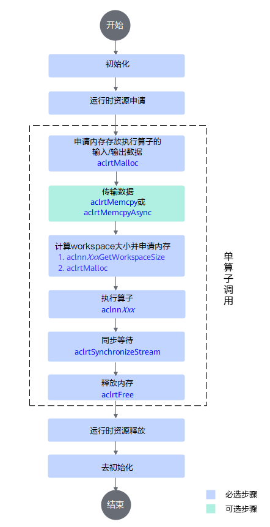
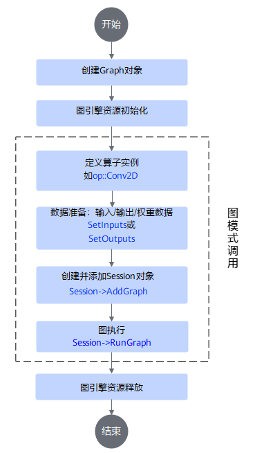

# 算子调用

## 使用须知

- 前提说明：算子调用前，请参考本项目README完成环境准备和源码下载，此处不再赘述。

- 调用范围：支持调用的内置算子清单参见[算子列表](../op_list.md)，还支持调用自定义算子（如experimental目录下贡献算子）。

- 调用场景：请根据实际场景诉求选择合适的算子调用方案。

   |调用场景|场景说明|特点|
   |--------|----|-----|
   |[快速调用算子](#快速调用算子)|适用于快速体验和验证算子功能的场景。|**无需搭建调用工程**，基于源码编译包和项目脚本build.sh可直接调用算子样例。|
   |[业务应用集成算子](#业务应用集成算子)|适用于将算子灵活集成到实际业务应用中。|**需自行搭建调用工程**，手动创建调用脚本/CMake工程，灵活实现算子编译和运行。|

- 调用方式：当前主要提供如下算子调用方式，请按需选择。

  |调用方式|说明|
  |--------|----|
  |[PyTorch API](#pytorch-api)|将算子Kernel注册到PyTorch原生框架，以类似于Torch原生API方式实现算子调用。|
  |[aclnn API](#aclnn-api)|针对算子提供相应的C语言API（前缀为aclnn），无需提供IR定义，实现API直接调用算子。|
  |[GE图模式](#ge图模式)|通过算子IR（Intermediate Representation）定义，以构图方式实现算子调用。|

## 快速调用算子

**如需快速体验或验证项目中已有算子功能，可参考本章最简调用方法，通过build.sh执行算子样例**。

该方法特点是无需搭建调用工程（即创建编译/运行脚本等），简单易操作。

> **说明**：对于Ascend 950PR产品，可通过Simulator仿真工具执行算子样例，详见[仿真指导](../debug/op_debug_prof.md#方式二-仿真流水图采集)。

**步骤1**：环境准备。在调用算子前，请先确保您的环境已安装CANN-toolkit包和编译好的算子包。

**步骤2**：执行项目中已有算子的样例。

- 基于**自定义算子包**执行算子样例，命令如下：

    ```bash
    bash build.sh --run_example ${op} ${mode} ${pkg_mode} [--vendor_name=${vendor_name}] [--soc=${soc_version}]
    # 以FlashAttentionScore算子example执行为例
    # bash build.sh --run_example flash_attention_score eager cust --vendor_name=custom
    ```

  - \$\{op\}：表示待执行算子，算子名为小写下划线形式，如flash_attention_score。
  - \$\{mode\}：表示调用方式，目前支持eager（aclnn调用）、graph（图模式调用）。
  - \$\{pkg_mode\}：表示包模式，目前仅支持cust，即自定义算子包。
  - \$\{example_name\}（可选）：表示待执行样例名，名称为各个算子examples文件夹下的文件名称，去掉`test_aclnn_`前缀和`.cpp`后缀。
  - \$\{vendor\_name\}（可选）：与构建的自定义算子包设置一致，默认名为custom。
  - \$\{soc_version\}（可选）：表示NPU型号，默认"ascend910b"。当设置为"ascend950"时会运行"arch35"目录下的示例文件。
  - \$\{simulator\}（可选）：表示仿真模式，目前仅支持eager（aclnn调用）场景下使用。仿真模式下，会根据soc_version链接对应的仿真库。
  - \$\{experimental\}（可选）：表示执行用户保存在experimental贡献目录下的算子。

    说明：\$\{mode\}为graph时，不指定\$\{pkg_mode\}和\$\{vendor\_name\}

- 基于**ops-transformer包**执行算子样例，安装后，执行命令如下：

    ```bash
    bash build.sh --run_example ${op} ${mode} [--soc=${soc_version}]
    # 以FlashAttentionScore算子example执行为例
    # bash build.sh --run_example flash_attention_score eager
    ```

    - \$\{op\}：表示待执行算子，算子名为小写下划线形式，如flash_attention_score。
    - \$\{mode\}：表示算子执行模式，目前支持eager（aclnn调用）、graph（图模式调用）。
    - \$\{soc_version\}（可选）：表示NPU型号，默认"ascend910b"。当设置为"ascend950"时会运行"arch35"目录下的示例文件。

- 基于**ops-transformer静态库**执行算子样例：

    1. **前提条件**

        ops-transformer静态库依赖于ops-legacy静态库和ops-math静态库，将上述静态库准备好，解压并将所有lib64、include目录移动至统一目录\$\{static_lib_path\}下。

        > 说明：ops-legacy静态库`cann-${soc_name}-ops-legacy-static_${cann_version}_linux-${arch}.tar.gz`需单击[下载链接](https://ascend.devcloud.huaweicloud.com/artifactory/cann-run-mirror/dependency/master/)获取， ops-transformer静态库、[ops-math](https://gitcode.com/cann/ops-math)静态库暂未提供软件包，请通过本地编译生成。

    2. **创建run.sh**

        在待执行算子`examples/test_aclnn_${op_name}.cpp`同级目录下创建run.sh文件。

        以FlashAttentionScore算子执行test_aclnn_flash_attention_score.cpp为例，示例如下:

        ```bash
        # 环境变量生效
        if [ -n "$ASCEND_INSTALL_PATH" ]; then
            _ASCEND_INSTALL_PATH=$ASCEND_INSTALL_PATH
        elif [ -n "$ASCEND_HOME_PATH" ]; then
            _ASCEND_INSTALL_PATH=$ASCEND_HOME_PATH
        else
            _ASCEND_INSTALL_PATH="/usr/local/Ascend/cann"
        fi
    
        source ${_ASCEND_INSTALL_PATH}/bin/setenv.bash
    
        # 编译可执行文件
        g++ test_aclnn_flash_attention_score.cpp \
        -I ${static_lib_path}/include -I ${ASCEND_HOME_PATH}/include -I ${ASCEND_HOME_PATH}/include/aclnnop \
        -L ${static_lib_path}/lib64 -L ${ASCEND_HOME_PATH}/lib64 -Wl,--allow-multiple-definition \
        -Wl,--start-group -lcann_transformer_static -lcann_math_static -lcann_legacy_static -Wl,--end-group \
        -lgraph -lmetadef -lascendalog -lregister -lopp_registry -lops_base -lascendcl -lascend_dump -ltiling_api \
        -lplatform -ldl -lnnopbase -lgraph_base -lc_sec -lunified_dlog -lruntime \
        -o test_aclnn_flash_attention_score   # 替换为实际算子可执行文件名

        # 编译MC2算子可执行文件时，在编译命令的末尾添加如下链接库
        # -lruntime -lpthread -Wl,--no-as-needed -lhccl -lhccl_fwk -o 

        # 执行程序
        ./test_aclnn_flash_attention_score
        ```

        \$\{static_lib_path}表示静态库统一放置路径；\$\{ASCEND_HOME_PATH\}已通过环境变量配置，表示CANN toolkit包安装路径，一般为\$\{install_path\}/cann；最终可执行文件名请替换为实际算子可执行文件名。
        其中lcann_transformer_static、lcann_math_static、lcann_legacy_static表示算子依赖的静态库文件，从静态库统一放置路径\$\{static_lib_path\}中获取；lgraph、lmetadef等表示算子依赖的底层库文件，可在CANN toolkit包获取。

    3. **执行run.sh**

        ```bash
        bash run.sh
        ```

**步骤3**：检查执行结果。

算子样例执行后会打印结果，以FlashAttentionScore算子执行为例：

```text
mean result[0] is: 256.000000
mean result[1] is: 256.000000
mean result[2] is: 256.000000
mean result[3] is: 256.000000
mean result[4] is: 256.000000
mean result[4] is: 256.000000
...
mean result[65532] is: 256.000000
mean result[65533] is: 256.000000
mean result[65534] is: 256.000000
mean result[65535] is: 256.000000
```

## 业务应用集成算子

**如需将算子集成到实际业务应用中，可参考本章自行搭建调用工程。通过自定义调用脚本/CMake工程等，实现算子编译和运行**。

该方法特点是手动搭建调用工程，场景灵活度高，可移植性强。

不同调用方式对应的编译工程不同，当前支持PyTorch API、aclnn API、GE图模式调用方式，调用方法和实践请参考下文，请按需选择。

### PyTorch API

该方式将算子Kernel注册到PyTorch原生框架，以类似于Torch原生API方式实现算子调用。

具体调用原理和过程请参考[examples/fast_kernel_launch_example](../../../examples/fast_kernel_launch_example/README.md)。

### aclnn API

#### 调用流程

为方便调用算子，Host侧提供算子对应的C语言API（即以aclnn为前缀的API）实现算子调用，无需提供算子IR（Intermediate Representation）定义。aclnn API调用流程如下



#### 编译运行

> 注意：操作过程中，如遇到日志提示设置环境变量，请按提示操作。

1. 环境准备。在编译运行前，请先确保您的环境已安装CANN-toolkit包和编译好的算子包。

2. 创建调用脚本。

在环境任意目录下，新建调用cpp脚本，命名自定义（例如`${test_aclnn_op_name}.cpp`）。

为方便理解，以`AddExample`算子为例，调用脚本如下，仅供参考，全量代码参见[test_aclnn_add_example.cpp](../../../examples/add_example/examples/test_aclnn_add_example.cpp)。


```Cpp
int aclnnAddExampleTest(int32_t deviceId, aclrtStream& stream)
{
    // 1. 调用acl进行device/stream初始化
    auto ret = Init(deviceId, &stream);
    CHECK_RET(ret == ACL_SUCCESS, LOG_PRINT("Init acl failed. ERROR: %d\n", ret); return ret);

    // 2. 构造输入与输出，需要根据API的接口自定义构造
    aclTensor* selfX = nullptr;
    void* selfXDeviceAddr = nullptr;
    // 当前样例算子未进行shape、dtype全泛化，其他输入场景可能存在不支持情况
    std::vector<int64_t> selfXShape = {32, 4, 4, 4};
    std::vector<float> selfXHostData(2048, 1);
    ret = CreateAclTensor(selfXHostData, selfXShape, &selfXDeviceAddr, aclDataType::ACL_FLOAT, &selfX);
    // 通过智能指针自动释放aclTensor和device资源
    std::unique_ptr<aclTensor, aclnnStatus (*)(const aclTensor*)> selfXPtr(selfX, aclDestroyTensor);
    std::unique_ptr<void, aclError (*)(void*)> selfXDeviceAddrPtr(selfXDeviceAddr, aclrtFree);
    CHECK_RET(ret == ACL_SUCCESS, return ret);

    aclTensor* selfY = nullptr;
    void* selfYDeviceAddr = nullptr;
    std::vector<int64_t> selfYShape = {32, 4, 4, 4};
    std::vector<float> selfYHostData(2048, 1);
    ret = CreateAclTensor(selfYHostData, selfYShape, &selfYDeviceAddr, aclDataType::ACL_FLOAT, &selfY);
    std::unique_ptr<aclTensor, aclnnStatus (*)(const aclTensor*)> selfYPtr(selfY, aclDestroyTensor);
    std::unique_ptr<void, aclError (*)(void*)> selfYDeviceAddrPtr(selfYDeviceAddr, aclrtFree);
    CHECK_RET(ret == ACL_SUCCESS, return ret);

    aclTensor* out = nullptr;
    void* outDeviceAddr = nullptr;
    std::vector<int64_t> outShape = {32, 4, 4, 4};
    std::vector<float> outHostData(2048, 1);
    ret = CreateAclTensor(outHostData, outShape, &outDeviceAddr, aclDataType::ACL_FLOAT, &out);
    std::unique_ptr<aclTensor, aclnnStatus (*)(const aclTensor*)> outPtr(out, aclDestroyTensor);
    std::unique_ptr<void, aclError (*)(void*)> outDeviceAddrPtr(outDeviceAddr, aclrtFree);
    CHECK_RET(ret == ACL_SUCCESS, return ret);

    // 3. 调用CANN算子库API，需要修改为具体的Api名称
    uint64_t workspaceSize = 0;
    aclOpExecutor* executor;

    // 4. 调用aclnnAddExample第一段接口
    ret = aclnnAddExampleGetWorkspaceSize(selfX, selfY, out, &workspaceSize, &executor);
    CHECK_RET(ret == ACL_SUCCESS, LOG_PRINT("aclnnAddExampleGetWorkspaceSize failed. ERROR: %d\n", ret); return ret);

    // 根据第一段接口计算出的workspaceSize申请device内存
    void* workspaceAddr = nullptr;
    std::unique_ptr<void, aclError (*)(void *)> workspaceAddrPtr(nullptr, aclrtFree);
    if (workspaceSize > static_cast<uint64_t>(0)) {
        ret = aclrtMalloc(&workspaceAddr, workspaceSize, ACL_MEM_MALLOC_HUGE_FIRST);
        CHECK_RET(ret == ACL_SUCCESS, LOG_PRINT("allocate workspace failed. ERROR: %d\n", ret); return ret);
        workspaceAddrPtr.reset(workspaceAddr);
    }

    // 5. 调用aclnnAddExample第二段接口
    ret = aclnnAddExample(workspaceAddr, workspaceSize, executor, stream);
    CHECK_RET(ret == ACL_SUCCESS, LOG_PRINT("aclnnAddExample failed. ERROR: %d\n", ret); return ret);

    // 6.（固定写法）同步等待任务执行结束
    ret = aclrtSynchronizeStream(stream);
    CHECK_RET(ret == ACL_SUCCESS, LOG_PRINT("aclrtSynchronizeStream failed. ERROR: %d\n", ret); return ret);

    // 7. 获取输出的值，将device侧内存上的结果拷贝至host侧，需要根据具体API的接口定义修改
    PrintOutResult(outShape, &outDeviceAddr, selfXHostData, selfYHostData);
    return ACL_SUCCESS;
}

int main()
{
    int32_t deviceId = 0;
    aclrtStream stream;
       
    auto ret = aclnnAddExampleTest(deviceId, stream);
    // 释放device资源以及acl去初始化
    aclrtDestroyStream(stream);
    aclrtResetDevice(deviceId);
    aclFinalize();

    CHECK_RET(ret == ACL_SUCCESS, LOG_PRINT("aclnnAddExampleTest failed. ERROR: %d\n", ret); return ret);

    return 0;
}
```

3. 创建CMakeLists.txt文件。

在`${test_aclnn_op_name}.cpp`同级目录下创建CMakeLists.txt文件，需注意的是，调用自定义算子（如experimental目录）和标准项目算子（内置算子）时编译脚本有差异。示例如下，仅供参考，请根据实际情况自行修改。

- **调用自定义算子**：依赖自定义算子包

    ```bash
    cmake_minimum_required(VERSION 3.14)
    # 设置工程名
    project(ACLNN_EXAMPLE)

    # 设置C++编译标准
    add_compile_options(-std=c++11)

    # 设置编译输出目录为当前目录下的bin文件夹
    set(CMAKE_RUNTIME_OUTPUT_DIRECTORY  "./bin")    

    # 设置调试和发布模式的编译选项
    set(CMAKE_CXX_FLAGS_DEBUG "-fPIC -O0 -g -Wall")
    set(CMAKE_CXX_FLAGS_RELEASE "-fPIC -O2 -Wall")

    # 添加可执行文件（自定义：替换为实际调用算子的*.cpp文件）
    add_executable(${test_aclnn_op_name}              
    ${test_aclnn_op_name}.cpp)         

    # ASCEND_PATH（如遇CANN包路径有误，请根据实际路径修改）
    if(NOT "$ENV{ASCEND_HOME_PATH}" STREQUAL "")      
        set(ASCEND_PATH $ENV{ASCEND_HOME_PATH})
    else()
        set(ASCEND_PATH "/usr/local/Ascend/cann")
    endif()

    # 获取自定义算子包名称，存在多个自定义算子包时，只会使用其中一个
    set(VENDORS_DIR "${ASCEND_PATH}/opp/vendors")
    file(GLOB CUSTOM_DIRS "${VENDORS_DIR}/*")
    foreach(CUSTOM_DIR ${CUSTOM_DIRS})
        if(IS_DIRECTORY ${CUSTOM_DIR})
            set(TARGET_SUBDIR ${CUSTOM_DIR})
        endif()
    endforeach()

    if(NOT DEFINED TARGET_SUBDIR)
        message(FATAL_ERROR "在路径${ASCEND_PATH}中未找到自定义算子包") 
    endif()

    # 设置头文件路径
    set(INCLUDE_BASE_DIR "${ASCEND_PATH}/include")
    include_directories(
        ${INCLUDE_BASE_DIR}
        ${TARGET_SUBDIR}/op_api/include
    )
    include_directories(
        ${INCLUDE_BASE_DIR}
    )

    # 链接所需的动态库（自定义：替换为实际算子可执行文件）
    target_link_libraries(${test_aclnn_op_name} PRIVATE    
        ${ASCEND_PATH}/lib64/libascendcl.so
        ${ASCEND_PATH}/lib64/libnnopbase.so
        ${TARGET_SUBDIR}/op_api/lib/libcust_opapi.so      # 链接自定义算子库文件
    )
    target_link_options(${test_aclnn_op_name} PRIVATE
        "-Wl,-rpath,${TARGET_SUBDIR}/op_api/lib"
    )

    # 安装目标文件到bin目录（自定义：替换为实际算子可执行文件）  
    install(TARGETS ${test_aclnn_op_name} DESTINATION ${CMAKE_RUNTIME_OUTPUT_DIRECTORY})
    ```

- **调用标准算子（内置算子）**：依赖ops-transformer整包

    ```bash
    cmake_minimum_required(VERSION 3.14)
    # 设置工程名
    project(ACLNN_EXAMPLE)
        
    # 设置C++编译标准
    add_compile_options(-std=c++11)
        
	# 设置编译输出目录为当前目录下的bin文件夹
    set(CMAKE_RUNTIME_OUTPUT_DIRECTORY  "./bin")
        
	# 设置调试和发布模式的编译选项
    set(CMAKE_CXX_FLAGS_DEBUG "-fPIC -O0 -g -Wall")
    set(CMAKE_CXX_FLAGS_RELEASE "-fPIC -O2 -Wall")
        
	# 添加可执行文件（自定义：替换为实际调用算子的*.cpp文件）
    add_executable(${test_aclnn_op_name}
    ${test_aclnn_op_name}.cpp)
        
	# ASCEND_PATH（如遇CANN包路径有误，请根据实际路径修改）
    if(NOT "$ENV{ASCEND_HOME_PATH}" STREQUAL "")
        set(ASCEND_PATH $ENV{ASCEND_HOME_PATH})
    else()
        set(ASCEND_PATH "/usr/local/Ascend/cann")
    endif()
        
	# 设置头文件路径
    set(INCLUDE_BASE_DIR "${ASCEND_PATH}/include")
    include_directories(
        ${INCLUDE_BASE_DIR}
        ${ASCEND_PATH}/include/aclnnop
    )
        
	# 链接所需的动态库（自定义：替换为实际算子可执行文件）
    target_link_libraries(${test_aclnn_op_name} PRIVATE
        ${ASCEND_PATH}/lib64/libascendcl.so
        ${ASCEND_PATH}/lib64/libnnopbase.so
        ${ASCEND_PATH}/lib64/libopapi_transformer.so            # 链接内置算子库文件
    )
        
	# 安装目标文件到bin目录（自定义：替换为实际算子可执行文件）  
    install(TARGETS ${test_aclnn_op_name} DESTINATION ${CMAKE_RUNTIME_OUTPUT_DIRECTORY})
    ```
    
4. 创建run.sh文件。

    在`${test_aclnn_op_name}.cpp`同级目录下创建run.sh文件，以`${test_aclnn_op_name}`算子为例，示例如下，请根据实际情况自行修改。

    ```bash
    if [ -n "$ASCEND_INSTALL_PATH" ]; then                     # 实际CANN包安装路径
        _ASCEND_INSTALL_PATH=$ASCEND_INSTALL_PATH
    elif [ -n "$ASCEND_HOME_PATH" ]; then
        _ASCEND_INSTALL_PATH=$ASCEND_HOME_PATH
    else
        _ASCEND_INSTALL_PATH="/usr/local/Ascend/cann"
    fi
    
    source ${_ASCEND_INSTALL_PATH}/bin/setenv.bash
    
    rm -rf build
    mkdir -p build 
    cd build
    cmake ../ -DCMAKE_CXX_COMPILER=g++ -DCMAKE_SKIP_RPATH=TRUE  # 执行构建命令
    make
    cd bin
    ./${test_aclnn_op_name}                                     # 替换为实际算子可执行文件名
    ```

5. 运行run.sh文件。
   在run.sh文件所在路径执行如下命令：

   ```bash
   bash run.sh
   ```

    默认在当前执行路径`/build/bin`下生成可执行文件${test_aclnn_op_name}。运行结果以test_aclnn_add_example为例：

   ```
   mean result[2046] is 2.000000
   mean result[2047] is 2.000000
   ```

### GE图模式

#### 调用流程

该方式基于算子GE IR（Intermediate Representation）定义，以构图方式调用算子，调用流程如下：



#### 编译运行

> 注意：操作过程中，如遇到日志提示设置环境变量，请按提示操作。

1. 环境准备。在编译运行前，请先确保您的环境已安装CANN-toolkit包和编译好的算子包。

2. 创建调用脚本。

   在环境任意目录下，新建调用cpp脚本，命名自定义（例如`${test_geir_op_name}.cpp`）。

   为方便理解，以`AddExample`算子为例，调用脚本如下，仅供参考，全量代码参见[test_geir_add_example.cpp](../../../examples/add_example/examples/test_geir_add_example.cpp)。

   ```CPP
   int main() {
       // 1. 创建图对象
       Graph graph(graphName);
   
       // 2. 图全局编译选项初始化
       Status ret = ge::GEInitialize(globalOptions);
   
       // 3. 创建AddExample算子实例
       auto add1 = op::AddExample("add1");
   
       // 4. 定义图输入输出向量
       std::vector<Operator> inputs{};
       std::vector<Operator> outputs{};
   
       // 5. 准备输入数据
       std::vector<int64_t> xShape = {32,4,4,4};
       // 宏展开方式处理变量赋值
       ADD_INPUT(1, x1, inDtype, xShape);
       ADD_INPUT(2, x2, inDtype, xShape);
       ADD_OUTPUT(1, y, inDtype, xShape);
   
       outputs.push_back(add1);
   
       // 6. 设置图对象的输入算子和输出算子
       graph.SetInputs(inputs).SetOutputs(outputs);
   
       // 7. 创建session对象
       ge::Session* session = new Session(buildOptions);
   
       // 8. session添加图
       ret = session->AddGraph(graphId, graph, graphOptions);
   
       // 9. 运行图
       ret = session->RunGraph(graphId, input, output);
   
       // 10. 释放资源
       GEFinalize();
   
       return 0;
   }
   ```

3. 创建CMakeLists.txt文件。

   在`${test_geir_op_name}.cpp`同级目录下创建CMakeLists.txt文件，GE图引擎会根据配置好的环境变量自动加载已安装好的算子包（无论是自定义算子包或是标准内置算子包）库文件，无需特意区分。示例如下，仅供参考，请根据实际情况自行修改。

    ```bash
   cmake_minimum_required(VERSION 3.14)
    
   # 设置工程名
   project(GE_IR_EXAMPLE)
   
   if(NOT "$ENV{ASCEND_OPP_PATH}" STREQUAL "")
       get_filename_component(ASCEND_PATH $ENV{ASCEND_OPP_PATH} DIRECTORY)
   elseif(NOT "$ENV{ASCEND_HOME_PATH}" STREQUAL "")
       set(ASCEND_PATH $ENV{ASCEND_HOME_PATH})
   else()
       set(ASCEND_PATH "/usr/local/Ascend/cann")
   endif()
   
   set(FWK_INCLUDE_DIR "${ASCEND_PATH}/compiler/include")
   
   message(STATUS "ASCEND_PATH: ${ASCEND_PATH}")
   
   file(GLOB files CONFIGURE_DEPENDS
        ${test_geir_op_name}.cpp        
   )
   
   # 添加可执行文件（请替换为实际算子可执行文件）
   add_executable(${test_geir_op_name} ${files})      
   
   find_library(GRAPH_LIBRARY_DIR libgraph.so "${ASCEND_PATH}/compiler/lib64/stub")
   find_library(GE_RUNNER_LIBRARY_DIR libge_runner.so "${ASCEND_PATH}/compiler/lib64/stub")
   find_library(GRAPH_BASE_LIBRARY_DIR libgraph_base.so "${ASCEND_PATH}/compiler/lib64")
   
   # 链接所需的动态库
   target_link_libraries(${test_geir_op_name} PRIVATE   
        ${GRAPH_LIBRARY_DIR}
        ${GE_RUNNER_LIBRARY_DIR}
        ${GRAPH_BASE_LIBRARY_DIR}
   )
   
   # 设置头文件路径
   target_include_directories(${test_geir_op_name} PRIVATE     
        ${FWK_INCLUDE_DIR}/graph/
        ${FWK_INCLUDE_DIR}/ge/
        ${ASCEND_PATH}/opp/built-in/op_proto/inc/
        ${CMAKE_CURRENT_SOURCE_DIR}
        ${ASCEND_PATH}/compiler/include
   )
    ```

4. 创建run.sh脚本。

   在`${test_geir_op_name}.cpp`同级目录下创建run.sh文件，以`AddExample`算子为例，示例如下，请根据实际情况自行修改。

    ```bash
    if [ -n "$ASCEND_INSTALL_PATH" ]; then                      # 实际CANN包安装路径
        _ASCEND_INSTALL_PATH=$ASCEND_INSTALL_PATH
    elif [ -n "$ASCEND_HOME_PATH" ]; then
        _ASCEND_INSTALL_PATH=$ASCEND_HOME_PATH
    else
        _ASCEND_INSTALL_PATH="/usr/local/Ascend/cann"
    fi

    source ${_ASCEND_INSTALL_PATH}/bin/setenv.bash               

    rm -rf build                 
    mkdir -p build 
    cd build
    cmake ../ -DCMAKE_CXX_COMPILER=g++ -DCMAKE_SKIP_RPATH=TRUE  # 执行构建命令
    make
    ./${test_geir_op_name}                                     # 替换为实际算子可执行文件名
    ```

5. 运行run.sh脚本。
    在run.sh文件所在路径执行如下命令：

    ```bash
    bash run.sh
    ```
   
    默认在当前执行路径`/build/bin`下生成可执行文件${test_geir_op_name}，运行结果如下：
   
    ```
    INFO - [XIR]: Finalize ir graph session success
    ```