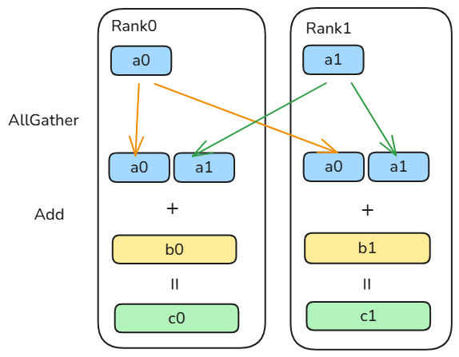
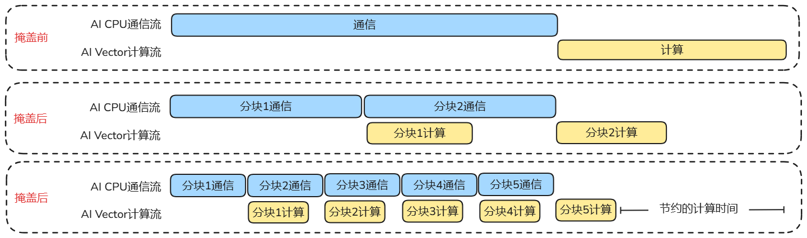
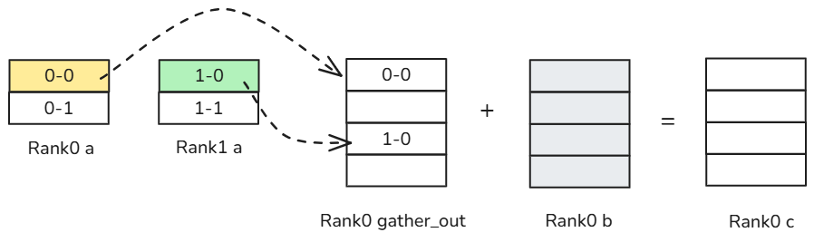
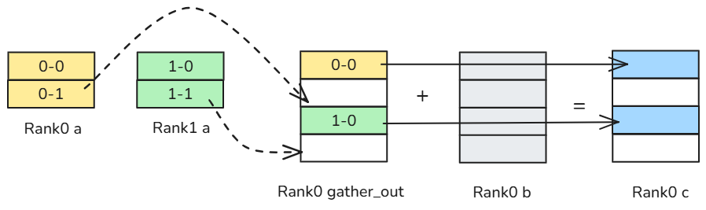
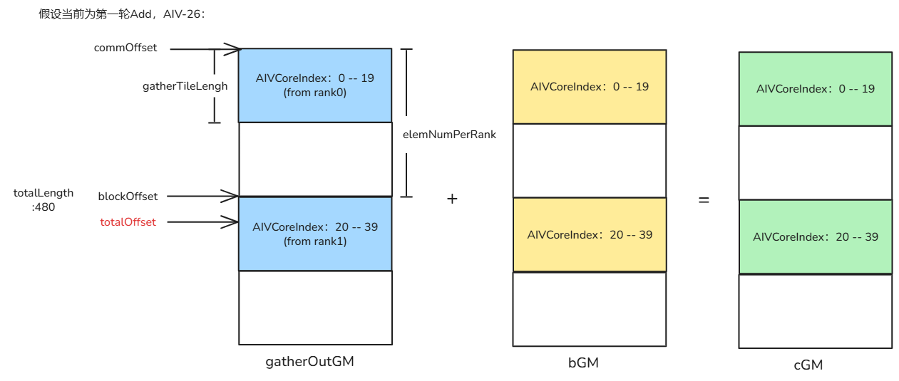
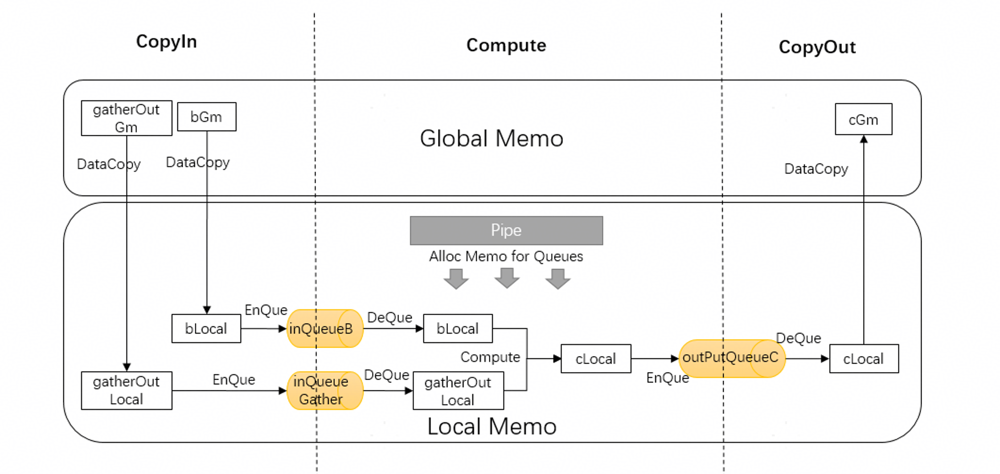

# AllGatherAdd算子设计实现详细介绍

**本篇算子设计和实现介绍基于<term>Atlas A2 训练系列产品/Atlas A2 推理系列产品</term>**

## 1.算子分析

### 1.1 算子逻辑

AllGatherAdd算子实现了[AllGather](https://www.hiascend.com/document/detail/zh/canncommercial/850/API/ascendcopapi/atlasascendc_api_07_0873.html)通信和[Add](https://www.hiascend.com/document/detail/zh/canncommercial/850/API/ascendcopapi/atlasascendc_api_07_0035.html)加法的融合。

算子逻辑为：对通信域内所有卡的操作数a做AllGather通信，得到通信结果gather_out，即Add计算的第一个操作数，然后将gather_out和另一个输入b做Add运算得到输出c。

- 对应的数学表达式为：

    $$
    gatherOut=AllGather(a0, a1)
    $$
    
    $$
    c[i]=gatherOut[i] + b[i]
    $$

### 1.2 输入输出和属性

- a，b为源操作数，a为通信的输入操作数，在本样例中形状固定为[240，256]。b为Add的加数，在本样例中形状固定为[480，256]；
- gather_out为目的操作数，存放AllGather的通信结果，形状为[240 * rank_size，256]，其中rank_size为通信域内的卡数，在本样例中固定为2；
- c为目的操作数，存放Add运算结果，形状为[240 * rank_size，256]；
- 算子输入输出的数据类型为float16，[format](https://www.hiascend.com/document/detail/zh/CANNCommunityEdition/850/API/ascendcopapi/atlasascendc_api_07_0961.html)为：ND。
- group为算子属性，表示通信域名称，明确算子运行时所在的通信域。


### 1.3 核函数名称和参数

- 本样例中核函数命名为all_gather_add。
- 根据对算子输入输出的分析，确定核函数的参数aGM，bGM，cGM，gatherOutGM；aGM，bGM为输入在Global Memory上的内存地址，cGM，gatherOutGM为输出在Global Memory上的内存地址。

### 1.4 算子实现所需接口

| 接口 | 描述 | 参考连接 |
|--|--------------------------------------------------------------------------|--|
| AllGather | 算子涉及AllGather通信，需要使用Hccl高阶API来实现AllGather通信。 |https://www.hiascend.com/document/detail/zh/canncommercial/850/commlib/hcclug/hcclug_000001.html  |
| DataCopy | 算子涉及Add被加数和加数在外部存储和内部存储间的数据搬运，需要使用DataCopy来实现数据搬运。 | https://www.hiascend.com/document/detail/zh/canncommercial/850/API/ascendcopapi/atlasascendc_api_07_0103.html  |
| Add | 计算过程涉及Add矢量计算操作，需要使用Add基础算术API实现加法计算。| https://www.hiascend.com/document/detail/zh/canncommercial/850/API/ascendcopapi/atlasascendc_api_07_0035.html |

### 1.5 算子规格

<table border="1" style="table-layout: fixed; width: 100%">
    <colgroup>
        <col style="width: 25%">
        <col style="width: 15%">
        <col style="width: 15%">
        <col style="width: 20%">
        <col style="width: 25%">
    </colgroup>
    <tr>
        <th>算子类型(OpType)</th>
        <td colspan="4">AllGatherAdd</td>
    </tr>
    <tr>
        <th rowspan="5">算子输入输出</th>
        <th>name</th>
        <th>dataType</th>
        <th>shape</th>
        <th>format</th>
    </tr>
    <tr>
        <td>a</td>
        <td>float16</td>
        <td>(240,256)</td>
        <td>ND</td>
    </tr>
    <tr>
        <td>b</td>
        <td>float16</td>
        <td>(480,256)</td>
        <td>ND</td>
    </tr>
    <tr>
        <td>c</td>
        <td>float16</td>
        <td>(480,256)</td>
        <td>ND</td>
    </tr>
    <tr>
        <td>gather_out</td>
        <td>float16</td>
        <td>(480,256)</td>
        <td>ND</td>
    </tr>
    <tr>
        <th rowspan="2">算子属性</th>
        <td>rank_size</td>
        <td>int32</td>
        <td>2</td>
        <td>\</td>
    </tr>
    <tr>
        <td>group</td>
        <td>string</td>
        <td colspan="2">通信域，不能手动构造，需在调用算子前调用hccl接口动态申请</td>
    </tr>
    <tr>
        <th>核函数名称</th>
        <td colspan="4">all_gather_add</td>
    </tr>
    <tr>
        <th rowspan="5">关键接口</th>
        <td colspan="4">DataCopy: 数据搬运接口</td>
    </tr>
    <tr>
        <td colspan="4">Add: 矢量双目指令接口</td>
    </tr>
    <tr>
        <td colspan="4">AllocTensor、FreeTensor、InitBuffer、Get：内存管理接口</td>
    </tr>
    <tr>
        <td colspan="4">TBuf：内存管理数据结构</td>
    </tr>
    <tr>
        <td colspan="4">GetHcclContext：获取通信Context</td>
    </tr>
</table>


## 数据流分析

AllGather操作会将通信域内所有卡的输入按照卡id重新排序，然后拼接起来，最后将结果发送到所有卡。Add操作将每张卡收到的AllGather结果与本卡的另一输入数据进行相加。

本样例通信域内卡数rank_size固定为2，若通信不切分轮次，通信计算串行进行，算子语义示意图如下：



AllGatherAdd算子的数据在卡间进行AllGather通信，在卡内进行Add计算，通信计算部分可以并行进行互不影响。
因此，可以将通信数据切分多块，每次通信只通信一块数据，每次计算只对前一轮的通信结果进行操作，流水互相掩盖，可得到通信计算掩盖示意图如下：



**AllGatherAdd算子计算过程示意**：（通信切分轮次为2时）

1. AI Core将要执行的通信信息写入Global Memory中的消息区，实现任务下发。消息区是特定地址的Global Memory，AI Core和AI CPU通过向其写入和轮询读取来实现消息在两者间的传递，这些操作统一封装于[Hccl](https://www.hiascend.com/document/detail/zh/canncommercial/850/API/ascendcopapi/atlasascendc_api_07_0869.html)高阶API中。
2. AI CPU从消息区读取到所有通信任务信息，开始基于HCCS（华为缓存一致性系统，用于CPU/NPU之间的高速互联）链路执行第一轮AllGather集合通信任务。下图为第一轮AllGather通信示意图。



3. AI CPU完成第一轮通信任务后，向消息区写入第一轮通信任务已完成的状态，并开始执行第二轮通信任务。同时，AI Vector开始对第一轮AllGather通信结果进行Add计算。下图为第二轮通信和rank0上第一轮Add计算的示意图。



4. 按照通信切分轮次逐步完成所有数据块的通信和计算。

## 创建算子工程

按照以下目录进行算子工程的创建：

```
├── all_gather_add             # AI Core算子名
│   ├── CMakeLists.txt         # 算子编译配置文件，保留原文件即可   
│   ├── examples               # 算子执行样例
│   ├── op_host                # 算子host目录，算子原型定义、Tiling、aclnn接口等相关实现
│   ├── op_kernel              # 算子kernel目录
│   └── README.md              # 算子说明文档
```

## 算子原型定义

相比于一般算子，通算融合算子在实现[算子原型定义](https://www.hiascend.com/document/detail/zh/CANNCommunityEdition/850/opdevg/Ascendcopdevg/atlas_ascendc_10_0062.html)时，有如下约束：

- 必须定义至少一个表示算子通信域名称的属性，该属性的数量与算子所在通信域数量一致。通信域是集合通信执行的上下文，管理对应的通信实体（例如一个NPU就是一个通信实体）和通信所需的资源。
- 必须通过原型注册中的[MC2](https://www.hiascend.com/document/detail/zh/CANNCommunityEdition/850/API/ascendcopapi/atlasascendc_api_07_0954.html)接口注册该算子为通算融合算子，并通过[HcclGroup](https://www.hiascend.com/document/detail/zh/CANNCommunityEdition/850/API/ascendcopapi/atlasascendc_api_07_1002.html)接口配置该算子的通信域名称。

AllGatherAdd算子原型定义如下：

```cpp
namespace ops {
class AllGatherAdd : public OpDef {
public:
explicit AllGatherAdd(const char *name) : OpDef(name) {
    this->Input("a")
        .ParamType(REQUIRED)
        .DataType({ge::DT_FLOAT16})
        .Format({ge::FORMAT_ND});
    this->Input("b")
        .ParamType(REQUIRED)
        .DataType({ge::DT_FLOAT16})
        .Format({ge::FORMAT_ND});
    
    this->Output("c")
        .ParamType(REQUIRED)
        .DataType({ge::DT_FLOAT16})
        .Format({ge::FORMAT_ND});
    this->Output("gather_out")
        .ParamType(REQUIRED)
        .DataType({ge::DT_FLOAT16})
        .Format({ge::FORMAT_ND});

    this->Attr("group").AttrType(REQUIRED).String(); // 通算融合算子属性，表示通信域名称
    this->Attr("rank_size").AttrType(REQUIRED).Int(0);

    this->AICore().AddConfig("ascend910b");
    this->AICore().AddConfig("ascend910_93");
    this->MC2().HcclGroup("group"); // group属性配置为该算子的通信域名称
}
};

OP_ADD(AllGatherAdd);
}  // namespace ops

```

## Tiling实现

通算融合算子Tiling策略的设计主要包括通信切分策略和Add多核切分策略。

- 通信切分策略：每轮通信数据块的大小，对通算融合算子的性能有较大影响。本样例为了向通算融合算子的初次使用者清晰展示通信计算掩盖的流程，将通信切分为两轮进行，第二轮通信和前一轮通信结果的Add计算进行掩盖。具体场景中如何切分使得性能最优，请参考[《Ascend C最佳实践》](https://www.hiascend.com/document/detail/zh/CANNCommunityEdition/850/opdevg/Ascendcopdevg/atlas_ascendc_map_10_0002.html)中的优秀实践：[MC²算子性能调优案例](https://www.hiascend.com/document/detail/zh/CANNCommunityEdition/850/opdevg/Ascendcopdevg/atlas_ascendc_best_practices_10_0043.html)。
- Add多核切分: 根据当前核数(rank_size = 2)，对输入shape的Y轴进行多核切分，得到单核内shape的大小。

本样例中计算数据量为x2的数据量，即480 * 256 * sizeof (float16) = 480 * 256 *（2 bytes/1024） KB = 240KB。当AIV核数为48时，单核计算量为5KB，当AIV核数为40时，单核计算量为6KB，两种情况均小于最大可分配Unified Buffer（AIV的[统一缓冲区](https://www.hiascend.com/document/detail/zh/CANNCommunityEdition/850/opdevg/Ascendcopdevg/atlas_ascendc_10_0008.html)，向量和标量计算的输入和输出）大小192KB，进行Add计算时需要均分给三个操作数，因此每个操作数有64KB最大可用片上UB（开启[Double Buffer](https://www.hiascend.com/document/detail/zh/canncommercial/850/opdevg/Ascendcopdevg/atlas_ascendc_10_0090.html)时最大可用32KB），因此不需要核内切分。

下面给出本样例Tiling实现关键步骤：

- **定义AllGatherAdd算子的Tiling结构体**：

    通信和Add计算融合得到的通算融合算子的Tiling结构体如下两个部分：
    - [Hccl高阶API的Tiling结构体](https://www.hiascend.com/document/detail/zh/canncommercial/850/API/ascendcopapi/atlasascendc_api_07_10048.html)。定义Mc2InitTiling和Mc2CcTiling参数。Mc2InitTiling参数用于初始化通信任务配置，必须定义为算子Tiling结构体的第一个参数。Mc2CcTiling为具体每个通信任务的参数配置，由于AllGatherAdd算子中只有AllGather一个通信任务，因此仅需定义一个Mc2CcTiling参数。
    - AllGatherAdd算子额外需要的自定义信息。
    AllGatherAdd算子的完整Tiling结构体定义如下：

    ```cpp
    struct AllGatherAddTilingData {
        Mc2InitTiling mc2InitTiling;
        Mc2CcTiling mc2CcTiling;
        uint32_t commTurn; // 通信轮次
        
        uint32_t totalElemNum;
        uint32_t blockElemNum;
        uint32_t tileNum;
        uint32_t addTileElemNum;
        uint32_t gatherTileElemNum;
        uint32_t addCoresPerRank;
    };
    ```

    - commTurn: 通信切分轮次，在实际业务场景中是对通算融合掩盖程度重要影响因素，参考[通算融合基础知识](https://www.hiascend.com/document/detail/zh/canncommercial/850/opdevg/Ascendcopdevg/atlas_ascendc_10_10033.html)。
    - tileNum: 计算切分轮次。在本节Tiling实现分析中可知单轮计算UB无溢出风险，该值为1。
    - totalElemNum: 总计算数，其值为输入b的ShapeSize，即480。
    - blockElemNum：每个核需要处理的数据量，其值为totalElemNum / GetBlockDim()。
    - addTileElemNum: 单次add计算数据个数，该值为blockElemNum/ tileNum。
    - gatherTileElemNum：单次通信数据个数，其值为totalElemNum / rankSize / commTurn。
    - addCoresPerRank：单次add计算时每个rank分到的核数，其值为GetBlockDim() / rankSize。

- **获取AllGatherAdd算子的Tiling结构体对象指针**：

    ```cpp
    AllGatherAddTilingData* tilingData = context->GetTilingData<AllGatherAddTilingData>();
    ```

    context为[TilingContext](https://www.hiascend.com/document/detail/zh/canncommercial/850/API/basicdataapi/atlasopapi_07_00555.html)的对象指针，该指针由[all_gather_add_tiling.cpp](../op_host/op_tiling/all_gather_add_tiling.cpp)文件的Tiling入口函数AllGatherAddTilingFunc传入，用于保存算子Tiling计算的上下文。在AllGatherAdd算子的Tiling实现中，通过该上下文context获取计算Tiling所需要的输入输出shape、输入属性等参数，然后将Tiling结果（例如TilingKey、TilingData）保存至上下文中，供后续算子执行时使用。

- **设置算子自定义的Tiling结构体参数**：
    
    ```cpp
    tilingData->commTurn = COMM_TURN; // 通信轮次为1时通算串行，大于1时开启通算掩盖
    tilingData->tileNum = TILE_NUM;
    tilingData->totalElemNum = context->GetInputTensor(1)->GetShapeSize();
    tilingData->blockElemNum = tilingData->totalElemNum / tilingData->commTurn / context->GetBlockDim(); // 每次Add计算只处理前一次通信结果长度的数据
    tilingData->addTileElemNum = tilingData->blockElemNum / tilingData->tileNum;
    uint32_t rankSize = *context->GetAttrs()->GetAttrPointer<uint32_t>(static_cast<int>(1));
    tilingData->addCoresPerRank = context->GetBlockDim() / rankSize; // 进行Add计算之前需要根据每个rank分到的核数来判断当前核的计算地址偏移
    tilingData->gatherTileElemNum = tilingData->totalElemNum / rankSize / tilingData->commTurn; // 每轮通信的数据长度
    ```

- **设置Hccl高阶API Tiling结构体**：

    根据通信任务类型、算法配置等，创建一个Mc2CcTilingConfig类对象，通过向[GetTiling](https://www.hiascend.com/document/detail/zh/canncommercial/850/API/ascendcopapi/atlasascendc_api_07_10037.html)方法传入算子Tiling结构体中mc2InitTiling和mc2CcTiling成员的引用，完成需要传递给Kernel侧的Mc2InitTiling参数和Mc2CcTiling参数的获取。Hccl高阶API Tiling结构体的具体使用方法详见[Hccl Tiling](https://www.hiascend.com/document/detail/zh/canncommercial/850/API/ascendcopapi/atlasascendc_api_07_0887.html)使用说明。

    ```cpp
    // 设置hccl高阶API Tiling结构体
    static void InitHcclParam(AllGatherAddTilingData* tilingData, const char* group)
    {
        std::string algConfig = "AllGather=level0:fullmesh";
        Mc2CcTilingConfig mc2CcTilingConfig(group, HCCL_CMD_ALLGATHER, algConfig);
        mc2CcTilingConfig.GetTiling(tilingData->mc2InitTiling);
        mc2CcTilingConfig.GetTiling(tilingData->mc2CcTiling);
    }
    ```

## Kernel实现

在AllGatherAdd算子的Kernel实现中，需要按照通信切分轮次对所有卡的数据执行AllGather通信计算，同时需要对每轮的通信数据进行Add运算。多轮通信场景下，多张卡的数据拼接到一张卡时，相邻数据块地址并不连续，而每轮Add运算仅对上一轮的通信结果进行计算，因此需要考虑Add计算所需的基本信息：

- 输入a、b操作数和输出c的地址。
- gather_out、b操作数在核间切分的策略。

**首先介绍AllGatherAdd算子核函数的主流程**：

AllGatherAdd算子的核函数定义如下，aGM、bGM、cGM、gatherOutGM参数含义如算子分析中所述，workspaceGM和tilingGM分别表示wrokspace空间和tiling数据在Global Memory的地址。

```cpp
extern "C" __global__ __aicore__ void all_gather_add(GM_ADDR aGM, GM_ADDR bGM, GM_ADDR cGM,
                                                     GM_ADDR gatherGM, GM_ADDR workspaceGM, GM_ADDR tilingGM);
```

- Add计算依赖AIV核，因此算子逻辑仅运行于AIV核中。
    通过KERNEL_TYPE_MIX_AIV_1_0宏[设置kernel类型](https://www.hiascend.com/document/detail/zh/canncommercial/850/API/ascendcopapi/atlasascendc_api_07_0218.html)，AIC、AIV混合场景下，控制算子执行时仅启动AI Core上的Vector核。

    ```cpp
    KERNEL_TASK_TYPE_DEFAULT(KERNEL_TYPE_MIX_AIV_1_0);
    ```

- 注册算子Tiling结构体、获取Tiling，并初始化TPipe。

    ```cpp
    // 注册算子Tiling结构体
    REGISTER_TILING_DEFAULT(AllGatherAddTilingData);
    GET_TILING_DATA(tilingData, tilingGM);
    TPipe pipe;
    ```

- 初始化AllGatherAdd类，进行AllGatherAdd计算流程。

    ```cpp
    AllGatherAdd allGatherAdd;
    allGatherAdd.Init(aGM, bGM, cGM, gatherGM, &tilingData, &pipe);
    allGatherAdd.Process();
    ```

**下面介绍AllGatherAdd算子kernel侧计算的具体实现步骤**：

- **Init函数**定义并赋值后续计算所需变量，初始化hccl对象为AllGather通信做准备，初始化TQue内存为Add计算做准备：

    ```cpp
    __aicore__ inline void AllGatherAdd::Init(GM_ADDR aGM, GM_ADDR bGM, GM_ADDR cGM, GM_ADDR gatherGM, 
                                              AllGatherAddTilingData *tilingData, TPipe *tPipe)
    {
        aGM_ = aGM;
        bGM_ = bGM;
        cGM_ = cGM;
        gatherGM_ = gatherGM;

        tilingData_ = tilingData;
        blockElemNum_ = tilingData->blockElemNum;
        addTileElemNum_ = tilingData->addTileElemNum / ADD_BUFFER_NUM;
        tileNum_ = tilingData->tileNum;
        blockIdx_ = AscendC::GetBlockIdx();

        // 初始化hccl对象
        GM_ADDR contextGM = GetHcclContext<HCCL_GROUP_ID_0>();
        hccl_.InitV2(contextGM, tilingData);
        hccl_.SetCcTilingV2(offsetof(AllGatherAddTilingData, mc2CcTiling));
        
        tPipe->InitBuffer(inputQueueGather, ADD_BUFFER_NUM, addTileElemNum_ * sizeof(half));
        tPipe->InitBuffer(inputQueueB, ADD_BUFFER_NUM, addTileElemNum_ * sizeof(half));
        tPipe->InitBuffer(outputQueueC, ADD_BUFFER_NUM, addTileElemNum_ * sizeof(half));
    }
    ```

- **Process函数**根据通信切分轮次，按照先通信后计算的顺序，逐轮等待通信分块完成，并对通信结果gather_out和b输入执行Add计算：

    ```cpp
    __aicore__ inline void AllGatherAdd::Process()
    {
        HcclPrepare();
        int addLoop = tileNum_ * ADD_BUFFER_NUM;
        for (int i = 0; i < tilingData_->commTurn; i++) {
            hccl_.Wait(handleId_); 
            // 根据通信轮次和rankSize计算本核需要处理数据的起始地址
            CalcAddGmAddr(i);
            // 对前一轮的通信结果进行Add计算
            for (int j = 0; j < addLoop; j++) {
                CopyIn(j);
                Compute();
                CopyOut(j);
            }
        }
        HcclFinalize();
    }
    ```

    Process函数操作算子通信和计算的过程。
    首先，HcclPrepare()函数调用AllGather接口下发通信任务。需要注意通信多轮切分时，strideCount、repeat参数需要配合使用：

    ```cpp
    __aicore__ inline void AllGatherAdd::HcclPrepare()
    {
        elemNumPerRank_ = tilingData_->gatherTileElemNum * tilingData_->commTurn; // 通信多轮切分，多张卡的数据拼接到gatherOutGM时，相邻数据块的起始地址偏移
        // 下发通信任务
        handleId_ = hccl_.AllGather<true>(aGM_, gatherGM_, tilingData_->gatherTileElemNum,
                                        HcclDataType::HCCL_DATA_TYPE_FP16, elemNumPerRank_, tilingData_->commTurn);
    }
    ```

    第一轮通信任务完成后，算子开始第一轮Add计算。在开始计算之前，需要确认参与计算的数据地址，CalcAddGmAddr函数根据通信轮次和卡数计算本核需要处理数据的起始地址。为了实现通信计算掩盖和多核并行，提升计算效率，将Add计算的操作数进行切分，切分后的数据分配到不同的核上进行处理。本样例仅切分操作数的Y轴，示意图如下。在这种场景下，每个核需要计算两个加数相对于原始数据的偏移量，并将偏移后的数据块传入AIV核的Unified Buffer作为入参进行Add计算。

    

    如上图所示，假设当前在AIV-26核进行第一次Add计算，根据Process()函数逻辑，当i = 0时，CalcAddGmAddr函数第一次触发执行，根据[hccl.wait()](https://www.hiascend.com/document/detail/zh/canncommercial/850/API/ascendcopapi/atlasascendc_api_07_0878.html)接口说明，此时第一轮通信已经完成，第二轮通信开始，因此CalcAddGmAddr函数中计算本核需要处理数据的起始地址偏移时，首先偏移i * 单次通信数据长度的距离，如图commOffset；每次Add操作对上一轮通信的结果进行计算，由于通信分多轮进行，每张卡的相邻数据块在gatherOutGM中起始地址存在偏移（即strideCount），因此需要根据卡数和当前核的index计算当前核被分到处理哪个rank的通信数据，如图，总共40个AIV核被均分给两个rank，则AIV-26被分到处理来自rank1的数据，blockOffset如图；计算出当前核处理的rank后，最终偏移需要再加上在此rank数据上的偏移，即6 * 每个核处理的数据个数。
    CalcAddGmAddr函数实现如下：

    ```cpp
    __aicore__ inline void AllGatherAdd::CalcAddGmAddr(int32_t commTurn)
    {
        uint32_t commOffset = commTurn * tilingData_->gatherTileElemNum; // 1.根据通信轮次偏移单个通信数据大小
        uint32_t blockOffset = blockIdx_ / tilingData_->addCoresPerRank * elemNumPerRank_; // 2.根据rank数和aivId判断当前核被分到处理哪个rank的通信数据
        uint32_t totalOffset = commOffset + blockOffset + (blockIdx_ % tilingData_->addCoresPerRank) * blockElemNum_; // 3.最终偏移需要再加上当前核在所处理rank数据上的偏移
        gatherOutGM.SetGlobalBuffer((__gm__ half*)gatherGM_ + totalOffset, blockElemNum_);
        inputBGM.SetGlobalBuffer((__gm__ half*)bGM_ + totalOffset, blockElemNum_);
        outputCGM.SetGlobalBuffer((__gm__ half*)cGM_ + totalOffset, blockElemNum_);
    }
    ```

    每个核完成数据地址的计算之后，就可以遵循[典型算子的编程范式](https://www.hiascend.com/document/detail/zh/canncommercial/850/opdevg/Ascendcopdevg/atlas_ascendc_10_00033.html)，CopyIn（从GM将数据搬到片上Local Memo）->Compute（调用Add算术API完成计算）->CopyOut（从Local Memo将计算结果搬出到GM），完成AllGatherAdd算子的全部计算。每个核内的Add计算内存示意图：

    

    - 轮询等待每个分块的通信完成和计算完成，最后释放资源。

    整合前述代码，完整Kernel代码请访问开源仓。  

## 编译和运行

编译部署算子请参考开源仓算子README：
https://gitcode.com/cann/ops-transformer/blob/master/examples/mc2/all_gather_add/README.md

## 算子执行样例

本示例算子只支持aclnn单算子调用，具体内部调用流程请参考[单算子API调用](https://www.hiascend.com/document/detail/zh/CANNCommunityEdition/850/opdevg/Ascendcopdevg/atlas_ascendc_10_0070.html)。
通过工程编译脚本完成算子的编译后，会自动生成单算子API，可以直接在应用程序中调用。

本节介绍[op_host](../op_host/op_api/)目录下如何对API生成的两段式aclnn接口进行封装，并在examples目录下的[test_aclnn_all_gather_add.cpp](../examples/test_aclnn_all_gather_add.cpp)文件中完成算子调用执行。

首先，对框架自动生成的aclnnInnerAllGatherAddGetWorkspaceSize和aclnnInnerAllGatherAdd函数进行封装：

- 在调用aclnnInnerAllGatherAddGetWorkspaceSize函数计算本次API调用过程中需要多少npu内存之前，先对入参进行校验（包括非空、数据类型、shape等），记录日志：

  ```cpp
  aclnnStatus aclnnAllGatherAddGetWorkspaceSize(const aclTensor *a, const aclTensor *b, char *group,
                                              int64_t rankSize, const aclTensor *cOut,
                                              const aclTensor *gatherOutOut, uint64_t *workspaceSize,
                                              aclOpExecutor **executor) 
  {
    auto retParam = CheckParams(a, b, gatherOutOut, cOut, rankSize);
    CHECK_RET(retParam == ACLNN_SUCCESS, retParam);

    OP_LOGD("A is %s, B is %s.", a->ToString().GetString(), b->ToString().GetString());
    OP_LOGD("Output is %s, gatherOut is %s.", cOut->ToString().GetString(), gatherOutOut->ToString().GetString());

    aclnnStatus ret = aclnnInnerAllGatherAddGetWorkspaceSize(a, b, group, rankSize,
                                                            cOut, gatherOutOut, workspaceSize, executor);
    OP_LOGD("AllGatherAdd, aclnnInnerGetWorkspaceSize ret = %d.", ret);

    return ret;
  }

  ```

- 在调用aclnnInnerAllGatherAdd函数执行算子计算时，MC2算子需要设置[HcclServerType](https://www.hiascend.com/document/detail/zh/canncommercial/850/API/ascendcopapi/atlasascendc_api_07_00149.html)，同时对接口返回值记录日志：

    ```cpp
    aclnnStatus aclnnAllGatherAdd(void *workspace, uint64_t workspaceSize, aclOpExecutor *executor,
                              aclrtStream stream)
    {
        if (NnopbaseSetHcclServerType) {
            NnopbaseSetHcclServerType(executor, NNOPBASE_HCCL_SERVER_TYPE_AICPU);
        }
        auto ret = aclnnInnerAllGatherAdd(workspace, workspaceSize, executor, stream);
        if (ret != 0) {
            OP_LOGE(ACLNN_ERR_INNER, "This is an error in launch aicore,ret = %d.", ret);
            return ret;
        }
        return ret;
    }

    ```

接下来用伪代码介绍AllGatherAdd单算子调用的代码逻辑：

- 初始化环境和测试数据：

    ```cpp
    // 1.根据固定shape生成测试数据和CPU golden数据
    int ret = GenerateTestData(testData);
    CHECK_RET(ret == ACL_SUCCESS, LOG_PRINT("[ERROR] GenerateTestData failed. ret = %d \n", ret);  return ret);
    
    // 2.AscendCL初始化
    ret = aclInit(nullptr);
    CHECK_RET(ret == ACL_SUCCESS, LOG_PRINT("[ERROR] aclInit failed. ret = %d \n", ret); return ret);
    aclrtStream stream[RANK_DIM];
    for (uint32_t rankId = 0; rankId < RANK_DIM; rankId++) {
        ret = aclrtSetDevice(rankId);
        CHECK_RET(ret == ACL_SUCCESS, LOG_PRINT("[ERROR] aclrtSetDevice failed. ret = %d \n", ret); return ret);
        ret = aclrtCreateStream(&stream[rankId]);
        CHECK_RET(ret == ACL_SUCCESS, LOG_PRINT("[ERROR] aclrtCreateStream failed. ret = %d \n", ret); return ret);
    }
    int32_t devices[RANK_DIM];
    for (int i = 0; i < RANK_DIM; i++) {
        devices[i] = i;
    }
    // 3.初始化集合通信域
    HcclComm comms[RANK_DIM];
    ret = HcclCommInitAll(RANK_DIM, devices, comms);
    CHECK_RET(ret == ACL_SUCCESS, LOG_PRINT("[ERROR] HcclCommInitAll failed. ret = %d \n", ret); return ret);

    ```

- 启动多线程在两个rank上调用两阶段aclnn接口执行算子：

    ```cpp
    // 4.启动多线程
    std::vector<std::unique_ptrstd::thread> threads(RANK_DIM);
    for (uint32_t rankId = 0; rankId < RANK_DIM; rankId++) {
    args[rankId].rankId = rankId;
    args[rankId].hcclComm = comms[rankId];
    args[rankId].stream = stream[rankId];
    threads[rankId].reset(new(std::nothrow) std::thread(&LaunchOneThreadAllGatherAdd, std::ref(args[rankId]), std::ref(testData)));
    }
    // 5.将host侧数据copy到device侧
    ret = CreateAclTensor(aHostData, aShape, &aDeviceAddr, aclDataType::ACL_FLOAT16, &a);
    CHECK_RET(ret == ACL_SUCCESS, return ret);
    ret = CreateAclTensor(bHostData, bShape, &bDeviceAddr, aclDataType::ACL_FLOAT16, &b);
    CHECK_RET(ret == ACL_SUCCESS, return ret);
    // ......

    // 6.调用两阶段接口
    // 调用第一阶段接口
    ret = aclnnAllGatherAddGetWorkspaceSize(
    a, b, hcomName, RANK_DIM, out, gatherOut, &workspaceSize, &executor);
    CHECK_RET(ret == ACL_SUCCESS,
    LOG_PRINT("[ERROR] aclnnAllGatherAddGetWorkspaceSize failed. ret = %d \n", ret); return ret);
    // 根据第一阶段接口计算出的workspaceSize申请device内存
    if (workspaceSize > 0) {
    ret = aclrtMalloc(&workspaceAddr, workspaceSize, ACL_MEM_MALLOC_HUGE_FIRST);
    CHECK_RET(ret == ACL_SUCCESS, LOG_PRINT("[ERROR] aclrtMalloc workspace failed. ret = %d \n", ret); return ret);
    }
    // 调用第二阶段接口
    ret = aclnnAllGatherAdd(workspaceAddr, workspaceSize, executor, args.stream);
    CHECK_RET(ret == ACL_SUCCESS, LOG_PRINT("[ERROR] aclnnAllGatherAdd failed. ret = %d \n", ret); return ret);
    // 同步等待任务执行结束
    ret = aclrtSynchronizeStreamWithTimeout(args.stream, 10000);
    CHECK_RET(ret == ACL_SUCCESS, LOG_PRINT("[ERROR] aclrtSynchronizeStreamWithTimeout failed. ret = %d \n", ret);
    return ret);
    LOG_PRINT("[INFO] device_%d aclnnAllGatherAdd execute successfully.\n", args.rankId);

    ```

- 将算子计算结果与CPU golden结果进行精度对比：

    ```cpp
    // 7.算子计算结果与golden数据进行对比
    std::vectorop::fp16_t gatherOutData(bShapeSize, 0);
    // 将计算结果从device侧拷贝到host侧
    ret = aclrtMemcpy(gatherOutData.data(), bShapeSize * sizeof(gatherOutData[0]), gatherOutDeviceAddr,
    bShapeSize * sizeof(gatherOutData[0]), ACL_MEMCPY_DEVICE_TO_HOST);
    // 比较AllGather结果
    ret = CompareVector(gatherOutData, testData.gatherOut);
    CHECK_RET(ret == ACL_SUCCESS, LOG_PRINT("[ERROR] gatherOut compare failed. ret = %d \n", ret); return ret);

    std::vectorop::fp16_t outputData(bShapeSize, 0);
    ret = aclrtMemcpy(outputData.data(), bShapeSize * sizeof(outputData[0]), outDeviceAddr,
    bShapeSize * sizeof(outputData[0]), ACL_MEMCPY_DEVICE_TO_HOST);
    // 比较AllGatherAdd结果，误差在千分之一内
    if (args.rankId == 0) {
    ret = CompareVector(outputData, testData.rank0_c);
    CHECK_RET(ret == ACL_SUCCESS, LOG_PRINT("[ERROR] output compare failed. ret = %d \n", ret); return ret);
    } else {
    ret = CompareVector(outputData, testData.rank1_c);
    CHECK_RET(ret == ACL_SUCCESS, LOG_PRINT("[ERROR] output compare failed. ret = %d \n", ret); return ret);
    }

    ```

- 释放资源：

    ```cpp
    // 8.释放资源
    // 释放hccl资源
    auto hcclRet = HcclCommDestroy(args.hcclComm);
    // 释放device资源
    if (a != nullptr) {
    aclDestroyTensor(a);
    }
    if (b != nullptr) {
    aclDestroyTensor(b);
    }
    // ......
    if (aDeviceAddr != nullptr) {
    aclrtFree(aDeviceAddr);
    }
    if (bDeviceAddr != nullptr) {
    aclrtFree(bDeviceAddr);
    }
    // ......
    ret = aclrtDestroyStream(args.stream);
    CHECK_RET(ret == ACL_SUCCESS, LOG_PRINT("[ERROR] aclrtDestroyStream failed. ret = %d \n", ret); return ret);
    ret = aclrtResetDevice(args.rankId);
    CHECK_RET(ret == ACL_SUCCESS, LOG_PRINT("[ERROR] aclrtResetDevice failed. ret = %d \n", ret); return ret);
    ```
