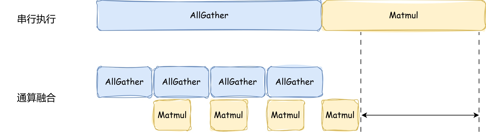
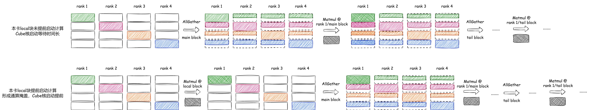
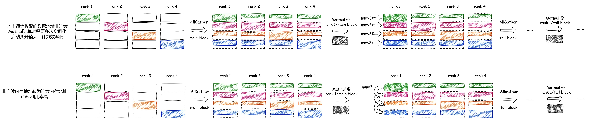

# 基于CCU通信的AllGatherMatmul算子样例

# 概述

本文档介绍基于CCU通信方式的AllGatherMatmul算子的实现原理及优化实践。通过分步优化策略，帮助开发者快速掌握算子性能调优的核心技术，提升算子在昇腾平台上的执行效率。

- **平台**：NPU多卡环境
- **芯片型号**：Ascend 950PR/950DT
- **数据类型**：输入fp16/bf16 → 输出fp16/bf16
- **测试规格**：`x1[1024, 10240] x2[10240, 5120] fp16 → y [1024, 5120] fp16`
- **最佳结果**：`1635μs → 1315μs`，总加速比 **1.24x**

## 🚀 快速开始

### 步骤1：环境检查

```bash
# 检查Ascend环境
echo $ASCEND_HOME_PATH
# 预期有路径输出

# 检查CMake版本
cmake --version | head -1
# CMake版本 >= 3.16

# 检查编译器
which bisheng
# 预期返回bisheng的绝对路径

# 检查PyTorch及torch_npu
python3 -c "import torch;import torch_npu; a = torch.randn(3, 4).npu(); print(a + a);"
# 输出如下类似信息说明安装成功
# tensor([[-0.6066,  6.3385,  0.0379,  3.3356],
#         [2.9243,  3.3134, -1.5465,  0.1916],
#         [-2.1807,  0.2008, -1.1431,  2.1523]], device='npu:0')
```

### 步骤2：编译运行示例

#### 2.1 添加环境变量

```bash
# 配置CANN包环境变量，此为默认路径安装，以root用户为例（非root用户，将/usr/local替换为${ASCEND_HOME_PATH}）
source /usr/local/Ascend/cann/set_env.sh
```

#### 2.2 编译自定义算子

在ops-transformer目录下，执行以下自定义算子编译命令。

```
bash build.sh --pkg --soc=ascend950 --ops=all_gather_matmul_v2 --experimental
```

#### 2.3 执行装包命令

```
cd build_out
chmod +x *.run
./*.run --install-path=/usr/local/Ascend/cann
```

#### 2.4 执行测试脚本

```
cd script
python test.py
```
该脚本以$worldsize = 4$，$m, k, n = 1024, 10240, 5120$ 为示例shape大小，输入示例数据类型为fp16；运行完成后，该脚本会逐卡比对小算子级联（即AllGhater通信+Matmul计算串行执行）与AllGatherMatmul算子的$output$与$gatherOut$，并打印一致性结果。

> 💡 **提示**：如果遇到环境配置问题，请确保：
> 1. `ASCEND_HOME_PATH`环境变量已正确设置
> 2. Bisheng编译器已安装并可用
> 3. CMake版本为3.16或更高
> 4. torch及torch_npu已安装并可用

## 💻 实战示例：AllGatherMatmul优化

### AllGatherMatmul计算流程

AllGatherMatmul算子实现了AllGather通信和Matmul矩阵乘法的融合。算子逻辑为：当对输入的通信矩阵$x1$做AllGather通信得到Matmul计算的左矩阵，即通信结果$gatherOut$，将$gatherOut$和右矩阵$x2$做Matmul运算得到输出c。对应的数学表达式为：

$$
output=AllGather(x1)@x2 + bias
$$

$$
gatherOut=AllGather(x1)
$$

MC<sup>2</sup>通算融合算子的性能收益主要来自于通信、计算的并行执行，即将输入数据切分为多个子块，子块的计算和通信任务形成两条流水线，通过两条流水线上任务的并行执行，实现流水掩盖，从而提升算子性能。如下图所示，相比于先做AllGather通信、后Matmul计算的场景，AllGatherMatmul算子通过将通信输入的矩阵切分为多块，前一块数据的Matmul计算和后一块数据的通信可以并行执行，从而达到计算和通信时间相互掩盖的目的。



### 传统实现分析

```cpp
// all_gather_matmul_fp16_bf16.h关键代码
__aicore__ inline void AllGatherMatmulFP16BF16<AType, BType, BiasType, CType>::Process()
{
    if ASCEND_IS_AIC {
        // Step 1: 启动AllGather通信（收取远端数据）
        StartNotify();

        // Step 2: 计算本卡、远端数据
        InnerProcess();

        // Step 3: 结束通信
        EndNotify();
    }
}
```

**问题诊断**：

- **通信前计算单元空闲**。AllGather通信首次启动前，本卡数据已准备好计算，此时计算单元闲置
- **单次通信数据量不足导致CUBE核利用率低**。Matmul计算GatherOut主块数据时，内存地址不连续，Cube核利用效率低

**性能统计**

以$worldsize = 4$，输入shape为$m, k, n = 1024, 10240, 5120$，输入数据类型fp16为例，原始AllGatherMatmul算子性能如下：

AllGatherMatmul耗时：1511μs

小算子级联耗时：1635μs

加速比：1.08x

### 优化实现1-local块提前启动

AllGather通信会将其他卡数据全部收取到本卡上，然后启动计算。在本卡下发AllGather通信任务时，可以同时**提前启动本卡本地数据的计算任务**，从而掩盖通信任务下发带来的额外开销，进一步释放性能。优化前与优化后的通信及计算执行流程对比如下图所示：



```cpp
// all_gather_matmul_fp16_bf16.h关键代码
template <typename AType, typename BType, typename BiasType, typename CType>
__aicore__ inline void AllGatherMatmulFP16BF16<AType, BType, BiasType, CType>::InnerProcess()
{
    // 计算本卡数据，与AllGather通信同时启动
    InnerProcessLocalMM();

    // 获取远端数据计算，在AllGather通信后启动
    InnerProcessGatherMM();
}

template <typename AType, typename BType, typename BiasType, typename CType>
__aicore__ inline void AllGatherMatmulFP16BF16<AType, BType, BiasType, CType>::InnerProcessLocalMM()
{
    auto&& tiling = tilingData_->mc2MmV3LocalTilingData;
    if (GetBlockIdx() >= tiling.tCubeTiling.usedCoreNum) {
        return;
    }

    auto&& cfg = tilingData_->param;
    auto aLocalGM = aGM_;
    auto cLocalGM = cGM_;

    using C_T = typename CType::T;
    cLocalGM += (uint64_t)rankId_ * (uint64_t)cfg.rankM * (uint64_t)tiling.tCubeTiling.N * sizeof(C_T);

    if (cfg.rankN != 0) {
        Mc2MatmulV3Advanced::Mc2MatmulAswKernel<AType, BType, CType, BiasType> mmv3;
        mmv3.Init(aLocalGM, bGM_, cLocalGM, biasGM_, nullptr, nullptr, &tiling, GetTPipePtr());
        mmv3.Process();
        mmv3.End();
    }
}
```
**性能统计**

加入local块提前启动后，AllGatherMatmul算子性能如下：

AllGatherMatmul耗时：1316μs

小算子级联耗时：1635μs

加速比：1.23x


### 优化实现2-非连续转连续

AllGatherMatmul算子通过将通信输入的矩阵切分为多块，主块数据的Matmul计算和尾块数据的通信并行执行，从而形成流水掩盖。本卡对通信后收取的GatherOut主块数据进行计算时，尾块数据尚未通信，导致主块数据地址不连续，Matmul模板需要重复实例化，Cube核执行效率低。通过非连续转连续优化，将GatherOut数据地址通过偏移的方式连续加载，从而减少Matmul重复实例化带来的计算头开销，实现Cube核流水的不间断运行，提升计算效率。优化前与优化后的通信及计算执行流程对比如下图所示：



```cpp
// all_gather_matmul_fp16_bf16.h关键代码
template <typename AType, typename BType, typename BiasType, typename CType>
__aicore__ inline void AllGatherMatmulFP16BF16<AType, BType, BiasType, CType>::MatmulKernelComputeGather(
    GM_ADDR aGM, GM_ADDR cGM, Mc2MatMulV3TilingData& tiling, uint32_t count, bool isLast, bool isTail)
{
    auto&& cfg = tilingData_->param;
    cfg.rankID = rankId_;
    uint32_t shift = isTail ? cfg.tileCnt : 0;
    if ((GetBlockIdx() >= tiling.tCubeTiling.usedCoreNum) || (cfg.rankN == 0)) {
        for (uint32_t i = 0; i < count; i++) {
            hccl_.Wait(hHandles_[i + shift]);
        }
        return;
    }

    // 原始AllGatherMatmul实现
    // for (uint32_t i = 0; i < count; i++) {
    //     hccl_.Wait(hHandles_[i + shift]);

    //     // Matmul计算rank[n]的gatherOut数据主流程
    //     mm.InitGlobalTensor(aGM, raSize, cGM, rcSize);
    //     mm.ComputeWithL2Cache(i);

    //     aGM += aOffset; // 更新rank[n+1]的gatherOut数据首地址
    //     cGM += cOffset;
    // }

    // 当前AllGatherMatmul实现
    MC2MatmulV3::MC2MatmulAswKernelDerive<AType, BType, CType, BiasType, MC2MatmulV3::MC2MatmulAswBlockDerive> mmv3;
    mmv3.Init(aGM, bGM_, cGM, biasGM_, nullptr, nullptr, &tiling, GetTPipePtr(), cfg, isTail, true);
    for (uint32_t i = 0; i < count; i++) {
        hccl_.Wait(hHandles_[i + shift]);
        mmv3.UpdateSlice(i, isTail);
        mmv3.Process(isLast && (i == (count - 1)));
    }
    mmv3.End();
}
```

**性能统计**

加入local块提前启动和非连续转连续后，AllGatherMatmul算子性能如下：

AllGatherMatmul耗时：1315μs

小算子级联耗时：1635μs

加速比：1.24x

**优化亮点**：

1. 通过通信启动即计算启动的策略，实现对通信延迟的自然掩盖，充分释放计算性能。
2. 将分散、非连续的GatherOut数据块融合为连续数据流，实现Cube核高效利用。