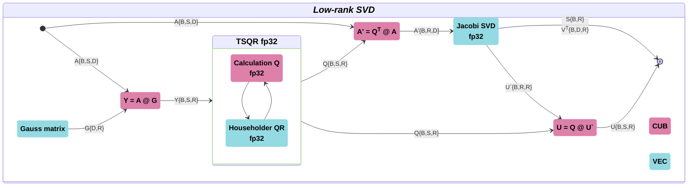

# Long-context Linear Algebra Operations for Ascend NPU

A target is to support PyTorch linear algebra operations for long sequences in method ShadowKV on NPU Ascend 910B/C, Ascend 950PR.

ShadowKV series operators (Ascend CANN / cann-ops-transformer).

This catalog contains custom operators for ShadowKV method, based on the cann-ops-transformer framework, achieving high-performance acceleration on the Huawei Ascend AI (Ascend NPU) 950PR platform.

**Low-rank SVD components：**



## Custom Kernel Input/Output (I/O)

**Parameters description:**  
B: batch size is zero or more batch dimensions  
S: sequence length (127 < S < 8M)  
D: hidden dimension (31 < D < 2K)  
R: SVD rank size (15 < R < D)  

**Input**

| Tensor | Layout | dType | Description                                                                  | 
|--------|--------|-------|------------------------------------------------------------------------------|
| A      | BSD    | FP32  | Tensor of shape (*, S, D) where * is zero or more batch dimensions and S > D |


**Output**

| Tensor        | Layout | dType | Description                        |
|---------------|--------|-------|------------------------------------|
| U             | BSR    | FP32  | Left orthogonal matrix             |
| S             | BR     | FP32  | Singular values                    |
| V<sup>T</sup> | BDR    | FP32  | Right orthogonal transposed matrix |

**Operators**
There are 4 linear algebra operators npu_linalg are the core implementation modules for SVD calculation:

| Ascend        | PyTorch | PyTorch NPU Linalg | Description                         |
|---------------|:-----|:-----|:-----|
| Tsqr          | torch.linalg.qr(A) | torch.ops.npu_linalg.tsqr(A) | Tall-skinny matrix QR decomposition |
| Jacobi        | torch.linalg.svd(A) | torch.ops.npu_linalg.svd(A) | Jacobi rotation SVD                 |
| SvdLowrank    | torch.svd_lowrank(A, q=6, niter=2) | torch.ops.npu_linalg.svd_lowrank(A, q=6, niter=2) | Low-rank SVD |

**Directory structure**  

```
├── svd                   # Linear algebra components for ShadowKV SVD
   ├── ascendc            # AscendC operators for linear algebra functions
   |  ├── jacobi/         # Jacobi rotation SVD
   |  └── tsqr/           # Tall-skinny QR decomposition (TSQR)
   └── torch_npu_linalg   # NPU linear algebra wrappers for PyTorch
      ├── npu_linalg      # AscendC operators adapters for PyTorch
      |   └── csrc/       # Operator adaptation layer C++ code
      ├── tests/          # Directory for linear algebra components tests
      |   ├── utils/      # Test utilities
      |   └── test_svd.py # Accuracy tests for all operators
      ├── build_and_install.sh # Compilation NPU linear algebra wheel package
      ├── requirements.txt# Python requied installation
	  └── setup.py        # Wheel package compilation file
```

**Compilation and use**

1. CANN operator compilation and installation @ 910B2

```bash
path="ops-transformer"
cd $path$
bash build.sh --make_clean --experimental -j16 --pkg --soc=ascend910b --ops=svd
```

2. Python wrapper compilation and installation

```bash
cd $path$/experimental/svd/torch_npu_linalg
bash build_and_install.sh
```

3. Accuracy tests

```bash
pytest $path$/experimental/svd/torch_npu_linalg/tests/test_svd.py
```

**Examples:**

```python
>>> import torch
>>> import torch_npu
>>> import npu_linalg
>>> device = torch.device('npu:6')
>>> A = torch.randn([32, 16], dtype=torch.float32, device=device)
>>> U, S, Vt = torch.ops.npu_linalg.svd(A, 2)
>>> U.shape, S.shape, Vt.shape
(torch.Size([32, 16, 0]), torch.Size([32, 0]), torch.Size([32, 0, 0]))
>>> torch.dist(A.cpu(), U.cpu() @ torch.diag_embed(S.cpu()) @ Vt.cpu().T)
tensor(3.0957e-06)

>>> A = torch.randn([128, 16], dtype=torch.float32, device=device)
>>> Q, R = torch.ops.npu_linalg.tsqr(A)
>>> Q.shape, R.shape
(torch.Size([128, 16]), torch.Size([16, 16]))
>>> torch.dist(A.cpu(), Q.cpu() @ R.cpu())
tensor(1.0486e-06)

>>> U, S, Vt = torch.ops.npu_linalg.svd_lowrank(A, q=16)
>>> torch.dist(A.cpu(), U.cpu() @ torch.diag_embed(S.cpu()) @ Vt.cpu().T)
tensor(3.0957e-06)
```

**Feature description**
1. The current version of the operator supports FP32 input/output real valued precision numbers;
2. All 'npu_linalg' series operators support BSN data layout;
3. The accuracy has been verified by comparison with the PyTorch reference implementation (test scripts can be found in the test directory of each operator).

**Performance speedup of single fusion operator (profile results of test scripts in 910B2 and 950PR (David) for each operator test):**

| torch<br>Operator | <br>Shape<br>[B, S, D]  | torch<br>Time (s) | torch.npu<br>@ 910B2<br>Time [s] | @910B2<br>Acceleration<br>Ratio | torch.npu<br>@ 950PR (David)<br>Time [s] | @950PR<br>Acceleration<br>Ratio |
|:---------------|:------------------------|------------------:|--------:|---------:|--------:|---------:|
| qr             |          [48, 64K, 168] |              160  |    13.2 | **12.2** |    8.34 | **19.2** |
| svd            |          [48, 168, 512] |              45.8 |    0.36 | **127**  |    0.7  | **65.4** |
| svd.lowrank    |          [48, 64K, 512] |              779  |    14.4 | **54**   |    8.76 | **88.9** |
